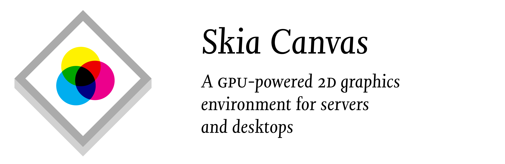

<picture>
  <source media="(prefers-color-scheme: dark)" srcset="test/assets/readme-header-dark@2x.png">
  
</picture>

Skia Canvas is a browser-less implementation of the HTML Canvas drawing API for Node.js. It is based on Google’s [Skia](https://skia.org) graphics engine and as a result produces very similar results to Chrome’s `<canvas>` element. The library is well suited for use on desktop machines where you can render hardware-accelerated graphics to a window and on the server where it can output a variety of image formats.

While the primary goal of this project is to provide a reliable emulation of the [standard API](https://developer.mozilla.org/en-US/docs/Web/API/Canvas_API) according to the [spec](https://html.spec.whatwg.org/multipage/canvas.html), it also extends it in a number of areas to take greater advantage of Skia's advanced graphical features and provide a more expressive coding environment.

In particular, Skia Canvas:

  - is fast and compact since rendering takes place on the GPU and all the heavy lifting is done by native code written in Rust and C++
  - renders directly to [windows](#window) using the OS's native drawing routines and provides a browser-like [UI event][win_bind] framework
  - generates output in both raster (JPEG & PNG) and vector (PDF & SVG) image formats
  - can save images to [files][saveAs], return them as [Buffers][toBuffer], or encode [dataURL][toDataURL_ext] strings
  - uses native threads and the Node [worker pool](https://github.com/neon-bindings/rfcs/pull/35) for asynchronous rendering and file I/O
  - can create [multiple ‘pages’][newPage] on a given canvas and then [output][saveAs] them as a single, multi-page PDF or an image-sequence saved to multiple files
  - can [simplify][p2d_simplify], [blunt][p2d_round], [combine][bool-ops], [excerpt][p2d_trim], and [atomize][p2d_points] bézier paths using [efficient](https://www.youtube.com/watch?v=OmfliNQsk88) boolean operations or point-by-point [interpolation][p2d_interpolate]
  - provides [3D perspective][createProjection()] transformations in addition to [scaling][scale()], [rotation][rotate()], and [translation][translate()]
  - can fill shapes with vector-based [Textures][createTexture()] in addition to bitmap-based [Patterns][createPattern()] and supports line-drawing with custom [markers][lineDashMarker]
  - supports the full set of [CSS filter][filter] image processing operators
  - offers rich typographic control including:

    - multi-line, [word-wrapped](#textwrap) text
    - line-by-line [text metrics](#measuretextstr-width)
    - small-caps, ligatures, and other opentype features accessible using standard [font-variant](#fontvariant) syntax
    - proportional letter-spacing (a.k.a. [‘tracking’](#texttracking)) and leading
    - support for [variable fonts][VariableFonts] and transparent mapping of weight values
    - use of non-system fonts [loaded](#usefamilyname-fontpaths) from local files

## Installation

If you’re running on a supported platform, installation should be as simple as:
```console
$ npm install skia-canvas
```

This will download a pre-compiled library from the project’s most recent [release](https://github.com/samizdatco/skia-canvas/releases).

### Platform Support

The underlying Rust library uses [N-API](https://nodejs.org/api/n-api.html) v6 which allows it to run on Node.js versions:
  - 10.20+
  - 12.17+
  - 14.0, 15.0, and later

Pre-compiled binaries are available for:

  - Linux (x64, arm64, & armhf)
  - macOS (x64 & Apple silicon)
  - Windows (x64)

Nearly everything you need is statically linked into the library. A notable exception is the [Fontconfig](https://www.freedesktop.org/wiki/Software/fontconfig/) library which must be installed separately if you’re running on Linux.


### Running in Docker

The library is compatible with Linux systems using [glibc](https://www.gnu.org/software/libc/) 2.28 or later as well as Alpine Linux (x64 & arm64) and the [musl](https://musl.libc.org) C library it favors. In both cases, Fontconfig must be installed on the system for `skia-canvas` to operate correctly.

If you are setting up a [Dockerfile](https://nodejs.org/en/docs/guides/nodejs-docker-webapp/) that uses [`node`](https://hub.docker.com/_/node) as its basis, the simplest approach is to set your `FROM` image to one of the (Debian-derived) defaults like `node:lts`, `node:18`, `node:16`, `node:14-buster`, `node:12-buster`, `node:bullseye`, `node:buster`, or simply:
```dockerfile
FROM node
```

You can also use the ‘slim’ image if you manually install fontconfig:

```dockerfile
FROM node:slim
RUN apt-get update && apt-get install -y -q --no-install-recommends libfontconfig1
```

If you wish to use Alpine as the underlying distribution, you can start with something along the lines of:

```dockerfile
FROM node:alpine
RUN apk update && apk add fontconfig
```

### Compiling from Source

If prebuilt binaries aren’t available for your system you’ll need to compile the portions of this library that directly interface with Skia.

Start by installing:

  1. The [Rust compiler](https://www.rust-lang.org/tools/install) and cargo package manager using [`rustup`](https://rust-lang.github.io/rustup/)
  2. A C compiler toolchain like LLVM/Clang or MSVC
  3. Python 2.7 (used by Skia's [build process](https://skia.org/docs/user/build/))
  4. On Linux: Fontconfig and OpenSSL

[Detailed instructions](https://github.com/rust-skia/rust-skia#building) for setting up these dependencies on different operating systems can be found in the ‘Building’ section of the Rust Skia documentation. Once all the necessary compilers and libraries are present, running `npm run build` will give you a usable library (after a fairly lengthy compilation process).

## Example Usage

#### Generating image files

```js
const {Canvas, loadImage} = require('skia-canvas'),
      rand = n => Math.floor(n * Math.random()),
      fs = require('fs')

let canvas = new Canvas(600, 600),
    ctx = canvas.getContext("2d"),
    {width, height} = canvas;

// draw a sea of blurred dots filling the canvas
ctx.filter = 'blur(12px) hue-rotate(20deg)'
for (let i=0; i<800; i++){
  ctx.fillStyle = `hsl(${rand(40)}deg, 80%, 50%)`
  ctx.beginPath()
  ctx.arc(rand(width), rand(height), rand(20)+5, 0, 2*Math.PI)
  ctx.fill()
}

// mask all of the dots that don't overlap with the text
ctx.filter = 'none'
ctx.globalCompositeOperation = 'destination-in'
ctx.font='italic 480px Times, DejaVu Serif'
ctx.textAlign = 'center'
ctx.textBaseline = 'top'
ctx.fillText('¶', width/2, 0)

// draw a background behind the clipped text
ctx.globalCompositeOperation = 'destination-over'
ctx.fillStyle = '#182927'
ctx.fillRect(0,0, width,height)

// render to files using a background thread
async function render(){
  // save the graphic...
  await canvas.saveAs("pilcrow.png")
  // ...or use a shorthand for canvas.toBuffer("png")
  let pngData = await canvas.png
  // ...or embed it in a string
  console.log(``)
}
render()

// ...or save the file synchronously from the main thread
canvas.saveAsSync("pilcrow.png")
```

#### Rendering to a window

```js
const {Window} = require('skia-canvas')

let win = new Window(300, 300)
win.title = "Canvas Window"
win.on("draw", e => {
  let ctx = e.target.canvas.getContext("2d")
  ctx.lineWidth = 25 + 25 * Math.cos(e.frame / 10)
  ctx.beginPath()
  ctx.arc(150, 150, 50, 0, 2 * Math.PI)
  ctx.stroke()

  ctx.beginPath()
  ctx.arc(150, 150, 10, 0, 2 * Math.PI)
  ctx.stroke()
  ctx.fill()
})
```


# API Documentation

> Documentation for the key classes and their attributes are listed below—properties are printed in **bold** and methods have parentheses attached to the name. The instances where Skia Canvas’s behavior goes beyond the standard are marked by a ⚡ symbol, linking to further details below.

The library exports a number of classes emulating familiar browser objects including:

 - [Canvas][Canvas] ⧸[⚡](#canvas)
 - [CanvasGradient][CanvasGradient]
 - [CanvasPattern][CanvasPattern]
 - [CanvasRenderingContext2D][CanvasRenderingContext2D] ⧸[⚡](#canvasrenderingcontext2d)
 - [DOMMatrix][DOMMatrix]
 - [Image][Image]
 - [ImageData][ImageData]
 - [Path2D][Path2D] ⧸[⚡](#path2d)

In addition, the module contains:

- [Window](#window) a class allowing you to display your canvas interactively in an on-screen window
- [App](#app) a helper class for coordinating multiple windows in a single script
- [loadImage()](#loadimage) a utility function for loading `Image` objects asynchronously
- [FontLibrary](#fontlibrary) a class allowing you to inspect the system’s installed fonts and load additional ones


## Canvas

The Canvas object is a stand-in for the HTML `<canvas>` element. It defines image dimensions and provides a [rendering context](#canvasrenderingcontext2d) to draw to it. Once you’re ready to save or display what you’ve drawn, the canvas can [save][saveAs] it to a file, or hand it off to you as a [data buffer][toBuffer] or [string][toDataURL_ext] to process manually.


| Image Dimensions             | Rendering Contexts            | Output                                           |
| --                           | --                            | --                                               |
| [**width**][canvas_width]    | [**gpu**][canvas_gpu] ⚡      | ~~[**async**][canvas_async]~~  ⚡                    |
| [**height**][canvas_height]  | [**pages**][canvas_pages] ⚡  | [**pdf**, **png**, **svg**, **jpg**][shorthands] ⚡ |
|                              | [getContext()][getContext]    | [saveAs()][saveAs] / [saveAsSync()][saveAs] ⚡                            |
|                              | [newPage()][newPage] ⚡       | [toBuffer()][toBuffer] / [toBufferSync()][toBuffer] ⚡                        |
|                              |                               | [toDataURL()][toDataURL_ext] / [toDataURLSync()][toDataURL_ext] ⚡ |

[canvas_width]: https://developer.mozilla.org/en-US/docs/Web/API/HTMLCanvasElement/width
[canvas_height]: https://developer.mozilla.org/en-US/docs/Web/API/HTMLCanvasElement/height
[canvas_async]: #async
[canvas_gpu]: #gpu
[canvas_pages]: #pages
[getContext]: https://developer.mozilla.org/en-US/docs/Web/API/HTMLCanvasElement/getContext
[saveAs]: #saveasfilename-page-format-matte-density1-quality092-outlinefalse
[toBuffer]: #tobufferformat-page-matte-density-quality-outline
[newPage]: #newpagewidth-height
[toDataURL_mdn]: https://developer.mozilla.org/en-US/docs/Web/API/HTMLCanvasElement/toDataURL
[toDataURL_ext]: #todataurlformat-page-matte-density-quality-outline
[shorthands]: #pdf-svg-jpg-and-png

#### Creating new `Canvas` objects

Rather than calling a DOM method to create a new canvas, you can simply call the `Canvas` constructor with the width and height (in pixels) of the image you’d like to begin drawing.

```js
let defaultCanvas = new Canvas() // without arguments, defaults to 300 × 150 px
let squareCanvas = new Canvas(512, 512) // creates a 512 px square
```

#### Saving graphics to files, buffers, and strings

When the canvas renders images and writes them to disk, it does so in a background thread so as not to block execution within your script. As a result you’ll generally want to deal with the canvas from within an `async` function and be sure to use the `await` keyword when accessing any of its output methods or shorthand properties (all of which return Promises):
  - [`saveAs()`][saveAs]
  - [`toBuffer()`][toBuffer]
  - [`toDataURL()`][toDataURL_ext]
  - [`.pdf`, `.svg`, `.jpg`, and `.png`][shorthands]


In cases where this is not the desired behavior, you can use the synchronous equivalents for the primary export functions. They accept identical arguments to their async versions but block execution and return their values synchronously rather than wrapped in Promises. Also note that the [shorthand properties][shorthands] do not have synchronous versions:
- [`saveAsSync()`][saveAs]
- [`toBufferSync()`][toBuffer]
- [`toDataURLSync()`][toDataURL_ext]

For instance, both of the example functions below will generate PNG & PDF from the canvas, though the first will be more efficient (particularly for parallel contexts like request-handlers in an HTTP server or batch exports):

```js
let canvas = new Canvas()

async function normal(){
  let pngURL = await canvas.toDataURL("png")
  let pdfBuffer = await canvas.pdf
}

function synchronous(){
  let pngURL = canvas.toDataURLSync("png")
  let pdfBuffer = canvas.toBufferSync("pdf")
}
```

##### PROPERTIES

#### ~~`.async`~~

**The async property has been deprecated** and will be removed in a future release. Use the [`saveAsSync()`][saveAs], [`toBufferSync()`][toBuffer], and [`toDataURLSync()`][toDataURL_ext] methods if the default, asynchronous versions aren't to your liking.

#### `.gpu`

The `.gpu` attribute allows you to control whether rendering occurs on the graphics card or uses the CPU. Rendering is hardware accelerated by default, using [Metal](https://developer.apple.com/metal/) on macOS and [Vulkan](https://www.vulkan.org) on Linux and Windows. To use software-based rendering, set the `.gpu` property to the `false`. If the current platform doesn't support GPU-based rendering, the property will be `false` by default (see [this article](https://linuxconfig.org/install-and-test-vulkan-on-linux) for some tips on getting Vulkan working on Linux).

#### `.pages`

The canvas’s `.pages` attribute is an array of [`CanvasRenderingContext2D`][CanvasRenderingContext2D] objects corresponding to each ‘page’ that has been created. The first page is added when the canvas is initialized and additional ones can be added by calling the `newPage()` method. Note that all the pages remain drawable persistently, so you don’t have to constrain yourself to modifying the ‘current’ page as you render your document or image sequence.

#### `.pdf`, `.svg`, `.jpg`, and `.png`

These properties are syntactic sugar for calling the `toBuffer()` method. Each returns a Node [`Buffer`][Buffer] object with the contents of the canvas in the given format. If more than one page has been added to the canvas, only the most recent one will be included unless you’ve accessed the `.pdf` property in which case the buffer will contain a multi-page PDF.

##### METHODS

#### `newPage(width, height)`

This method allows for the creation of additional drawing contexts that are fully independent of one another but will be part of the same output batch. It is primarily useful in the context of creating a multi-page PDF but can be used to create multi-file image-sequences in other formats as well. Creating a new page with a different size than the previous one will update the parent Canvas object’s `.width` and `.height` attributes but will not affect any other pages that have been created previously.

The method’s return value is a `CanvasRenderingContext2D` object which you can either save a reference to or recover later from the `.pages` array.

#### `saveAs(filename, {page, format, matte, density=1, quality=0.92, outline=false})`

The `saveAs` method takes a file path and writes the canvas’s current contents to disk. If the filename ends with an extension that makes its format clear, the second argument is optional. If the filename is ambiguous, you can pass an options object with a `format` string using names like `"png"` and `"jpeg"` or a full mime type like `"application/pdf"`.

The way multi-page documents are handled depends on the `filename` argument. If the filename contains the string `"{}"`, it will be used as template for generating a numbered sequence of files—one per page. If no curly braces are found in the filename, only a single file will be saved. That single file will be multi-page in the case of PDF output but for other formats it will contain only the most recently added page.

An integer can optionally be placed between the braces to indicate the number of padding characters to use for numbering. For instance `"page-{}.svg"` will generate files of the form `page-1.svg` whereas `"frame-{4}.png"` will generate files like `frame-0001.png`.

##### page
The optional `page` argument accepts an integer that allows for the individual selection of pages in a multi-page canvas. Note that page indexing starts with page 1 **not** 0. The page value can also be negative, counting from the end of the canvas’s `.pages` array. For instance, `.saveAs("currentPage.png", {page:-1})` is equivalent to omitting `page` since they both yield the canvas’s most recently added page.

##### format

The image format to generate, specified either as a mime-type string or file extension. The `format` argument will take precedence over the type specified through the `filename` argument’s extension, but is primarily useful when generating a file whose name cannot end with an extension for other reasons.

##### matte
The optional `matte` argument accepts a color-string specifying the background that should be drawn *behind* the canvas in the exported image. Any transparent portions of the image will be filled with the matte color.

##### density
By default, the images will be at a 1:1 ratio with the canvas's `width` and `height` dimensions (i.e., a 72 × 72 canvas will yield a 72 pixel × 72 pixel bitmap). But with screens increasingly operating at higher densities, you’ll frequently want to generate images where an on-canvas 'point' may occupy multiple pixels. The optional `density` argument allows you to specify this magnification factor using an integer ≥1. As a shorthand, you can also select a density by choosing a filename using the `@nx` naming convention:

```js
canvas.saveAs('image.png', {density:2}) // choose the density explicitly
canvas.saveAs('image@3x.png') // equivalent to setting the density to 3
```

##### quality
The `quality` option is a number between 0 and 1.0 that controls the level of JPEG compression both when making JPEG files directly and when embedding them in a PDF. If omitted, quality will default to 0.92.

##### outline
When generating SVG output containing text, you have two options for how to handle the fonts that were used. By default, SVG files will contain `<text>` elements that refer to the fonts by name in the embedded stylesheet. This requires that viewers of the SVG have the same fonts available on their system (or accessible as webfonts). Setting the optional `outline` argument to `true` will trace all the letterforms and ‘burn’ them into the file as bézier paths. This will result in a much larger file (and one in which the original text strings will be unrecoverable), but it will be viewable regardless of the specifics of the system it’s displayed on.

#### `toBuffer(format, {page, matte, density, quality, outline})`

Node [`Buffer`][Buffer] objects containing various image formats can be created by passing either a format string like `"svg"` or a mime-type like `"image/svg+xml"`. An ‘@’ suffix can be added to the format string to specify a pixel-density (for instance, `"jpg@2x"`). The optional arguments behave the same as in the `saveAs` method.

#### `toDataURL(format, {page, matte, density, quality, outline})`

This method accepts the same arguments and behaves similarly to `.toBuffer`. However instead of returning a Buffer, it returns a string of the form `"data:<mime-type>;base64,<image-data>"` which can be used as a `src` attribute in `` tags, embedded into CSS, etc.


## CanvasRenderingContext2D

Most of your interaction with the canvas will actually be directed toward its ‘rendering context’, a supporting object you can acquire by calling the canvas’s [getContext()](https://developer.mozilla.org/en-US/docs/Web/API/HTMLCanvasElement/getContext) and [newPage()][newPage] methods.

| Canvas State                                  | Drawing                                           | Pattern & Color                                   | Line Style                                   | Transform                                        | Bezier Paths                             | Typography                                                       | Images                                             | Compositing Effects                                      |
|-----------------------------------------------|---------------------------------------------------|---------------------------------------------------|----------------------------------------------|--------------------------------------------------|------------------------------------------|------------------------------------------------------------------|----------------------------------------------------|----------------------------------------------------------|
| [**canvas**][canvas_attr] ⧸[⚡](#canvas) | [clearRect()][clearRect()]                        | [**fillStyle**][fillStyle]                        | [**lineCap**][lineCap]                       | [**currentTransform**][currentTransform]         | [moveTo()][moveTo()]                     | [**direction**][direction]                                       | [**imageSmoothingEnabled**][imageSmoothingEnabled] | [**filter**][filter]                                     |
| [beginPath()][beginPath()]                    | [fillRect()][fillRect()]                          | [**strokeStyle**][strokeStyle]                    | [**lineDashFit** ⚡][lineDashFit]       | [createProjection() ⚡][createProjection()] | [lineTo()][lineTo()]                     | [**font**][font] ⧸[⚡](#font)                               | [**imageSmoothingQuality**][imageSmoothingQuality] | [**globalAlpha**][globalAlpha]                           |
| [isPointInPath()][isPointInPath()]            | [strokeRect()][strokeRect()]                      | [createConicGradient()][createConicGradient()]    | [**lineDashMarker** ⚡][lineDashMarker] | [getTransform()][getTransform()]                 | [arcTo()][arcTo()]                       | [**fontVariant** ⚡](#fontvariant)                          | [createImageData()][createImageData()]             | [**globalCompositeOperation**][globalCompositeOperation] |
| [isPointInStroke()][isPointInStroke()]        | [fillText()][fillText()] ⧸[⚡][drawText]     | [createLinearGradient()][createLinearGradient()]  | [**lineDashOffset**][lineDashOffset]         | [setTransform()][setTransform()]                 | [bezierCurveTo()][bezierCurveTo()]       | [**textAlign**][textAlign]                                       | [getImageData()][getImageData()]                   | [**shadowBlur**][shadowBlur]                             |
| [save()][save()]                              | [strokeText()][strokeText()] ⧸[⚡][drawText] | [createRadialGradient()][createRadialGradient()]  | [**lineJoin**][lineJoin]                     | [resetTransform()][resetTransform()]             | [conicCurveTo() ⚡][conicCurveTo]   | [**textBaseline**][textBaseline]                                 | [putImageData()][putImageData()]                   | [**shadowColor**][shadowColor]                           |
| [restore()][restore()]                        | [fill()][fill()]                                  | [createPattern()][createPattern()]                | [**lineWidth**][lineWidth]                   | [transform()][transform()]                       | [quadraticCurveTo()][quadraticCurveTo()] | [**textTracking** ⚡](#texttracking)                        | [drawCanvas() ⚡](#drawcanvascanvas-x-y-)     | [**shadowOffsetX**][shadowOffsetX]                       |
| [clip()][clip()]                              | [stroke()][stroke()]                              | [createTexture() ⚡][createTexture()]        | [**miterLimit**][miterLimit]                 | [translate()][translate()]                       | [closePath()][closePath()]               | [**textWrap** ⚡](#textwrap)                                | [drawImage()][drawImage()]                         | [**shadowOffsetY**][shadowOffsetY]                       |
|                                               |                                                   |                                                   | [getLineDash()][getLineDash()]               | [rotate()][rotate()]                             | [arc()][arc()]                           | [measureText()][measureText()] ⧸[⚡](#measuretextstr-width) |                                                    |                                                          |
|                                               |                                                   |                                                   | [setLineDash()][setLineDash()]               | [scale()][scale()]                               | [ellipse()][ellipse()]                   | [outlineText() ⚡][outlineText()]                           |                                                    |                                                          |
|                                               |                                                   |                                                   |                                              |                                                  | [rect()][rect()]                         |                                                                  |                                                    |

##### PROPERTIES

#### `.font`

By default any [`line-height`][lineHeight] value included in a font specification (separated from the font size by a `/`) will be preserved but ignored. If the `textWrap` property is set to `true`, the line-height will control the vertical spacing between lines.

#### `.fontVariant`

The context’s [`.font`][font] property follows the CSS 2.1 standard and allows the selection of only a single font-variant type: `normal` vs `small-caps`. The full range of CSS 3 [font-variant][font-variant] values can be used if assigned to the context’s `.fontVariant` property (presuming the currently selected font supports them). Note that setting `.font` will also update the current `.fontVariant` value, so be sure to set the variant *after* selecting a typeface.

#### `.textTracking`

To loosen or tighten letter-spacing, set the `.textTracking` property to an integer representing the amount of space to add/remove in terms of 1/1000’s of an ‘em’ (a.k.a. the current font size). Positive numbers will space out the text (e.g., `100` is a good value for setting all-caps) while negative values will pull the letters closer together (this is only rarely a good idea).

The tracking value defaults to `0` and settings will persist across changes to the `.font` property.

#### `.textWrap`

The standard canvas has a rather impoverished typesetting system, allowing for only a single line of text and an approach to width-management that horizontally scales the letterforms (a type-crime if ever there was one). Skia Canvas allows you to opt-out of this single-line world by setting the `.textWrap` property to `true`. Doing so affects the behavior of the `fillText()`, `strokeText()`, and `measureText()`


#### `.lineDashMarker`

If a Path2D object is assigned to the context’s `lineDashMarker` property, it will be used instead of the default dash pattern when [`setLineDash`][setLineDash()] has been set to a non-empty value. The marker will be drawn at evenly spaced intervals along the path with the distance controlled by the first number in the `setLineDash` array—any subsequent values are ignored.

The marker should be a Path2D object centered on (0, 0). Points to the right of the origin will run parallel to the path being stroked. If the marker path ends with a [`closePath()`][p2d_closePath], the marker will be filled using the current [`strokeStyle`][strokeStyle]. if the path is not closed, it will be stroked using the current [`lineWidth`][lineWidth]/[`join`][lineJoin]/[`cap`][lineCap], [`miterLimit`][miterLimit], and [`strokeStyle`][strokeStyle].

```js
// define marker paths
let caret = new Path2D()
caret.moveTo(-8,-8)
caret.lineTo( 0, 0)
caret.lineTo(-8, 8)

let dot = new Path2D()
dot.arc(0, 0, 4, 0, 2*Math.PI)
dot.closePath() // use fill rather than stroke

let cross = new Path2D()
cross.moveTo(-6,-6)
cross.lineTo( 6, 6)
cross.moveTo(-6, 6)
cross.lineTo( 6,-6)

// draw arcs using different markers
function drawArc(x, color){
  ctx.strokeStyle = color
  ctx.lineWidth = 4
  ctx.beginPath()
  ctx.arc(x + 120, 120, 100, -Math.PI, -Math.PI/2)
  ctx.stroke()
}

ctx.setLineDash([20])
drawArc(0, "orange")

ctx.lineDashMarker = caret
drawArc(100, "deepskyblue")

ctx.lineDashMarker = dot
drawArc(200, "limegreen")

ctx.lineDashMarker = cross
drawArc(300, "red")

ctx.setLineDash([])
drawArc(400, "#aaa")

```


#### `.lineDashFit`

The `lineDashFit` attribute can be set to `"move"`, `"turn"`, or `"follow"` and controls how the marker is transformed with each repetition along the path. `"move"`  and `"turn"` use simple translation and rotation, whereas `"follow"` will bend the marker to match the dashed path's contours.


##### METHODS

#### `conicCurveTo(cpx, cpy, x, y, weight)`

Adds a line segment connecting the current point to (*x, y*) but curving toward the control point (*cpx, cpy*) along the way. The `weight` argument controls how close the curve will come to the control point. If the weight is `0`, the result will be a straight line from the current point to (*x, y*). With a weight of `1.0`, the function is equivalent to calling `quadraticCurveTo()`. Weights greater than `1.0` will pull the line segment ever closer to the control point.

#### `createProjection(quad, [basis])`

This method returns a [DOMMatrix][DOMMatrix] object which can be used to simulate perspective effects or other distortions in which the four corners of the canvas are mapped to an arbitrary quadrilateral (four sided polygon). The matrix must be passed to the context's [setTransform][setTransform()] method for it take effect.

##### `quad`

The `quad` argument defines the **target** of the transformation. It specifies four points that establish where the four corners of the source coordinate space will be positioned within the viewport. If these points form a polygon other than a rectangle, lines drawn along the x & y axes of the source space will no longer be perpendicular—trapezoids allow for ‘vanishing point’ effects and parallelograms create ‘skew’.

The geometry of the quadrilateral should be described as an Array of either 8 or 4 numbers specifying an arbitrary polygon or rectangle respectively:

```js
[x1, y1, x2, y2, x3, y3, x4, y4] // four corner points
[left, top, right, bottom] // four edges of a rectangle

// internal arrays for grouping are also allowed
[[x1, y1], [x2, y2], [x3, y3], [x4, y4]]
```

##### `basis`

The optional `basis` argument defines the **source** quadrilateral whose corners will be mapped to the positions defined by `quad`. If no `basis` is specified, the canvas's bounding box will be used (i.e., the rectangle from ⟨`0`, `0`⟩ to ⟨`canvas.width`, `canvas.height`⟩). Note that drawing commands that go outside of the `basis` region may well be visible—it only establishes the geometry of the projection, not the [clipping][clip()] path.

The `basis` polygon can be described using 2, 4, or 8 numbers, using the canvas dimensions to fill in the unspecified coordinates:
```js
[width, height] // rectangle from ⟨0, 0⟩ to ⟨width, height⟩
[left, top, right, bottom] // four edges of a rectangle
[x1, y1, x2, y2, x3, y3, x4, y4] // four corner points
```

----

The projection matrix will apply to all types of drawing: shapes, images, and text. This example transforms a white box and red `"@"` character into a trapezoid bounded by the vertical midline of the canvas and its left and right edges. Since no `basis` argument is provided, it will default to using the current canvas bounds as the rectangle to be mapped onto that trapezoid.

```js
let canvas = new Canvas(512, 512),
    ctx = canvas.getContext("2d"),
    {width:w, height:h} = canvas;
ctx.font = '900 480px Times'
ctx.textAlign = 'center'
ctx.fillStyle = '#aaa'
ctx.fillRect(0, 0, w, h)

let quad = [
  w*.33, h/2,  // upper left
  w*.66, h/2,  // upper right
  w,     h*.9, // bottom right
  0,     h*.9, // bottom left
]

let matrix = ctx.createProjection(quad) // use default basis
ctx.setTransform(matrix)

ctx.fillStyle = 'white'
ctx.fillRect(10, 10, w-20, h-20)

ctx.fillStyle = '#900'
ctx.fillText("@", w/2, h-40)

```

The results below show the image generated when the `createProjection()` call is omitted entirely, called (as above) with just a `quad` argument, or called with two different values for the optional `basis` argument:


#### `createTexture(spacing, {path, line, color, angle, offset=0})`

The `createTexture()` method returns a `CanvasTexture` object that can be assigned to the context’s `strokeStyle` or `fillStyle` property. Similar to a `CanvasPattern`, a `CanvasTexture` defines a repeating pattern that will be drawn instead of a flat color, but textures define their content using *vectors* rather than bitmaps.

Textures can be based on a user-provided Path2D object or will draw a stripe pattern of parallel lines if a path isn’t provided.

##### `spacing`

The `spacing` argument is required and defines the rectangular area that each repeating ‘tile’ in the pattern will occupy. It can either be a single number (which will be used for both dimensions) or an array with two numbers (width and height). When creating a stripe pattern, the `spacing` argument defines the distance between neighboring lines, so providing more than one value is unnecessary.

**The optional second argument can be an object with one or more of the following attributes:**

##### `path`
If set to a Path2D object, the `path` will be drawn once per tile with its origin in the upper left corner of each tile. Note that the path will not be clipped even if it extends beyond the bounds of the current tile, allowing you to overlap the texture with neighboring tiles.

##### `line`
If set to a positive number, the path will be stroked rather than filled and the `line` value will set the width of the stroke.

##### `color`
By default the texture will be drawn in black (filled if `line` is undefined, stroked otherwise). The `color` argument can be set to a string defining the stroke/fill color to be used instead.

##### `angle`
The rectangle defined by the `spacing` argument will be aligned with the canvas’s horizontal and vertical axes by default. Specifying an `angle` value (in radians) allows you to rotate this tile grid clockwise relative to its default orientation.

##### `offset`
As with `CanvasPattern` objects, textures are positioned globally relative to the upper left corner of the canvas—not the corner of the object currently being filled or stroked. To fine-tune the texture’s alignment with individual objects, set the `offset` argument to an `[x, y]` array with two numbers that will shift the texture relative to its origin.

#### `drawCanvas(canvas, x, y, …)`
This method behaves identically to the standard [`drawImage()`][drawImage()] function with one key difference: if the first argument is a canvas, it will not be converted to a bitmap before being drawn. Instead its contents will be added to the canvas as resolution-independent vector graphics. This is especially useful when scaling or rotating since it preserves the fidelity of text, patterns, and gradients from the source canvas.

```js
let src = new Canvas(10, 10),
    srcCtx = src.getContext("2d");
srcCtx.font = 'italic 10px Times'
srcCtx.fillText('¶', 2, 8)

let dst = new Canvas(350, 150),
    dstCtx = dst.getContext("2d");
dstCtx.drawImage(src, 0, 0, 150, 150)
dstCtx.drawCanvas(src, 200, 0, 150, 150)
```


#### `fillText(str, x, y, [width])` & `strokeText(str, x, y, [width])`

The text-drawing methods’ behavior is mostly standard unless `.textWrap` has been set to `true`, in which case there are 3 main effects:

  1. Manual line breaking via `"\n"` escapes will be honored rather than converted to spaces
  2. The optional `width` argument accepted by `fillText`, `strokeText` and `measureText` will be interpreted as a ‘column width’ and used to word-wrap long lines
  3. The line-height setting in the `.font` value will be used to set the inter-line leading rather than simply being ignored.

Even when `.textWrap` is `false`, the text-drawing methods will never choose a more-condensed weight or otherwise attempt to squeeze your entire string into the measure specified by `width`. Instead the text will be typeset up through the last word that fits and the rest will be omitted. This can be used in conjunction with the `.lines` property of the object returned by `measureText()` to incrementally lay out a long string into, for example, a multi-column layout with an even number of lines in each.

#### `measureText(str, [width])`

The `measureText()` method returns a [TextMetrics][TextMetrics] object describing the dimensions of a run of text *without* actually drawing it to the canvas. Skia Canvas adds an additional property to the metrics object called `.lines` which contains an array describing the geometry of each line individually.

Each element of the array contains an object of the form:
```
{x, y, width, height, baseline, startIndex, endIndex}
```
The `x`, `y`, `width`, and `height` values define a rectangle that fully encloses the text of a given line relative to the ‘origin’ point you would pass to `fillText()` or `strokeText()` (and reflecting the context’s current `.textBaseline` setting).

The `baseline` value is a y-axis offset from the text origin to that particular line’s baseline.

The `startIndex` and `endIndex` values are the indices into the string of the first and last character that were typeset on that line.

#### `outlineText(str)`

The `outlineText()` method typesets a string and returns a Path2D containing the shapes of its character glyphs. It will use the context’s current [`.font`][font], [`.textAlign`][textAlign], and [`.textBaseline`][textBaseline] settings to style the string and will anchor the text relative to the (0, 0) origin point. As a result, you’ll typically want to use the context’s transform-related methods or Path2D’s [`offset()`][p2d_offset] and [`transform()`][p2d_transform] to position the path before drawing it to the canvas.

Note that path-generation uses a more limited typesetting system than [`fillText()`][drawText] and [`strokeText()`][drawText]. As such, it ignores any settings made using the [`.fontVariant`](#fontvariant) or [`.textTracking`](#texttracking) properties and does not support multi-line text (regardless of the current [`.textWrap`](#textwrap) setting).

```js
ctx.textBaseline = 'top'
ctx.font = 'bold 140px Helvetica'
let ampersand = ctx.outlineText('&')

for (let i=0; i<8000; i++){
  let x = Math.random() * 100,
      y = Math.random() * 120;
  ctx.fillStyle = path.contains(x, y) ? 'lightblue' : '#eee'
  ctx.fillRect(x, y, 2, 2)
}
```


## Path2D

The `Path2D` class allows you to create paths independent of a given [Canvas](#canvas) or [graphics context](#canvasrenderingcontext2d). These paths can be modified over time and drawn repeatedly (potentially on multiple canvases). `Path2D` objects can also be used as [lineDashMarker][lineDashMarker]s or as the repeating pattern in a [CanvasTexture][createTexture()].


| Line Segments                              | Shapes                   | Boolean Ops ⚡           | Filters ⚡                       | Geometry ⚡                  |
| --                                         | --                       | --                       | --                               | --                           |
| [**d** ⚡](#d)                             | [addPath()][p2d_addPath] | [complement()][bool-ops] | [interpolate()][p2d_interpolate] | [**bounds**](#bounds)        |
| [moveTo()][p2d_moveTo]                     | [arc()][p2d_arc]         | [difference()][bool-ops] | [jitter()][p2d_jitter]           | [**edges**](#edges)          |
| [lineTo()][p2d_lineTo]                     | [arcTo()][p2d_arcTo]     | [intersect()][bool-ops]  | [round()][p2d_round]             | [contains()][p2d_contains]   |
| [bezierCurveTo()][p2d_bezierCurveTo]       | [ellipse()][p2d_ellipse] | [union()][bool-ops]      | [simplify()][p2d_simplify]       | [points()][p2d_points]       |
| [conicCurveTo() ⚡][conicCurveTo]          | [rect()][p2d_rect]       | [xor()][bool-ops]        | [trim()][p2d_trim]               | [offset()][p2d_offset]       |
| [quadraticCurveTo()][p2d_quadraticCurveTo] |                          |                          | [unwind()][p2d_unwind]           | [transform()][p2d_transform] |
| [closePath()][p2d_closePath]               |

#### Creating `Path2D` objects

Its constructor can be called without any arguments to create a new, empty path object. It can also accept a string using [SVG syntax][SVG_path_commands] or a reference to an existing `Path2D` object (which it will return a clone of):
```js
// three identical (but independent) paths
let p1 = new Path2D("M 10,10 h 100 v 100 h -100 Z")
let p2 = new Path2D(p1)
let p3 = new Path2D()
p3.rect(10, 10, 100, 100)
```

#### Drawing paths

A canvas’s context always contains an implicit ‘current’ bézier path which is updated by commands like [lineTo()][lineTo()] and [arcTo()][arcTo()] and is drawn to the canvas by calling [fill()][fill()], [stroke()][stroke()], or [clip()][clip()] without any arguments (aside from an optional [winding][nonzero] [rule][evenodd]). If you start creating a second path by calling [beginPath()][beginPath()] the context discards the prior path, forcing you to recreate it by hand if you need it again later.

You can then use these objects by passing them as the first argument to the context’s `fill()`, `stroke()`, and `clip()` methods (along with an optional second argument specifying the winding rule).

##### PROPERTIES

#### `.bounds`

In the browser, Path2D objects offer very little in the way of introspection—they are mostly-opaque recorders of drawing commands that can be ‘played back’ later on. Skia Canvas offers some additional transparency by allowing you to measure the total amount of space the lines will occupy (though you’ll need to account for the current `lineWidth` if you plan to draw the path with `stroke()`).

The `.bounds` property returns an object defining the minimal rectangle containing the path:
```
{top, left, bottom, right, width, height}
```

#### `.d`

Contains a string describing the path’s edges using [SVG syntax][SVG_path_commands]. This property is both readable and writeable (and can be appended to using the `+=` operator).

#### `.edges`

Returns an array containing each path segment that has been added to the path so far. Each element of the list is an array of the form `["verb", ...points]`, mirroring the calling conventions of both Path2D and the rendering context. As a result, the `edges` may be used to ‘replay’ a sequence of commands such as:
```js
let original = new Path2D()
// ... add some contours to the path

// apply the original path’s edges to a new Path2D
let clone = new Path2D()
for (const [verb, ...pts] of original.edges){
  clone[verb](...pts)
}

// or use the original path’s edges to draw directly to the context
for (const [verb, ...pts] of original.edges){
  ctx[verb](...pts)
}
```

The array is not a verbtaim transcript of the drawing commands that have been called since some commands (e.g., `arc()`) will be converted into an equivalent sequence of bézier curves. The full range of verbs and numbers of point arguments is as follows:

```js
[
  ["moveTo", x, y],
  ["lineTo", x, y],
  ["quadraticCurveTo", cpx, cpy, x, y],
  ["bezierCurveTo", cp1x, cp1y, cp2x, cp2y, x, y],
  ["conicCurveTo", cpx, cpy, x, y, weight],
  ["closePath"]
]
```

##### METHODS

#### `contains(x, y)`

Returns true if the point (*x, y*) is either inside the path or intersects one of its contours.

#### `complement()`, `difference()`, `intersect()`, `union()`, and `xor()`
In addition to creating `Path2D` objects through the constructor, you can use pairs of existing paths *in combination* to generate new paths based on their degree of overlap. Based on the method you choose, a different boolean relationship will be used to construct the new path. In all the following examples we’ll be starting off with a pair of overlapping shapes:
```js
let oval = new Path2D()
oval.arc(100, 100, 100, 0, 2*Math.PI)

let rect = new Path2D()
rect.rect(0, 100, 100, 100)
```


We can then create a new path by using one of the boolean operations such as:
```js
let knockout = rect.complement(oval),
    overlap = rect.intersect(oval),
    footprint = rect.union(oval),
    ...
```


Note that the `xor` operator is liable to create a path with lines that cross over one another so you’ll get different results when filling it using the [`"evenodd"`][evenodd] winding rule (as shown above) than with [`"nonzero"`][nonzero] (the canvas default).

#### `interpolate(otherPath, weight)`

When two similar paths share the same sequence of ‘verbs’ and differ only in the point arguments passed to them, the `interpolate()` method can combine them in different proportions to create a new path. The `weight` argument controls whether the resulting path resembles the original (at `0.0`), the `otherPath` (at `1.0`), or something in between.

```js
let start = new Path2D()
start.moveTo(-200, 100)
start.bezierCurveTo(-300, 100, -200, 200, -300, 200)
start.bezierCurveTo(-200, 200, -300, 300, -200, 300)

let end = new Path2D()
end.moveTo(200, 100)
end.bezierCurveTo(300, 100, 200, 200, 300, 200)
end.bezierCurveTo(200, 200, 300, 300, 200, 300)

let left = start.interpolate(end, .25),
    mean = start.interpolate(end, .5),
    right = start.interpolate(end, .75)
```


#### `jitter(segmentLength, amount, seed=0)`

The `jitter()` method will return a new Path2D object obtained by breaking the original path into segments of a given length then applying random offsets to the resulting points. Though the modifications are random, they will be consistent between runs based on the specified `seed`. Try passing different integer values for the seed until you get results that you like.

```js
let cube = new Path2D()
cube.rect(100, 100, 100, 100)
cube.rect(150, 50, 100, 100)
cube.moveTo(100, 100)
cube.lineTo(150, 50)
cube.moveTo(200, 100)
cube.lineTo(250, 50)
cube.moveTo(200, 200)
cube.lineTo(250, 150)

let jagged = cube.jitter(1, 2),
    reseed = cube.jitter(1, 2, 1337),
    sketchy = cube.jitter(10, 1)
```


#### `offset(dx, dy)`

Returns a copy of the path whose points have been shifted horizontally by `dx` and vertically by `dy`.

#### `points(step=1)`

The `points()` method breaks a path into evenly-sized steps and returns the (*x, y*) positions of the resulting vertices. The `step` argument determines the amount of distance between neighboring points and defaults to 1 px if omitted.


```js
let path = new Path2D()
path.arc(100, 100, 50, 0, 2*Math.PI)
path.rect(100, 50, 50, 50)
path = path.simplify()

for (const [x, y] of path.points(10)){
  ctx.fillRect(x, y, 3, 3)
}
```


#### `round(radius)`

Calling `round()` will return a new Path2D derived from the original path whose corners have been rounded off to the specified radius.

```js
let spikes = new Path2D()
spikes.moveTo(50, 225)
spikes.lineTo(100, 25)
spikes.lineTo(150, 225)
spikes.lineTo(200, 25)
spikes.lineTo(250, 225)
spikes.lineTo(300, 25)

let snake = spikes.round(80)
```


#### `simplify(rule="nonzero")`

In cases where the contours of a single path overlap one another, it’s often useful to have a way of effectively applying a `union` operation *within* the path itself. The `simplify` method traces the path and returns a new copy that removes any overlapping segments. When called with no arguments it defaults to the `"nonzero"` winding rule, but can also be called with `"evenodd"` to preserve overlap regions while still removing edge-crossings.

```js
let cross = new Path2D(`
  M 10,50 h 100 v 20 h -100 Z
  M 50,10 h 20 v 100 h -20 Z
`)
let uncrossed = cross.simplify()
```


#### `transform(matrix)` or `transform(a, b, c, d, e, f)`

Returns a new copy of the path whose points have been modified by the specified transform matrix. The matrix’s terms can be passed individually as 6 numbers or as a [DOMMatrix][DOMMatrix] object. The original path remains unmodified.

#### `trim(start, end, inverted)`

The `trim()` method returns a new Path2D which contains only a portion of the original path. The `start` and `end` arguments specify percentages of the original contour as numbers between `0` and `1.0`. If both arguments are provided, the new path will be a continuous contour connecting those endpoints. If the `inverted` argument is set to `true`, the new path will contain everything from the original **except** the region between the specified endpoints.

Passing a single positive number implicitly sets the starting point to `0.0` and uses the supplied argument as the `end`. Passing a negative value sets the ending point to `1.0` and uses the argument as the `start` value. In either case, you can include `inverted` as the second argument to flip the selected contour.

```js
let orig = new Path2D()
orig.arc(100, 100, 50, Math.PI, 0)

let middle = orig.trim(.25, .75),
    endpoints = orig.trim(.25, .75, true),
    left = orig.trim(.25),
    right = orig.trim(-.25)

```


#### `unwind()`

The `unwind()` method interprets the current path using the `"evenodd"` winding rule then returns a new path that covers an equivalent area when filled using the `"nonzero"` rule (i.e., the default behavior of the context’s [`fill()`][fill()] method).

This conversion can be useful in situations where a single path contains multiple, overlapping contours and the resulting shape depends on the [nesting-depth and direction](https://oreillymedia.github.io/Using_SVG/extras/ch06-fill-rule.html) of the contours.

```js
let orig = new Path2D(`
  M 0 0 h 100 v 100 h -100 Z
  M 50 30 l 20 20 l -20 20 l -20 -20 Z
`)

let unwound = orig.unwind()
```


## Window

The `Window` class allows you to open a native OS window and draw within its frame. You can create multiple windows (each with their own event-handling and rendering routines) and update them in response to user input.

Its attributes and methods include:

| Dimensions               | Content                          | Interface            | Mode                         | Methods            |
| --                       | --                               | --                   | --                           | --                 |
| [**left**][win_layout]   | [**background**][win_background] | [**title**][title]   | [**visible**][visible]       | [on()][win_bind] / [once()][win_bind]  |
| [**top**][win_layout]    | [**canvas**][win_canvas]         | [**cursor**][cursor] | [**fullscreen**][fullscreen] | [off()][win_bind]  |
| [**width**][win_layout]  | [**ctx**][win_ctx]               | [**fit**][fit]       |                              | [close()][close] |
| [**height**][win_layout] | [**page**][win_page]             |                      |                              |    | 

[win_background]: #background
[win_canvas]: #canvas-1
[win_ctx]: #ctx
[win_page]: #page-1
[win_layout]: #left--top--width--height
[title]: #title
[cursor]: #cursor
[fit]: #fit
[visible]: #visible
[fullscreen]: #fullscreen
[win_bind]: #on--off--once
[close]: #close

#### Creating new `Window` objects

When called with no arguments, the `Window` constructor will return a 512 × 512 pt window with a white background and automatically create a `Canvas` of the same size that you can access through its `.canvas` property:

```js
let win = new Window()
console.log(win.canvas)
// Canvas {width:512, height:512, gpu:true, pages:[CanvasRenderingContext2D{}]}
```

You can specify a size (to be shared by the window and canvas) by passing width & height arguments:
```js
let smaller = new Window(256, 128)
````

All of the other window properties can be customized by passing an options object, either in addition to the width & height or all by itself:

```js
let orange = new Window(1024, 768, {background:"orange"})
let titled = new Window({title:"Canvas Window"}) // use default 512×512 size 
```

After creating the window, you can modify these properties through simple assignment:

```js
let win = new Window(800, 600, {title="Multi-step Window"})
win.background = "skyblue"
win.top = 40
win.left = 40
```

The object accessible through the window’s `.canvas` attribute is no different than any other `Canvas` you create. You can even create a `Window` after setting up a canvas and tell the window to use it instead of automatically creating one. If you pass it to the constructor without specifying a window size, the window will match the dimensions of the canvas:

```js
let bigCanvas = new Canvas(1024, 1024)
let win = new Window({canvas:bigCanvas})
console.log([win.width, win.height])
// [1024, 1024]
```

Likewise, assigning a new `.canvas` will replace the contents of the window (though it won’t affect the window’s size):

```js
let win = new Window()
win.canvas = new Canvas(1024, 32)

console.log([win.width, win.height])
// [512, 512]
console.log([win.canvas.width, win.canvas.height])
// [1024, 32]
```

> When the window and canvas sizes don’t perfectly match, the canvas will be scaled using the approach selected via the window’s [`fit`][fit] property. 

#### Drawing to a Window

To draw to the window’s canvas, you can either use the reference to its `.canvas` property to create a context, or use the shortcut `.ctx` property which skips that step:

```js
let win = new Window({background:"olive", fit:"contain-y"})
console.log(win.ctx === win.canvas.getContext("2d"))
// true

let {canvas, ctx} = win
ctx.fillStyle = 'lightskyblue'
ctx.fillRect(10, 10, canvas.width-20, canvas.height-20)
```

If you create multiple pages in your canvas using [newPage()][newPage], you can select which one is currently displayed by setting the window’s [`.page`][win_page]. By default, the most recently created page will be visible, but if you create a new page after the window is on screen, you’ll need to update the `.page` attribute manually to display it. The window’s `.ctx` shortcut will always point to the context for the currently visible page.

```js
let canvas = new Canvas(32, 32),
    colors = ['orange', 'yellow', 'green', 'skyblue', 'purple']

for (var c of colors){
  ctx = canvas.newPage(canvas.width * 2, canvas.height * 2)
  ctx.fillStyle = c
  ctx.fillRect(0,0, canvas.width, canvas.height)
  ctx.fillStyle = 'white'
  ctx.arc(canvas.width/2, canvas.height/2, 40, 0, 2 * Math.PI)
  ctx.fill()
}

let win = new Window({canvas, page:-2})
win.on('keydown', e => {
  if (e.key=='Left') win.page--
  if (e.key=='Right') win.page++
  console.log(`page ${win.page}/${canvas.pages.length}: ${canvas.width} × ${canvas.height}`)
})
```

#### Responding to Events

Once you've created a `Window` object, Node will wait for your current function to end and then switch over to an OS-controlled event loop for the rest of your program’s runtime. This means it can actively redraw your canvas when you resize the window or update its contents, but also means the Node interpreter will be frozen for the duration. 

As a result, you cannot rely upon Node's traditional asynchrononous behavior for structuring your program. In particular, the usual methods for scheduling callbacks like `setTimeout`, `setImmediate`, and `setInterval` **will not work**.

Instead, you must use event handlers attached to the `Window` object. By calling the window’s `.on()`, `.off()`, and `.once()` methods, you can respond to [user interface events][win_bind] like mouse and keyboard input, the window being dragged or resized, a new window becoming active, etc.

Any changes you make in an event handler (whether to the window's canvas or its attributes) will become visible in the next pass through the event loop. For example, you can let the user scribble to the canvas with the mouse and clear it via the escape key with:

```js
let win = new Window(400, 300, {background:'rgba(16, 16, 16, 0.35)'}),
    {canvas, ctx} = win // use the canvas & context created by the window

win.on('mousemove', ({button, x, y}) => {
  if (button == 0){ // a left click
    ctx.fillStyle = `rgb(${Math.floor(255 * Math.random())},0,0)`
    ctx.beginPath()
    ctx.arc(x, y, 10 + 30 * Math.random(), 0, 2 * Math.PI)
    ctx.fill()
  }

  win.cursor = button === 0 ? 'none' : 'crosshair'
})

win.on('keydown', ({key}) => {
  if (key == 'Escape'){
    ctx.clearRect(0, 0, canvas.width, canvas.height)
  }
})
```

In the previous example, we created references to the window’s `ctx` and `canvas` objects from outside the event handler, but sometimes you'll want to use the same handler function in more than one window. You can get a reference to the specific window associated with an event through its `target` attribute, allowing us to write an event handler that doesn't contain a reference to the `win` variable it's attached to:
```js
const closeWindow = (e) => {
  console.log("now closing window:", e.target)
  e.target.close()
}

let win1 = new Window(), 
    win2 = new Window();
win1.on('mousedown', closeWindow)
win2.on('mousedown', closeWindow)
```

Alternatively, we could have created our event handler using a `function(e){…}` defintion (rather than an `(e) => {…}` arrow expression) in which case the `this` variable will point to the window:
```js
function closeWindow(e){
  console.log("now closing window:", this)
  this.close()
}
```


#### Events for Animation

In the previous example you may have noticed that the canvas’s contents were preserved in between events and the screen was only being updated in response to user interaction. In general, this is the behavior you want for UI-driven graphics. 

But another common case is creating animations in which you redraw the canvas at regular intervals (quite possibly from scratch rather than layering atop the previous contents). In these situations you’ll want to use a set of events that are driven by *timing* rather than interaction:
  - [`setup`][setup] fires once, just before your window is first drawn to the screen
  - [`frame`][frame] fires [60 times per second][fps] and provides a frame counter in its event object
  - [`draw`][draw] fires immediately after `frame` and **clears the canvas** of any window that has event handlers for it


To create a ‘flipbook’ animation (in which the screen is fully redrawn in each pass), your best choice is set up an event handler for the `draw` event. Since `draw` automatically erases the canvas before your code begins to run, you can presume a clean slate each time. The event object passed as an argument to your handler contains a propery called `frame` which will increment by one each time you draw (making it handy for advancing the ‘state’ of your animation):

```js
let win = new Window(300, 300, {background:'red'}),
    {ctx} = win

win.on("draw", e => {
  ctx.strokeStyle = 'white'
  ctx.lineWidth = 60 + 80 * Math.sin(e.frame/20)
  ctx.beginPath()
  ctx.moveTo(100,100)
  ctx.lineTo(200,200)
  ctx.moveTo(100,200)
  ctx.lineTo(200,100)
  ctx.stroke()
})
````


##### PROPERTIES

#### `background`
This specifies the color of the window's background which is drawn behind your canvas content. It supports all the same CSS color formats as the `fillStyle` and `strokeStyle` properties. Defaults to white.

#### `canvas`
The `Canvas` object associated with the window. By default the window will create a canvas with the same size as the window dimensions, but the canvas can also be replaced at any time by assigning a new one to this property. 

#### `ctx`
The rendering context of the window's canvas. This is a shortcut to calling `win.canvas.getContext("2d")`. If the canvas has multiple pages, this will point to the most recent (i.e., the ‘topmost’ page in the stack).

#### `page`
A 1-based index into the canvas's pages array. If the canvas has multiple pages, this property allows you to select which one to display (potentially allowing for pre-rendering a canvas then animating it as a flip-book). Page `1` is the earliest (or ‘bottommost’) page created. Negative page numbers also work, counting backward from `-1` (the ‘topmost’ page).

#### `left` / `top` / `width` / `height` 
The current location and size of the window as specified in resolution-independent ‘points’. Defaults to a 512 × 512 pt window in the center of the screen. Note that the window and the canvas have independent sizes: the window will scale the canvas's content to fit its current dimensions (using the `fit` property to determine how to deal with differences in aspect ratio). 

#### `title`
The string that is displayed in the window's title bar.

#### `cursor`
The icon used for the mouse pointer. By default an arrow cursor is used, but other styles can be selected by setting the property to one of the standard [CSS cursor][mdn_cursor] values.

#### `fit`
When the window is resized, it is likely that it will not perfectly match the aspect ratio of the underlying canvas. This property selects how the layout should adapt—whether it should add margins, allow portions of the canvas to be cropped, or stretch the image to fit. It supports the standard [CSS modes][mdn_object_fit] (`"none"`, `"contain"`, `"cover"`, `"fill"`, and `"scale-down"`) plus some additions: 
  - `contain-x` and `contain-y` extend the `contain` mode to choose which axis to use when fitting the canvas
  - `resize` will modify the window's canvas to match the new window size (you'll probably also want to define an `.on("resize")` handler to update the contents)


#### `visible`
When set to `false`, the window will become invisible but will not be permanently ‘closed’. It can be made visible again by setting the property back to `true`.

#### `fullscreen`
A boolean flag determining whether the window should expand to fill the screen.

##### METHODS

#### `close()`
Removes the window from the screen permanently. References to the `Window` object will remain valid however, and its canvas can still be used to export images to file, be inserted into other windows, etc.

#### `on()` / `off()` / `once()`
The `Window` object is an [Event Emitter][event_emitter] subclass and supports all the standard methods for adding and removing event listeners. The supported events are mostly consistent with browser-based DOM events, but include some non-standard additions (⚡) specific to Skia Canvas:

| Mouse                      | Keyboard             | Window                   | Focus            | Animation                 |  
| --                         | --                   | --                       | --               | --                        | 
| [`mousedown`][mousedown]   | [`keydown`][keydown] | [`move`](#move-event) ⚡ | [`blur`][blur]   | [`setup`][setup] ⚡|
| [`mouseup`][mouseup]       | [`keyup`][keyup]     | [`resize`][resize]       | [`focus`][focus] | [`frame`][frame] ⚡|
| [`mousemove`][mousemove]   | [`input`][input]     |                          |                  | [`draw`][draw] ⚡  |
| [`wheel`][wheel] |                    

##### `move` event
Emitted when the user drags the window to a new position. The event object includes `top` and `left` properties expressed in resolution-independent points.

##### `setup` event
The `setup` event is emitted just before a newly created window is displayed on screen. This can be a good place to collect the data you'll need for an animation. Immediately after `setup`, the `frame` and `draw` events will fire.

##### `frame` event
Similar to the `requestAnimationFrame` callback system in browsers, the `frame` event allows you to schedule redrawing your canvas to maintain a constant frame rate. The event object provides a window-specific frame counter that begins ticking upward from zero as soon as the window appears.

##### `draw` event
The `draw` event fires immediately after `frame` and has the potentially convenient side effect of automatically erasing the window's canvas before calling your event handler. 

> Note that this canvas-clearing behavior depends upon your having set up an event handler using `.on("draw", …)` and will continue until (and unless) you delete the window's `draw` event handlers using `.off()` or [`removeAllListeners()`][remove_all].

[event_emitter]: https://nodejs.org/api/events.html#class-eventemitter
[event_on]: https://nodejs.org/api/events.html#emitteroneventname-listener
[event_off]: https://nodejs.org/api/events.html#emitteroffeventname-listener
[event_once]: https://nodejs.org/api/events.html#emitteronceeventname-listener
[remove_all]: https://nodejs.org/api/events.html#emitterremovealllistenerseventname
[mdn_cursor]: https://developer.mozilla.org/en-US/docs/Web/CSS/cursor
[mdn_object_fit]: https://developer.mozilla.org/en-US/docs/Web/CSS/object-fit
[mousedown]: https://developer.mozilla.org/en-US/docs/Web/API/Element/mousedown_event
[mouseup]: https://developer.mozilla.org/en-US/docs/Web/API/Element/mouseup_event
[mousemove]: https://developer.mozilla.org/en-US/docs/Web/API/Element/mousemove_event
[wheel]: https://developer.mozilla.org/en-US/docs/Web/API/Element/wheel_event
[keydown]: https://developer.mozilla.org/en-US/docs/Web/API/Element/keydown_event
[keyup]: https://developer.mozilla.org/en-US/docs/Web/API/Element/keyup_event
[input]: https://developer.mozilla.org/en-US/docs/Web/API/HTMLElement/input_event
[resize]: https://developer.mozilla.org/en-US/docs/Web/API/Window/resize_event
[focus]: https://developer.mozilla.org/en-US/docs/Web/API/Window/focus_event
[blur]: https://developer.mozilla.org/en-US/docs/Web/API/Window/blur_event
[setup]: #setup-event
[frame]: #frame-event
[draw]: #draw-event

## App

The `App` global variable is a static class which does not need to be instantiated with `new`. Instead you can directly access its properties and methods on the `App` you import from the module. It allows you to access all the windows that are currently on screen, choose a frame rate for the `frame` and `draw` events, and control when the GUI event loop begins and terminates.

[fps]: #fps

##### PROPERTIES

#### `fps`
By default, each window will attempt to update its display 60 times per second. You can reduce this by setting `App.fps` to a smaller integer value. You can raise it as well but on the majority of LCD monitors you won't see any benefit and are likely to get worse performance as you begin to swamp the CPU with your rendering code. 
> This setting is only relevant if you are listening for `frame` or `draw` events on your windows. Otherwise the canvas will only be updated when responding to UI interactions like keyboard and mouse events.

#### `running`
A read-only boolean flagging whether the GUI event loop has taken control away from Node in order to display your windows. 

#### `windows`
An array of references to all of the `Window` objects that have been created and not yet [closed][close].

##### METHODS

#### `launch()`
Any `Window` you create will schedule the `App` to begin running as soon as the current function returns. You can make this happen sooner by calling `App.launch` within your code. The `launch()` method will not return until the last window is called so you may find it handy to place ‘clean up’ code after the `launch()` invocation. 
>Note, however, that the `App` **cannot be launched a second time** once it terminates due to limitiations in the underlying platform libraries.

#### `quit()`
By default your process will terminate once the final window has closed. If you wish to bring things to a swifter conclusion from code, call the `App.quit()` method from one of your event handlers instead.

## Utilities

### loadImage()

The included [Image][Image] object behaves just like the one in browsers, which is to say that loading images can be verbose, fiddly, and callback-heavy. The `loadImage()` utility method wraps image loading in a [Promise][Promise], allowing for more concise initialization. For instance the following snippets are equivalent:

```js
let img = new Image()
img.onload = function(){
  ctx.drawImage(img, 100, 100)
}
img.src = 'https://example.com/icon.png'
```

```js
let img = new Image()
img.src = 'https://example.com/icon.png'
await img.decode()
ctx.drawImage(img, 100, 100)
```

```js
let img = await loadImage('https://example.com/icon.png')
ctx.drawImage(img, 100, 100)
```

In addition to HTTP URLs, both `loadImage()` and the `Image.src` attribute will also accept [data URLs][DataURL], local file paths, and [Buffer][Buffer] objects.

### FontLibrary

The `FontLibrary` is a static class which does not need to be instantiated with `new`. Instead you can access the properties and methods on the global `FontLibrary` you import from the module and its contents will be shared across all canvases you create.

##### `.families`

The `.families` property contains a list of family names, merging together all the fonts installed on the system and any fonts that have been added manually through the `FontLibrary.use()` method. Any of these names can be passed to `FontLibrary.family()` for more information.

##### `family(name)`

If the `name` argument is the name of a known font family, this method will return an object with information about the available weights and styles. For instance, on my system `FontLibrary.family("Avenir Next")` returns:
```js
{
  family: 'Avenir Next',
  weights: [ 100, 400, 500, 600, 700, 800 ],
  widths: [ 'normal' ],
  styles: [ 'normal', 'italic' ]
}
```

Asking for details about an unknown family will return `undefined`.

##### `has(familyName)`

Returns `true` if the family is installed on the system or has been added via `FontLibrary.use()`.

##### `reset()`

Uninstalls any dynamically loaded fonts that had been added via `FontLibrary.use()`.

##### `use(familyName, [...fontPaths])`

The `FontLibrary.use()` method allows you to dynamically load local font files and use them with your canvases. By default it will use whatever family name is in the font metadata, but this can be overridden by an alias you provide. Since font-wrangling can be messy, `use` can be called in a number of different ways:

###### with a list of file paths
```js
// with default family name
FontLibrary.use([
  "fonts/Oswald-Regular.ttf",
  "fonts/Oswald-SemiBold.ttf",
  "fonts/Oswald-Bold.ttf",
])

// with an alias
FontLibrary.use("Grizwald", [
  "fonts/Oswald-Regular.ttf",
  "fonts/Oswald-SemiBold.ttf",
  "fonts/Oswald-Bold.ttf",
])
```

###### with a list of ‘glob’ patterns

> Note to Windows users: Due to recent changes to the [glob][glob] module, you must write paths using unix-style forward slashes. Backslashes are now used solely for escaping wildcard characters.

```js
// with default family name
FontLibrary.use(['fonts/Crimson_Pro/*.ttf'])

// with an alias
FontLibrary.use("Stinson", ['fonts/Crimson_Pro/*.ttf'])
```

###### multiple families with aliases
```js
FontLibrary.use({
  Nieuwveen: ['fonts/AmstelvarAlpha-VF.ttf', 'fonts/AmstelvarAlphaItalic-VF.ttf'],
  Fairway: 'fonts/Raleway/*.ttf'
})
```

The return value will be either a list or an object (matching the style in which it was called) with an entry describing each font file that was added. For instance, one of the entries from the first example could be:
```js
{
  family: 'Grizwald',
  weight: 600,
  style: 'normal',
  width: 'normal',
  file: 'fonts/Oswald-SemiBold.ttf'
}
```

## Acknowledgements

This project is deeply indebted to the work of the [Rust Skia project](https://github.com/rust-skia/rust-skia) whose Skia bindings provide a safe and idiomatic interface to the mess of C++ that lies underneath.

Many thanks to the [`node-canvas`](https://github.com/Automattic/node-canvas) developers for their terrific set of unit tests. In the absence of an [Acid Test](https://www.acidtests.org) for canvas, these routines were invaluable.

[SVG_path_commands]: https://developer.mozilla.org/en-US/docs/Web/SVG/Attribute/d#path_commands
[p2d_addPath]: https://developer.mozilla.org/en-US/docs/Web/API/Path2D/addPath
[p2d_closePath]: https://developer.mozilla.org/en-US/docs/Web/API/CanvasRenderingContext2D/closePath
[p2d_moveTo]: https://developer.mozilla.org/en-US/docs/Web/API/CanvasRenderingContext2D/moveTo
[p2d_lineTo]: https://developer.mozilla.org/en-US/docs/Web/API/CanvasRenderingContext2D/lineTo
[p2d_bezierCurveTo]: https://developer.mozilla.org/en-US/docs/Web/API/CanvasRenderingContext2D/bezierCurveTo
[p2d_quadraticCurveTo]: https://developer.mozilla.org/en-US/docs/Web/API/CanvasRenderingContext2D/quadraticCurveTo
[p2d_arc]: https://developer.mozilla.org/en-US/docs/Web/API/CanvasRenderingContext2D/arc
[p2d_arcTo]: https://developer.mozilla.org/en-US/docs/Web/API/CanvasRenderingContext2D/arcTo
[p2d_ellipse]: https://developer.mozilla.org/en-US/docs/Web/API/CanvasRenderingContext2D/ellipse
[p2d_rect]: https://developer.mozilla.org/en-US/docs/Web/API/CanvasRenderingContext2D/rect
[p2d_jitter]: #jittersegmentlength-amount-seed0
[p2d_round]: #roundradius
[p2d_trim]: #trimstart-end-inverted
[p2d_interpolate]: #interpolateotherpath-weight
[p2d_simplify]: #simplifyrulenonzero
[p2d_unwind]: #unwind
[p2d_points]: #pointsstep1
[p2d_contains]: #containsx-y
[p2d_offset]: #offsetdx-dy
[p2d_transform]: #transformmatrix-or-transforma-b-c-d-e-f
[bool-ops]: #complement-difference-intersect-union-and-xor

[drawText]: #filltextstr-x-y-width--stroketextstr-x-y-width
[conicCurveTo]: #coniccurvetocpx-cpy-x-y-weight
[outlineText()]: #outlinetextstr
[createTexture()]: #createtexturespacing-path-line-color-angle-offset0
[createProjection()]: #createprojectionquad-basis
[lineDashMarker]: #linedashmarker
[lineDashFit]: #linedashfit

[Buffer]: https://nodejs.org/api/buffer.html
[Canvas]: https://developer.mozilla.org/en-US/docs/Web/API/Canvas
[TextMetrics]: https://developer.mozilla.org/en-US/docs/Web/API/TextMetrics
[Promise]: https://developer.mozilla.org/en-US/docs/Web/JavaScript/Reference/Global_Objects/Promise
[DataURL]: https://developer.mozilla.org/en-US/docs/Web/HTTP/Basics_of_HTTP/Data_URIs
[VariableFonts]: https://developer.mozilla.org/en-US/docs/Web/CSS/CSS_Fonts/Variable_Fonts_Guide

[CanvasGradient]: https://developer.mozilla.org/en-US/docs/Web/API/CanvasGradient
[CanvasPattern]: https://developer.mozilla.org/en-US/docs/Web/API/CanvasPattern
[CanvasRenderingContext2D]: https://developer.mozilla.org/en-US/docs/Web/API/CanvasRenderingContext2D
[DOMMatrix]: https://developer.mozilla.org/en-US/docs/Web/API/DOMMatrix
[Image]: https://developer.mozilla.org/en-US/docs/Web/API/Image
[ImageData]: https://developer.mozilla.org/en-US/docs/Web/API/ImageData
[Path2D]: https://developer.mozilla.org/en-US/docs/Web/API/Path2D
[lineHeight]: https://developer.mozilla.org/en-US/docs/Web/CSS/line-height
[font-variant]: https://developer.mozilla.org/en-US/docs/Web/CSS/font-variant

[canvas_attr]: https://developer.mozilla.org/en-US/docs/Web/API/CanvasRenderingContext2D/canvas
[currentTransform]: https://developer.mozilla.org/en-US/docs/Web/API/CanvasRenderingContext2D/currentTransform
[direction]: https://developer.mozilla.org/en-US/docs/Web/API/CanvasRenderingContext2D/direction
[fillStyle]: https://developer.mozilla.org/en-US/docs/Web/API/CanvasRenderingContext2D/fillStyle
[filter]: https://developer.mozilla.org/en-US/docs/Web/API/CanvasRenderingContext2D/filter
[font]: https://developer.mozilla.org/en-US/docs/Web/API/CanvasRenderingContext2D/font
[globalAlpha]: https://developer.mozilla.org/en-US/docs/Web/API/CanvasRenderingContext2D/globalAlpha
[globalCompositeOperation]: https://developer.mozilla.org/en-US/docs/Web/API/CanvasRenderingContext2D/globalCompositeOperation
[imageSmoothingEnabled]: https://developer.mozilla.org/en-US/docs/Web/API/CanvasRenderingContext2D/imageSmoothingEnabled
[imageSmoothingQuality]: https://developer.mozilla.org/en-US/docs/Web/API/CanvasRenderingContext2D/imageSmoothingQuality
[lineCap]: https://developer.mozilla.org/en-US/docs/Web/API/CanvasRenderingContext2D/lineCap
[lineDashOffset]: https://developer.mozilla.org/en-US/docs/Web/API/CanvasRenderingContext2D/lineDashOffset
[lineJoin]: https://developer.mozilla.org/en-US/docs/Web/API/CanvasRenderingContext2D/lineJoin
[lineWidth]: https://developer.mozilla.org/en-US/docs/Web/API/CanvasRenderingContext2D/lineWidth
[miterLimit]: https://developer.mozilla.org/en-US/docs/Web/API/CanvasRenderingContext2D/miterLimit
[shadowBlur]: https://developer.mozilla.org/en-US/docs/Web/API/CanvasRenderingContext2D/shadowBlur
[shadowColor]: https://developer.mozilla.org/en-US/docs/Web/API/CanvasRenderingContext2D/shadowColor
[shadowOffsetX]: https://developer.mozilla.org/en-US/docs/Web/API/CanvasRenderingContext2D/shadowOffsetX
[shadowOffsetY]: https://developer.mozilla.org/en-US/docs/Web/API/CanvasRenderingContext2D/shadowOffsetY
[strokeStyle]: https://developer.mozilla.org/en-US/docs/Web/API/CanvasRenderingContext2D/strokeStyle
[textAlign]: https://developer.mozilla.org/en-US/docs/Web/API/CanvasRenderingContext2D/textAlign
[textBaseline]: https://developer.mozilla.org/en-US/docs/Web/API/CanvasRenderingContext2D/textBaseline
[arc()]: https://developer.mozilla.org/en-US/docs/Web/API/CanvasRenderingContext2D/arc
[arcTo()]: https://developer.mozilla.org/en-US/docs/Web/API/CanvasRenderingContext2D/arcTo
[beginPath()]: https://developer.mozilla.org/en-US/docs/Web/API/CanvasRenderingContext2D/beginPath
[bezierCurveTo()]: https://developer.mozilla.org/en-US/docs/Web/API/CanvasRenderingContext2D/bezierCurveTo
[clearRect()]: https://developer.mozilla.org/en-US/docs/Web/API/CanvasRenderingContext2D/clearRect
[clip()]: https://developer.mozilla.org/en-US/docs/Web/API/CanvasRenderingContext2D/clip
[closePath()]: https://developer.mozilla.org/en-US/docs/Web/API/CanvasRenderingContext2D/closePath
[createConicGradient()]: https://developer.mozilla.org/en-US/docs/Web/API/CanvasRenderingContext2D/createConicGradient
[createImageData()]: https://developer.mozilla.org/en-US/docs/Web/API/CanvasRenderingContext2D/createImageData
[createLinearGradient()]: https://developer.mozilla.org/en-US/docs/Web/API/CanvasRenderingContext2D/createLinearGradient
[createPattern()]: https://developer.mozilla.org/en-US/docs/Web/API/CanvasRenderingContext2D/createPattern
[createRadialGradient()]: https://developer.mozilla.org/en-US/docs/Web/API/CanvasRenderingContext2D/createRadialGradient
[drawFocusIfNeeded()]: https://developer.mozilla.org/en-US/docs/Web/API/CanvasRenderingContext2D/drawFocusIfNeeded
[drawImage()]: https://developer.mozilla.org/en-US/docs/Web/API/CanvasRenderingContext2D/drawImage
[ellipse()]: https://developer.mozilla.org/en-US/docs/Web/API/CanvasRenderingContext2D/ellipse
[fill()]: https://developer.mozilla.org/en-US/docs/Web/API/CanvasRenderingContext2D/fill
[fillRect()]: https://developer.mozilla.org/en-US/docs/Web/API/CanvasRenderingContext2D/fillRect
[fillText()]: https://developer.mozilla.org/en-US/docs/Web/API/CanvasRenderingContext2D/fillText
[getImageData()]: https://developer.mozilla.org/en-US/docs/Web/API/CanvasRenderingContext2D/getImageData
[getLineDash()]: https://developer.mozilla.org/en-US/docs/Web/API/CanvasRenderingContext2D/getLineDash
[getTransform()]: https://developer.mozilla.org/en-US/docs/Web/API/CanvasRenderingContext2D/getTransform
[isPointInPath()]: https://developer.mozilla.org/en-US/docs/Web/API/CanvasRenderingContext2D/isPointInPath
[isPointInStroke()]: https://developer.mozilla.org/en-US/docs/Web/API/CanvasRenderingContext2D/isPointInStroke
[lineTo()]: https://developer.mozilla.org/en-US/docs/Web/API/CanvasRenderingContext2D/lineTo
[measureText()]: https://developer.mozilla.org/en-US/docs/Web/API/CanvasRenderingContext2D/measureText
[moveTo()]: https://developer.mozilla.org/en-US/docs/Web/API/CanvasRenderingContext2D/moveTo
[putImageData()]: https://developer.mozilla.org/en-US/docs/Web/API/CanvasRenderingContext2D/putImageData
[quadraticCurveTo()]: https://developer.mozilla.org/en-US/docs/Web/API/CanvasRenderingContext2D/quadraticCurveTo
[rect()]: https://developer.mozilla.org/en-US/docs/Web/API/CanvasRenderingContext2D/rect
[resetTransform()]: https://developer.mozilla.org/en-US/docs/Web/API/CanvasRenderingContext2D/resetTransform
[restore()]: https://developer.mozilla.org/en-US/docs/Web/API/CanvasRenderingContext2D/restore
[rotate()]: https://developer.mozilla.org/en-US/docs/Web/API/CanvasRenderingContext2D/rotate
[save()]: https://developer.mozilla.org/en-US/docs/Web/API/CanvasRenderingContext2D/save
[scale()]: https://developer.mozilla.org/en-US/docs/Web/API/CanvasRenderingContext2D/scale
[setLineDash()]: https://developer.mozilla.org/en-US/docs/Web/API/CanvasRenderingContext2D/setLineDash
[setTransform()]: https://developer.mozilla.org/en-US/docs/Web/API/CanvasRenderingContext2D/setTransform
[stroke()]: https://developer.mozilla.org/en-US/docs/Web/API/CanvasRenderingContext2D/stroke
[strokeRect()]: https://developer.mozilla.org/en-US/docs/Web/API/CanvasRenderingContext2D/strokeRect
[strokeText()]: https://developer.mozilla.org/en-US/docs/Web/API/CanvasRenderingContext2D/strokeText
[transform()]: https://developer.mozilla.org/en-US/docs/Web/API/CanvasRenderingContext2D/transform
[translate()]: https://developer.mozilla.org/en-US/docs/Web/API/CanvasRenderingContext2D/translate

[nonzero]: https://en.wikipedia.org/wiki/Nonzero-rule
[evenodd]: https://en.wikipedia.org/wiki/Even–odd_rule

[glob]: https://github.com/isaacs/node-glob/blob/main/changelog.md#80
