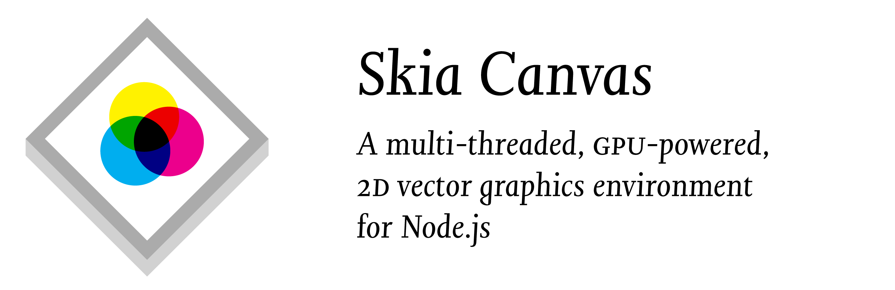

<a href="https://skia-canvas.org">

<picture>
  <source media="(prefers-color-scheme: dark)" srcset="docs/assets/hero-dark@2x.png">
  
</picture>

</a>

---

<div align="center">
  <a href="http://skia-canvas.org/getting-started">Getting Started</a> <span>&nbsp;&nbsp;·&nbsp;&nbsp;</span>
  <a href="http://skia-canvas.org/api">Documentation</a> <span>&nbsp;&nbsp;·&nbsp;&nbsp;</span>
  <a href="http://skia-canvas.org/releases">Release Notes</a>  <span>&nbsp;&nbsp;·&nbsp;&nbsp;</span>
  <a href="https://github.com/samizdatco/skia-canvas/discussions">Discussion Forum</a>
</div>

<div align="center">

<!--### [Version 3.0 now available](https://github.com/samizdatco/skia-canvas/discussions/255)-->

</div>

---

Skia Canvas is an implementation of the [HTML Canvas](https://developer.mozilla.org/en-US/docs/Web/API/Canvas_API) drawing API that runs in [Node.js](https://nodejs.org/en) on Mac, Linux, and Windows systems. Depending on your needs, you can use it as:
  1. **A spec-compliant offscreen canvas:** it accepts the same drawing code you'd write for a browser but can run on servers and in other ‘headless’ contexts to generate image files and buffers.
  2. **A windowing toolkit:** it can open native [windows][window] on macOS, Windows, and Linux with [display-synced][win_animation] drawing and browser-inspired [event handling][win_events].
  3. **A JavaScript interface for the Skia graphics library:** it uses familiar web APIs as a front-end to Google’s sophisticated [imaging engine](https://skia.org), rendering with high-performance native code (and optional GPU acceleration).


### A More Capable Canvas

In addition to being a faithful emulation of the [canvas standard](https://html.spec.whatwg.org/multipage/canvas.html), Skia Canvas includes a raft of extensions, adding 2D capabilities that reach well beyond what the browser’s `<canvas>` can do.

In particular, Skia Canvas can:

  - generate images in vector (PDF & SVG) as well as bitmap (JPEG, PNG, WEBP, & RAW) formats
  - save images to [files][toFile], encode to [dataURL][toURL] strings, and return [Buffers][toBuffer] or [Sharp][sharp] objects
  - create [multiple ‘pages’][newPage] on a given canvas and [output][toFile] them as a multi-page PDF or an image-sequence saved to multiple files
  - load [PDFs & SVGs][loadimage] as scalable vector images or open a [multi-page PDF][loadcanvas] as an editable canvas
  - render in wide-gamut Display P3 color with [CSS Color 4][ctx_colors] syntax support
  - [slice][p2d_slice] & [sample][p2d_points] Path2D objects, combine them with [boolean operators][bool-ops], and decompose them into [contours][p2d_contours], [verbs][edges], or [points][p2d_positionAt]
  - transform coordinates using [3D perspective][createProjection()] in addition to [scaling][scale()], [rotation][rotate()], and [translation][translate()]
  - fill paths with vector-based [Textures][createTexture()] or bitmap [Patterns][createPattern()] and draw strokes with custom [markers][lineDashMarker]
  - apply the full set of [CSS filter][filter] image processing operators
  - provide rich typographic control including:
    - multi-line, [word-wrapped][textwrap] text
    - line-by-line [text metrics][c2d_measuretext]
    - small-caps, ligatures, and other [opentype features][fontfeatures] accessible using standard [font-variant][fontvariant] syntax
    - proportional [letter-spacing][letterSpacing], [word-spacing][wordSpacing], and [leading][c2d_font]
    - support for [variable fonts][VariableFonts] and automatic use of weight, width, and optical-sizing axes
    - use of non-system fonts [loaded][fontlibrary-use] from local files
  - use native threads in a [user-configurable][multithreading] worker pool for asynchronous rendering and file I/O
  - render images server-side on standard Linux hosts and ‘serverless’ platforms like Vercel, Cloudflare Containers, and AWS Lambda

## Installing Skia Canvas

If you’re running on a supported platform, installation should be as simple as:

```bash
npm install skia-canvas
```

For detailed [installation][installation] instructions and runtime [configuration][global_settings] options, take a look at the [Getting Started][getting_started] page.

## Example Usage

Skia Canvas's classes and extensions to the standard are extensively covered in the [API Documentation][api_docs]. But to give you a sense of  some of things you can achieve with it, here are some real-world examples:

### Generating image files

```js
import {Canvas} from 'skia-canvas'

let canvas = new Canvas(400, 400),
    ctx = canvas.getContext("2d"),
    {width, height} = canvas;

// draw an empty box with a gradient at its edges
let sweep = ctx.createConicGradient(Math.PI * 1.2, width/2, height/2)
sweep.addColorStop(0, "red")
sweep.addColorStop(0.25, "orange")
sweep.addColorStop(0.5, "yellow")
sweep.addColorStop(0.75, "green")
sweep.addColorStop(1, "red")
ctx.strokeStyle = sweep
ctx.lineWidth = 100
ctx.strokeRect(100,100, 200,200)

// render to multiple destinations using a background thread...
await canvas.toFile("rainbox.png", {density:2}) // save a ‘retina’ image
let pngData = await canvas.png // use a shorthand for canvas.toBuffer("png")
let pngEmbed = `` // embed it in a string

// ...or save the file synchronously from the main thread
canvas.toFileSync("rainbox.pdf")
```
&nbsp;&nbsp;[*rainbox.png* 👁️](docs/assets/examples/generating-image-files@2x.png)

### Multi-page sequences

```js
import {Canvas, loadCanvas} from 'skia-canvas'

let canvas = new Canvas(400, 400),
    ctx = canvas.getContext("2d"), // leave first page blank
    {width, height} = canvas

for (const color of ['orange', 'yellow', 'green', 'skyblue', 'purple']){
  ctx = canvas.newPage() // add pages 2–6
  ctx.fillStyle = color
  ctx.fillRect(0,0, width, height)
  ctx.fillStyle = 'white'
  ctx.arc(width/2, height/2, 40, 0, 2 * Math.PI)
  ctx.fill()
}

await canvas.toFile("page-{2}.png")  // save to files named `page-01.png`, `page-02.png`, etc.
await canvas.toFile("all-pages.pdf") // save to a single multi-page PDF file

// the multi-page PDF can be read back in and even drawn upon
let multipage = await loadCanvas("all-pages.pdf")
for (let [i, pg] of multipage.pages.entries()){
  pg.font = 'italic 12px serif'
  pg.textAlign = 'center'
  pg.textBaseline = 'middle'
  pg.fillText(`p. ${i+1}`, multipage.width/2, multipage.height/2)
}
await multipage.toFile("all-pages-labeled.pdf")
```
&nbsp;&nbsp;[*all-pages-labeled.pdf* 👁️](docs/assets/examples/multi-page-sequences.pdf)

### Rendering to a window

```js
import {Window} from 'skia-canvas'

let win = new Window(300, 300)
win.title = "Canvas Window"
win.on("draw", e => {
  let ctx = e.target.canvas.getContext("2d")
  ctx.lineWidth = 25 + 25 * Math.cos(e.frame / 10)
  ctx.beginPath()
  ctx.arc(150, 150, 50, 0, 2 * Math.PI)
  ctx.stroke()

  ctx.beginPath()
  ctx.arc(150, 150, 10, 0, 2 * Math.PI)
  ctx.stroke()
  ctx.fill()
})
```
&nbsp;&nbsp;[*screenshot* 👁️](docs/assets/examples/rendering-to-a-window@2x.png)


### Wide-gamut colors

```js
import {Canvas} from 'skia-canvas'

let pad = 16, size = 64, width = 4*size + 3*pad,
    canvas = new Canvas(336, 240),
    ctx = canvas.getContext("2d", {colorSpace:"display-p3"})

// CSS Color 4 syntax is supported everywhere (and colors can exceed the sRGB gamut)
for (let [p3, srgb] of [
  ["color(display-p3 1 0 0)", "#ff0000"], ["lch(75% 100 150)", "#00dc51"],
  ["lch(85% 80 170)", "#00f8b6"], ["color(display-p3 0 1 1)", "#00ffff"]
]){
  ctx.fillStyle = p3 // wide gamut color
  ctx.fillRect(pad, pad, size, size/2)
  ctx.fillStyle = srgb  // nearest sRGB equivalent
  ctx.fillRect(pad, pad + size/2, size, size/2)
  ctx.translate(size + pad, 0)
}
ctx.translate(-width, pad + size)

// gradients can select the color space used for interpolation
for (let {space, from, to, hue} of [
  {space:"srgb",  from:"navy", to:"gold"}, // perceptual midpoint is off-center
  {space:"oklab", from:"navy", to:"gold"}, // Oklab stays perceptually uniform
  {space:"oklch", from:"red",  to:"red", hue:"longer"}, // full 360° from a single hue
]){
  let ramp = ctx.createLinearGradient(0, pad, width, pad)
  if (hue) ramp.hueInterpolationMethod = hue // only applies to angle-based spaces
  ramp.colorInterpolationMethod = space
  ramp.addColorStop(0, from)
  ramp.addColorStop(1, to)
  ctx.fillStyle = ramp
  ctx.fillRect(0, pad, width, size/2)
  ctx.translate(0, pad + size/2)
}

await canvas.toFile("test-pattern.png")
```

&nbsp;&nbsp;[*test-pattern.png* 👁️](docs/assets/examples/wide-gamut-colors@2x.png)

### Integrating with [Sharp.js][sharp]

```js
import sharp from 'sharp'
import {Canvas, loadImage} from 'skia-canvas'

let canvas = new Canvas(400, 400),
    ctx = canvas.getContext("2d"),
    {width, height} = canvas,
    [x, y] = [width/2, height/2]

ctx.fillStyle = 'red'
ctx.fillRect(0, 0, x, y)
ctx.fillStyle = 'orange'
ctx.fillRect(x, y, x, y)

// Render the canvas to a Sharp object on a background thread then desaturate
await canvas.toSharp().modulate({saturation:.25}).jpeg().toFile("faded.jpg")

// Convert an ImageData to a Sharp object and save a grayscale version
let imgData = ctx.getImageData(0, 0, width, height, {matte:'white', density:2})
await imgData.toSharp().grayscale().png().toFile("black-and-white.png")

// Create an image using Sharp then draw it to the canvas as an Image object
let sharpImage = sharp({create:{ width:x, height:y, channels:4, background:"skyblue" }})
let canvasImage = await loadImage(sharpImage)
ctx.drawImage(canvasImage, x, 0)
await canvas.toFile('mosaic.png')
```

&nbsp;&nbsp;[*sharp exports* 👁️](docs/assets/examples/integrating-with-sharp@2x.png)

## Benchmarks
In these benchmarks, Skia Canvas is tested running in two modes: serial and async. When running serially, each rendering operation is awaited before continuing to the next test iteration. When running asynchronously, all the test iterations are begun at once and are executed in parallel using the library’s multi-threading support.

[See full results here…](https://github.com/samizdatco/canvas-benchmarks/blob/main/results/darwin-arm64/2025-09-26/index.md)

### [Startup latency](https://github.com/samizdatco/canvas-benchmarks/tree/main/tests/cold-start.js)
| Library              | Per Run   | Total Time (100 iterations)                   |
| -------------------- | --------- | --------------------------------------------- |
| *canvaskit-wasm*     | `  25 ms` | ` 2.47 s`       |
| *canvas*             | `  88 ms` | ` 8.77 s`     |
| *@napi-rs/canvas*    | `  69 ms` | ` 6.87 s`       |
| *skia-canvas*        | `  <1 ms` | `  33 ms`  |

### [Bezier curves](https://github.com/samizdatco/canvas-benchmarks/tree/main/tests/beziers.js)
| Library                                                       | Per Run   | Total Time (20 iterations)                  |
| ------------------------------------------------------------- | --------- | ------------------------------------------- |
| *canvaskit-wasm* [👁️](https://github.com/samizdatco/canvas-benchmarks/blob/main/results/darwin-arm64/2025-09-26/snapshots/beziers_wasm.png)            | ` 790 ms` | `15.81 s`        |
| *canvas* [👁️](https://github.com/samizdatco/canvas-benchmarks/blob/main/results/darwin-arm64/2025-09-26/snapshots/beziers_canvas.png)                  | ` 486 ms` | ` 9.72 s`      |
| *@napi-rs/canvas* [👁️](https://github.com/samizdatco/canvas-benchmarks/blob/main/results/darwin-arm64/2025-09-26/snapshots/beziers_napi.png)           | ` 230 ms` | ` 4.60 s`        |
| *skia-canvas (serial)* [👁️](https://github.com/samizdatco/canvas-benchmarks/blob/main/results/darwin-arm64/2025-09-26/snapshots/beziers_skia-sync.png) | ` 137 ms` | ` 2.74 s`   |
| *skia-canvas (async)* [👁️](https://github.com/samizdatco/canvas-benchmarks/blob/main/results/darwin-arm64/2025-09-26/snapshots/beziers_skia-async.png) | `  28 ms` | ` 558 ms`  |

### [SVG to PNG](https://github.com/samizdatco/canvas-benchmarks/tree/main/tests/from-svg.js)
| Library                                                        | Per Run   | Total Time (100 iterations)                  |
| -------------------------------------------------------------- | --------- | -------------------------------------------- |
| canvaskit-wasm                                                 | ` ————— ` | ` ————— `   *not supported*                  |
| *canvas* [👁️](https://github.com/samizdatco/canvas-benchmarks/blob/main/results/darwin-arm64/2025-09-26/snapshots/from-svg_canvas.png)                  | ` 122 ms` | `12.16 s`      |
| *@napi-rs/canvas* [👁️](https://github.com/samizdatco/canvas-benchmarks/blob/main/results/darwin-arm64/2025-09-26/snapshots/from-svg_napi.png)           | `  84 ms` | ` 8.42 s`        |
| *skia-canvas (serial)* [👁️](https://github.com/samizdatco/canvas-benchmarks/blob/main/results/darwin-arm64/2025-09-26/snapshots/from-svg_skia-sync.png) | `  58 ms` | ` 5.83 s`   |
| *skia-canvas (async)* [👁️](https://github.com/samizdatco/canvas-benchmarks/blob/main/results/darwin-arm64/2025-09-26/snapshots/from-svg_skia-async.png) | `  11 ms` | ` 1.08 s`  |

### [Scale/rotate images](https://github.com/samizdatco/canvas-benchmarks/tree/main/tests/image-blit.js)
| Library                                                          | Per Run   | Total Time (50 iterations)                     |
| ---------------------------------------------------------------- | --------- | ---------------------------------------------- |
| *canvaskit-wasm* [👁️](https://github.com/samizdatco/canvas-benchmarks/blob/main/results/darwin-arm64/2025-09-26/snapshots/image-blit_wasm.png)            | ` 274 ms` | `13.72 s`        |
| *canvas* [👁️](https://github.com/samizdatco/canvas-benchmarks/blob/main/results/darwin-arm64/2025-09-26/snapshots/image-blit_canvas.png)                  | ` 283 ms` | `14.13 s`      |
| *@napi-rs/canvas* [👁️](https://github.com/samizdatco/canvas-benchmarks/blob/main/results/darwin-arm64/2025-09-26/snapshots/image-blit_napi.png)           | ` 112 ms` | ` 5.60 s`        |
| *skia-canvas (serial)* [👁️](https://github.com/samizdatco/canvas-benchmarks/blob/main/results/darwin-arm64/2025-09-26/snapshots/image-blit_skia-sync.png) | ` 100 ms` | ` 5.00 s`   |
| *skia-canvas (async)* [👁️](https://github.com/samizdatco/canvas-benchmarks/blob/main/results/darwin-arm64/2025-09-26/snapshots/image-blit_skia-async.png) | `  19 ms` | ` 935 ms`  |

### [Basic text](https://github.com/samizdatco/canvas-benchmarks/tree/main/tests/text.js)
| Library                                                    | Per Run   | Total Time (200 iterations)              |
| ---------------------------------------------------------- | --------- | ---------------------------------------- |
| *canvaskit-wasm* [👁️](https://github.com/samizdatco/canvas-benchmarks/blob/main/results/darwin-arm64/2025-09-26/snapshots/text_wasm.png)            | `  24 ms` | ` 4.75 s`        |
| *canvas* [👁️](https://github.com/samizdatco/canvas-benchmarks/blob/main/results/darwin-arm64/2025-09-26/snapshots/text_canvas.png)                  | `  24 ms` | ` 4.88 s`      |
| *@napi-rs/canvas* [👁️](https://github.com/samizdatco/canvas-benchmarks/blob/main/results/darwin-arm64/2025-09-26/snapshots/text_napi.png)           | `  19 ms` | ` 3.83 s`        |
| *skia-canvas (serial)* [👁️](https://github.com/samizdatco/canvas-benchmarks/blob/main/results/darwin-arm64/2025-09-26/snapshots/text_skia-sync.png) | `  21 ms` | ` 4.26 s`   |
| *skia-canvas (async)* [👁️](https://github.com/samizdatco/canvas-benchmarks/blob/main/results/darwin-arm64/2025-09-26/snapshots/text_skia-async.png) | `   4 ms` | ` 819 ms`  |

## Acknowledgements

This project is deeply indebted to the work of the [Rust Skia project](https://github.com/rust-skia/rust-skia) whose Skia bindings provide a safe and idiomatic interface to the mess of C++ that lies underneath. Many thanks to the developers of [node-canvas](https://github.com/Automattic/node-canvas) for their terrific set of unit tests. In the absence of an [Acid Test](https://www.acidtests.org) for canvas, these routines were invaluable.


### Notable contributors

- [@mpaparno](https://github.com/mpaparno) contributed support for SVG rendering, raw image-buffer handling, WEBP import/export and numerous bug fixes
- [@Salmondx](https://github.com/Salmondx) developed the initial Raw image loading & rendering routines
- [@lucasmerlin](https://github.com/lucasmerlin) helped get GPU rendering working on Vulkan
- [@cprecioso](https://github.com/cprecioso) & [@saantonandre](https://github.com/saantonandre) corrected and expanded upon the TypeScript type definitions
- [@meihuanyu](https://github.com/meihuanyu) contributed filter & path rendering fixes

## Copyright
© 2020–2026 [Samizdat Drafting Co.](https://samizdat.co)

[bool-ops]: https://skia-canvas.org/api/path2d#complement-difference-intersect-union-xor
[c2d_font]: https://skia-canvas.org/api/context#font
[c2d_measuretext]: https://skia-canvas.org/api/context#measuretext
[createProjection()]: https://skia-canvas.org/api/context#createprojection
[createTexture()]: https://skia-canvas.org/api/context#createtexture
[edges]: https://skia-canvas.org/api/path2d#edges
[fontlibrary-use]: https://skia-canvas.org/api/font-library#use
[fontvariant]: https://skia-canvas.org/api/context#fontvariant
[fontfeatures]: https://skia-canvas.org/api/context#fontfeaturesettings
[lineDashMarker]: https://skia-canvas.org/api/context#linedashmarker
[loadimage]: https://skia-canvas.org/api/image#loadimage
[newPage]: https://skia-canvas.org/api/canvas#newpage
[p2d_contours]: https://skia-canvas.org/api/path2d#contours
[p2d_points]: https://skia-canvas.org/api/path2d#points
[p2d_positionAt]: https://skia-canvas.org/api/path2d#positionat
[p2d_slice]: https://skia-canvas.org/api/path2d#slice
[toFile]: https://skia-canvas.org/api/canvas#tofile
[textwrap]: https://skia-canvas.org/api/context#textwrap
[toBuffer]: https://skia-canvas.org/api/canvas#tobuffer
[toURL]: https://skia-canvas.org/api/canvas#tourl
[win_events]: https://skia-canvas.org/api/window#events
[win_animation]: https://skia-canvas.org/api/window#events-for-animation
[window]: https://skia-canvas.org/api/window
[loadcanvas]: https://skia-canvas.org/api/canvas#loadcanvas
[ctx_colors]: https://skia-canvas.org/api/context#choosing-colors
[api_docs]: https://skia-canvas.org/api
[getting_started]: https://skia-canvas.org/getting-started
[installation]: https://skia-canvas.org/getting-started#installation
[global_settings]: https://skia-canvas.org/getting-started#global-settings
[multithreading]: https://skia-canvas.org/getting-started#multithreading
[sharp]: https://sharp.pixelplumbing.com
[VariableFonts]: https://developer.mozilla.org/en-US/docs/Web/CSS/CSS_Fonts/Variable_Fonts_Guide
[filter]: https://developer.mozilla.org/en-US/docs/Web/API/CanvasRenderingContext2D/filter
[letterSpacing]: https://developer.mozilla.org/en-US/docs/Web/API/CanvasRenderingContext2D/letterSpacing
[wordSpacing]: https://developer.mozilla.org/en-US/docs/Web/API/CanvasRenderingContext2D/wordSpacing
[createPattern()]: https://developer.mozilla.org/en-US/docs/Web/API/CanvasRenderingContext2D/createPattern
[rotate()]: https://developer.mozilla.org/en-US/docs/Web/API/CanvasRenderingContext2D/rotate
[scale()]: https://developer.mozilla.org/en-US/docs/Web/API/CanvasRenderingContext2D/scale
[translate()]: https://developer.mozilla.org/en-US/docs/Web/API/CanvasRenderingContext2D/translate
