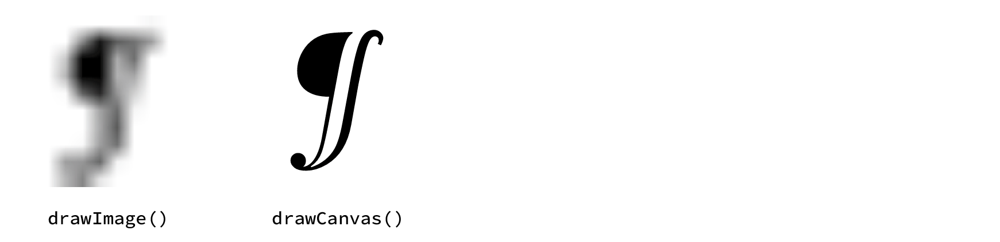
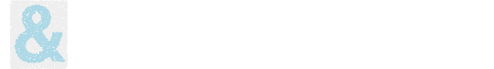

# CanvasRenderingContext2D

Most of your interaction with the canvas will actually be directed toward its ‘rendering context’, a supporting object you can acquire by calling the canvas’s [getContext()](https://developer.mozilla.org/en-US/docs/Web/API/HTMLCanvasElement/getContext) and [newPage()][newPage] methods.

| Canvas State                           | Drawing                                      | Pattern & Color                                  | Line Style                              | Transform                                         | Bezier Paths                             | Typography                                           | Images                                             | Compositing Effects                                      |
|----------------------------------------|----------------------------------------------|--------------------------------------------------|-----------------------------------------|---------------------------------------------------|------------------------------------------|------------------------------------------------------|----------------------------------------------------|----------------------------------------------------------|
| [**canvas**][canvas_attr] [🧪][canvas] | [clearRect()][clearRect()]                   | [**fillStyle**][fillStyle]                       | [**lineCap**][lineCap]                  | [**currentTransform**][currentTransform]          | [moveTo()][moveTo()]                     | [**direction**][direction]                           | [**imageSmoothingEnabled**][imageSmoothingEnabled] | [**filter**][filter]                                     |
| [beginPath()][beginPath()]             | [fillRect()][fillRect()]                     | [**strokeStyle**][strokeStyle]                   | [**lineDashFit** 🧪][lineDashFit]       | [createProjection() 🧪][createProjection()]       | [lineTo()][lineTo()]                     | [**font**][font] [🧪][c2d_font]                      | [**imageSmoothingQuality**][imageSmoothingQuality] | [**globalAlpha**][globalAlpha]                           |
| [closePath()][closePath()]             | [strokeRect()][strokeRect()]                 | [createConicGradient()][createConicGradient()]   | [**lineDashMarker** 🧪][lineDashMarker] | [getTransform()][getTransform()]                  | [arcTo()][arcTo()]                       | [**fontVariant** 🧪][fontvariant]                    | [createImageData()][createImageData()]             | [**globalCompositeOperation**][globalCompositeOperation] |
| [isPointInPath()][isPointInPath()]     | [fillText()][fillText()] ⧸[🧪][drawText]     | [createLinearGradient()][createLinearGradient()] | [**lineDashOffset**][lineDashOffset]    | [setTransform()][setTransform()]⧸[🧪][transforms] | [bezierCurveTo()][bezierCurveTo()]       | [**fontStretch**][fontStretch]                       | [getImageData()][getImageData()]                   | [**shadowBlur**][shadowBlur]                             |
| [isPointInStroke()][isPointInStroke()] | [strokeText()][strokeText()] ⧸[🧪][drawText] | [createRadialGradient()][createRadialGradient()] | [**lineJoin**][lineJoin]                | [resetTransform()][resetTransform()]              | [conicCurveTo() 🧪][conicCurveTo]        | [**letterSpacing**][letterSpacing]                   | [putImageData()][putImageData()]                   | [**shadowColor**][shadowColor]                           |
| [save()][save()]                       | [fill()][fill()]                             | [createPattern()][createPattern()]               | [**lineWidth**][lineWidth]              | [transform()][transform()] ⧸[🧪][transforms]      | [quadraticCurveTo()][quadraticCurveTo()] | [**wordSpacing**][wordSpacing]                       | [drawCanvas() 🧪][drawcanvas]                      | [**shadowOffsetX**][shadowOffsetX]                       |
| [restore()][restore()]                 | [stroke()][stroke()]                         | [createTexture() 🧪][createTexture()]            | [**miterLimit**][miterLimit]            | [translate()][translate()]                        | [arc()][arc()]                           | [**textAlign**][textAlign]                           | [drawImage()][drawImage()]                         | [**shadowOffsetY**][shadowOffsetY]                       |
| [reset()][reset()]                     |                                              |                                                  | [getLineDash()][getLineDash()]          | [rotate()][rotate()]                              | [ellipse()][ellipse()]                   | [**textBaseline**][textBaseline]                     |                                                    |                                                          |
| [clip()][clip()]                       |                                              |                                                  | [setLineDash()][setLineDash()]          | [scale()][scale()]                                | [rect()][rect()]                         | [**textWrap** 🧪][textwrap]                          |                                                    |                                                          |
|                                        |                                              |                                                  |                                         |                                                   | [roundRect()][roundRect()]               | [measureText()][measureText()] [🧪][c2d_measuretext] |                                                    |                                                          |
|                                        |                                              |                                                  |                                         |                                                   |                                          | [outlineText() 🧪][outlineText()]                    |                                                    |                                                          |


## Properties

### `.font`

By default any [`line-height`][lineHeight] value included in a font specification (separated from the font size by a `/`) will be preserved but ignored. If the `textWrap` property is set to `true`, the line-height will control the vertical spacing between lines.

### `.fontVariant`

The context’s [`.font`][font] property follows the CSS 2.1 standard and allows the selection of only a single font-variant type: `normal` vs `small-caps`. The full range of CSS 3 [font-variant][font-variant] values can be used if assigned to the context’s `.fontVariant` property (presuming the currently selected font supports them). Note that setting `.font` will also update the current `.fontVariant` value, so be sure to set the variant *after* selecting a typeface.

### ~~`.textTracking`~~

**The textTracking property has been removed** and replaced with the now-standard [`letterSpacing`][letterSpacing] property.

### `.textWrap`

The standard canvas has a rather impoverished typesetting system, allowing for only a single line of text and an approach to width-management that horizontally scales the letterforms (a type-crime if ever there was one). Skia Canvas allows you to opt-out of this single-line world by setting the `.textWrap` property to `true`. Doing so affects the behavior of the `fillText()`, `strokeText()`, and `measureText()`


### `.lineDashMarker`

If a Path2D object is assigned to the context’s `lineDashMarker` property, it will be used instead of the default dash pattern when [`setLineDash`][setLineDash()] has been set to a non-empty value. The marker will be drawn at evenly spaced intervals along the path with the distance controlled by the first number in the `setLineDash` array—any subsequent values are ignored.

The marker should be a Path2D object centered on (0, 0). Points to the right of the origin will run parallel to the path being stroked. If the marker path ends with a [`closePath()`][p2d_closePath], the marker will be filled using the current [`strokeStyle`][strokeStyle]. if the path is not closed, it will be stroked using the current [`lineWidth`][lineWidth]/[`join`][lineJoin]/[`cap`][lineCap], [`miterLimit`][miterLimit], and [`strokeStyle`][strokeStyle].

```js
// define marker paths
let caret = new Path2D()
caret.moveTo(-8,-8)
caret.lineTo( 0, 0)
caret.lineTo(-8, 8)

let dot = new Path2D()
dot.arc(0, 0, 4, 0, 2*Math.PI)
dot.closePath() // use fill rather than stroke

let cross = new Path2D()
cross.moveTo(-6,-6)
cross.lineTo( 6, 6)
cross.moveTo(-6, 6)
cross.lineTo( 6,-6)

// draw arcs using different markers
function drawArc(x, color){
  ctx.strokeStyle = color
  ctx.lineWidth = 4
  ctx.beginPath()
  ctx.arc(x + 120, 120, 100, -Math.PI, -Math.PI/2)
  ctx.stroke()
}

ctx.setLineDash([20])
drawArc(0, "orange")

ctx.lineDashMarker = caret
drawArc(100, "deepskyblue")

ctx.lineDashMarker = dot
drawArc(200, "limegreen")

ctx.lineDashMarker = cross
drawArc(300, "red")

ctx.setLineDash([])
drawArc(400, "#aaa")

```


### `.lineDashFit`

The `lineDashFit` attribute can be set to `"move"`, `"turn"`, or `"follow"` and controls how the marker is transformed with each repetition along the path. `"move"`  and `"turn"` use simple translation and rotation, whereas `"follow"` will bend the marker to match the dashed path's contours.

------

## Methods

### `conicCurveTo()`

```js returns="void"
conicCurveTo(cpx, cpy, x, y, weight)
```

Adds a line segment connecting the current point to (*x, y*) but curving toward the control point (*cpx, cpy*) along the way. The `weight` argument controls how close the curve will come to the control point. If the weight is `0`, the result will be a straight line from the current point to (*x, y*). With a weight of `1.0`, the function is equivalent to calling `quadraticCurveTo()`. Weights greater than `1.0` will pull the line segment ever closer to the control point.

### `createProjection()`
```js returns="DOMMatrix"
createProjection(quad, [basis])
```

This method returns a [DOMMatrix][DOMMatrix] object which can be used to simulate perspective effects or other distortions in which the four corners of the canvas are mapped to an arbitrary quadrilateral (four sided polygon). The matrix must be passed to the context's [setTransform][setTransform()] method for it take effect.

#### `quad`

The `quad` argument defines the **target** of the transformation. It specifies four points that establish where the four corners of the source coordinate space will be positioned within the viewport. If these points form a polygon other than a rectangle, lines drawn along the x & y axes of the source space will no longer be perpendicular—trapezoids allow for ‘vanishing point’ effects and parallelograms create ‘skew’.

The geometry of the quadrilateral should be described as an Array of either 8 or 4 numbers specifying an arbitrary polygon or rectangle respectively:

```js
[x1, y1, x2, y2, x3, y3, x4, y4] // four corner points
[left, top, right, bottom] // four edges of a rectangle

// internal arrays for grouping are also allowed
[[x1, y1], [x2, y2], [x3, y3], [x4, y4]]
```

#### `basis`

The optional `basis` argument defines the **source** quadrilateral whose corners will be mapped to the positions defined by `quad`. If no `basis` is specified, the canvas's bounding box will be used (i.e., the rectangle from ⟨`0`, `0`⟩ to ⟨`canvas.width`, `canvas.height`⟩). Note that drawing commands that go outside of the `basis` region may well be visible—it only establishes the geometry of the projection, not the [clipping][clip()] path.

The `basis` polygon can be described using 2, 4, or 8 numbers, using the canvas dimensions to fill in the unspecified coordinates:
```js
[width, height] // rectangle from ⟨0, 0⟩ to ⟨width, height⟩
[left, top, right, bottom] // four edges of a rectangle
[x1, y1, x2, y2, x3, y3, x4, y4] // four corner points
```

----

The projection matrix will apply to all types of drawing: shapes, images, and text. This example transforms a white box and red `"@"` character into a trapezoid bounded by the vertical midline of the canvas and its left and right edges. Since no `basis` argument is provided, it will default to using the current canvas bounds as the rectangle to be mapped onto that trapezoid.

```js
let canvas = new Canvas(512, 512),
    ctx = canvas.getContext("2d"),
    {width:w, height:h} = canvas;
ctx.font = '900 480px Times'
ctx.textAlign = 'center'
ctx.fillStyle = '#aaa'
ctx.fillRect(0, 0, w, h)

let quad = [
  w*.33, h/2,  // upper left
  w*.66, h/2,  // upper right
  w,     h*.9, // bottom right
  0,     h*.9, // bottom left
]

let matrix = ctx.createProjection(quad) // use default basis
ctx.setTransform(matrix)

ctx.fillStyle = 'white'
ctx.fillRect(10, 10, w-20, h-20)

ctx.fillStyle = '#900'
ctx.fillText("@", w/2, h-40)

```

The results below show the image generated when the `createProjection()` call is omitted entirely, called (as above) with just a `quad` argument, or called with two different values for the optional `basis` argument:


### `transform()` & `setTransform()`
```js
transform(...matrix)
setTransform(...matrix)
```

These behave just like the standard [transform][transform()] and [setTransform][setTransform()] methods, but can accept their matrix argument in a variety of forms:
- a [DOMMatrix][DOMMatrix] object
- a [CSS transform][css_transform] string (supporting all [transform functions][css_transform_fns] except `perspective`)
- a matrix-like object with numeric attributes named `a`, `b`, `c`, `d`, `e`, & `f`
- a 6-element array of numbers
- 6 individual numeric arguments

For example all of these invocations result in setting the context to the same transform state:

```js
ctx.setTransform(new DOMMatrix().scale(2, .5).rotate(180).translate(10, 10)) // DOMMatrix
ctx.setTransform('scale(2, 50%) rotate(180deg) translate(10, 10)') // CSS transform
ctx.setTransform({a:-2, b:0, c:0, d:-0.5, e:-20, f:-40}) // matrix-like object
ctx.setTransform([-2, 0, 0, -0.5, -20, -40]) // array
ctx.setTransform(-2, 0, 0, -0.5, -20, -40) // numeric arguments
```
### `createTexture()`
```js returns="CanvasTexture"
createTexture(spacing, {path, line, color, angle, offset=0})
```

The `createTexture()` method returns a `CanvasTexture` object that can be assigned to the context’s `strokeStyle` or `fillStyle` property. Similar to a `CanvasPattern`, a `CanvasTexture` defines a repeating pattern that will be drawn instead of a flat color, but textures define their content using *vectors* rather than bitmaps.

Textures can be based on a user-provided Path2D object or will draw a stripe pattern of parallel lines if a path isn’t provided.

#### `spacing`

The `spacing` argument is required and defines the rectangular area that each repeating ‘tile’ in the pattern will occupy. It can either be a single number (which will be used for both dimensions) or an array with two numbers (width and height). When creating a stripe pattern, the `spacing` argument defines the distance between neighboring lines, so providing more than one value is unnecessary.

**The optional second argument can be an object with one or more of the following attributes:**

#### `path`
If set to a Path2D object, the `path` will be drawn once per tile with its origin in the upper left corner of each tile. Note that the path will not be clipped even if it extends beyond the bounds of the current tile, allowing you to overlap the texture with neighboring tiles.

#### `line`
If set to a positive number, the path will be stroked rather than filled and the `line` value will set the width of the stroke.

#### `color`
By default the texture will be drawn in black (filled if `line` is undefined, stroked otherwise). The `color` argument can be set to a string defining the stroke/fill color to be used instead.

#### `angle`
The rectangle defined by the `spacing` argument will be aligned with the canvas’s horizontal and vertical axes by default. Specifying an `angle` value (in radians) allows you to rotate this tile grid clockwise relative to its default orientation.

#### `offset`
As with `CanvasPattern` objects, textures are positioned globally relative to the upper left corner of the canvas—not the corner of the object currently being filled or stroked. To fine-tune the texture’s alignment with individual objects, set the `offset` argument to an `[x, y]` array with two numbers that will shift the texture relative to its origin.

### `drawCanvas()`
```js
drawCanvas(canvas, x, y)
drawCanvas(canvas, x, y, width, height)
drawCanvas(canvas, srcX, srcY, srcWidth, srcHeight, x, y, width, height)
```

This method behaves identically to the standard [`drawImage()`][drawImage()] function with one key difference: if the first argument is a canvas, it will not be converted to a bitmap before being drawn. Instead its contents will be added to the canvas as resolution-independent vector graphics. This is especially useful when scaling or rotating since it preserves the fidelity of text, patterns, and gradients from the source canvas.

```js
let src = new Canvas(10, 10),
    srcCtx = src.getContext("2d");
srcCtx.font = 'italic 10px Times'
srcCtx.fillText('¶', 2, 8)

let dst = new Canvas(350, 150),
    dstCtx = dst.getContext("2d");
dstCtx.drawImage(src, 0, 0, 150, 150)
dstCtx.drawCanvas(src, 200, 0, 150, 150)
```


### `fillText()` & `strokeText()`
```js
fillText(str, x, y, [width])
strokeText(str, x, y, [width])
```

The text-drawing methods’ behavior is mostly standard unless `.textWrap` has been set to `true`, in which case there are 3 main effects:

  1. Manual line breaking via `"\n"` escapes will be honored rather than converted to spaces
  2. The optional `width` argument accepted by `fillText`, `strokeText` and `measureText` will be interpreted as a ‘column width’ and used to word-wrap long lines
  3. The line-height setting in the `.font` value will be used to set the inter-line leading rather than simply being ignored.

Even when `.textWrap` is `false`, the text-drawing methods will never choose a more-condensed weight or otherwise attempt to squeeze your entire string into the measure specified by `width`. Instead the text will be typeset up through the last word that fits and the rest will be omitted. This can be used in conjunction with the `.lines` property of the object returned by `measureText()` to incrementally lay out a long string into, for example, a multi-column layout with an even number of lines in each.

### `measureText()`
```js returns="TextMetrics"
measureText(str, [width])
```

The `measureText()` method returns a [TextMetrics][TextMetrics] object describing the dimensions of a run of text *without* actually drawing it to the canvas. Skia Canvas adds an additional property to the metrics object called `.lines` which contains an array describing the geometry of each line individually.

Each element of the `.lines` array contains an object of the form:
```
{x, y, width, height, baseline, startIndex, endIndex}
```
The `x`, `y`, `width`, and `height` values define a rectangle that fully encloses the text of a given line relative to the ‘origin’ point you would pass to `fillText()` or `strokeText()` (and reflecting the context’s current `.textBaseline` setting).

The `baseline` value is a y-axis offset from the text origin to that particular line’s baseline.

The `startIndex` and `endIndex` values are the indices into the string of the first and last character that were typeset on that line.

### `outlineText()`
```js returns="Path2D"
outlineText(str, [width])
```

The `outlineText()` method typesets a string and returns a Path2D containing the shapes of its character glyphs. It will use the context’s current typography settings (e.g., [`.font`][font],[`.textWrap`][textwrap], [`.textAlign`][textAlign] [`.textBaseline`][textBaseline], etc.) to style the string and will anchor the text relative to the (0, 0) origin point. As a result, you’ll typically want to use the context’s transform-related methods or Path2D’s [`offset()`][p2d_offset] and [`transform()`][p2d_transform] to position the path before drawing it to the canvas.

As with the [`fillText()`][drawText] and [`strokeText()`][drawText] methods, `outlineText()` will produce a single line of text unless `.textWrap` is enabled and will use the optional `width` argument to determine the maximum line width. If a `width` is specified but `.textWrap` is *not* enabled, any text that doesn't fit within that measure will be omitted from the path.

```js
ctx.textBaseline = 'top'
ctx.font = 'bold 140px Helvetica'
let ampersand = ctx.outlineText('&')

for (let i=0; i<8000; i++){
  let x = Math.random() * 100,
      y = Math.random() * 120;
  ctx.fillStyle = path.contains(x, y) ? 'lightblue' : '#eee'
  ctx.fillRect(x, y, 2, 2)
}
```


<!-- references_begin -->
[c2d_font]: #font
[c2d_measuretext]: #measuretext
[canvas]: canvas.md
[conicCurveTo]: #coniccurveto
[createProjection()]: #createprojection
[createTexture()]: #createtexture
[drawText]: #filltext--stroketext
[drawcanvas]: #drawcanvas
[fontvariant]: #fontvariant
[lineDashFit]: #linedashfit
[lineDashMarker]: #linedashmarker
[newPage]: #newpage
[outlineText()]: #outlinetext
[p2d_offset]: path2d.md#offset
[p2d_transform]: path2d.md#transform
[textwrap]: #textwrap
[transforms]: #transform--settransform
[reset()]: https://developer.chrome.com/blog/canvas2d/#context-reset
[roundRect()]: https://developer.chrome.com/blog/canvas2d/#round-rect
[p2d_closePath]: https://developer.mozilla.org/en-US/docs/Web/API/CanvasRenderingContext2D/closePath
[css_transform]: https://developer.mozilla.org/en-US/docs/Web/CSS/transform
[css_transform_fns]: https://developer.mozilla.org/en-US/docs/Web/CSS/transform-function
[TextMetrics]: https://developer.mozilla.org/en-US/docs/Web/API/TextMetrics
[DOMMatrix]: https://developer.mozilla.org/en-US/docs/Web/API/DOMMatrix
[lineHeight]: https://developer.mozilla.org/en-US/docs/Web/CSS/line-height
[font-variant]: https://developer.mozilla.org/en-US/docs/Web/CSS/font-variant
[canvas_attr]: https://developer.mozilla.org/en-US/docs/Web/API/CanvasRenderingContext2D/canvas
[currentTransform]: https://developer.mozilla.org/en-US/docs/Web/API/CanvasRenderingContext2D/currentTransform
[direction]: https://developer.mozilla.org/en-US/docs/Web/API/CanvasRenderingContext2D/direction
[fillStyle]: https://developer.mozilla.org/en-US/docs/Web/API/CanvasRenderingContext2D/fillStyle
[filter]: https://developer.mozilla.org/en-US/docs/Web/API/CanvasRenderingContext2D/filter
[font]: https://developer.mozilla.org/en-US/docs/Web/API/CanvasRenderingContext2D/font
[fontStretch]: https://developer.mozilla.org/en-US/docs/Web/API/CanvasRenderingContext2D/fontStretch
[globalAlpha]: https://developer.mozilla.org/en-US/docs/Web/API/CanvasRenderingContext2D/globalAlpha
[globalCompositeOperation]: https://developer.mozilla.org/en-US/docs/Web/API/CanvasRenderingContext2D/globalCompositeOperation
[imageSmoothingEnabled]: https://developer.mozilla.org/en-US/docs/Web/API/CanvasRenderingContext2D/imageSmoothingEnabled
[imageSmoothingQuality]: https://developer.mozilla.org/en-US/docs/Web/API/CanvasRenderingContext2D/imageSmoothingQuality
[lineCap]: https://developer.mozilla.org/en-US/docs/Web/API/CanvasRenderingContext2D/lineCap
[lineDashOffset]: https://developer.mozilla.org/en-US/docs/Web/API/CanvasRenderingContext2D/lineDashOffset
[lineJoin]: https://developer.mozilla.org/en-US/docs/Web/API/CanvasRenderingContext2D/lineJoin
[lineWidth]: https://developer.mozilla.org/en-US/docs/Web/API/CanvasRenderingContext2D/lineWidth
[miterLimit]: https://developer.mozilla.org/en-US/docs/Web/API/CanvasRenderingContext2D/miterLimit
[shadowBlur]: https://developer.mozilla.org/en-US/docs/Web/API/CanvasRenderingContext2D/shadowBlur
[shadowColor]: https://developer.mozilla.org/en-US/docs/Web/API/CanvasRenderingContext2D/shadowColor
[shadowOffsetX]: https://developer.mozilla.org/en-US/docs/Web/API/CanvasRenderingContext2D/shadowOffsetX
[shadowOffsetY]: https://developer.mozilla.org/en-US/docs/Web/API/CanvasRenderingContext2D/shadowOffsetY
[strokeStyle]: https://developer.mozilla.org/en-US/docs/Web/API/CanvasRenderingContext2D/strokeStyle
[textAlign]: https://developer.mozilla.org/en-US/docs/Web/API/CanvasRenderingContext2D/textAlign
[textBaseline]: https://developer.mozilla.org/en-US/docs/Web/API/CanvasRenderingContext2D/textBaseline
[letterSpacing]: https://developer.mozilla.org/en-US/docs/Web/API/CanvasRenderingContext2D/letterSpacing
[wordSpacing]: https://developer.mozilla.org/en-US/docs/Web/API/CanvasRenderingContext2D/wordSpacing
[arc()]: https://developer.mozilla.org/en-US/docs/Web/API/CanvasRenderingContext2D/arc
[arcTo()]: https://developer.mozilla.org/en-US/docs/Web/API/CanvasRenderingContext2D/arcTo
[beginPath()]: https://developer.mozilla.org/en-US/docs/Web/API/CanvasRenderingContext2D/beginPath
[bezierCurveTo()]: https://developer.mozilla.org/en-US/docs/Web/API/CanvasRenderingContext2D/bezierCurveTo
[clearRect()]: https://developer.mozilla.org/en-US/docs/Web/API/CanvasRenderingContext2D/clearRect
[clip()]: https://developer.mozilla.org/en-US/docs/Web/API/CanvasRenderingContext2D/clip
[closePath()]: https://developer.mozilla.org/en-US/docs/Web/API/CanvasRenderingContext2D/closePath
[createConicGradient()]: https://developer.mozilla.org/en-US/docs/Web/API/CanvasRenderingContext2D/createConicGradient
[createImageData()]: https://developer.mozilla.org/en-US/docs/Web/API/CanvasRenderingContext2D/createImageData
[createLinearGradient()]: https://developer.mozilla.org/en-US/docs/Web/API/CanvasRenderingContext2D/createLinearGradient
[createPattern()]: https://developer.mozilla.org/en-US/docs/Web/API/CanvasRenderingContext2D/createPattern
[createRadialGradient()]: https://developer.mozilla.org/en-US/docs/Web/API/CanvasRenderingContext2D/createRadialGradient
[drawImage()]: https://developer.mozilla.org/en-US/docs/Web/API/CanvasRenderingContext2D/drawImage
[ellipse()]: https://developer.mozilla.org/en-US/docs/Web/API/CanvasRenderingContext2D/ellipse
[fill()]: https://developer.mozilla.org/en-US/docs/Web/API/CanvasRenderingContext2D/fill
[fillRect()]: https://developer.mozilla.org/en-US/docs/Web/API/CanvasRenderingContext2D/fillRect
[fillText()]: https://developer.mozilla.org/en-US/docs/Web/API/CanvasRenderingContext2D/fillText
[getImageData()]: https://developer.mozilla.org/en-US/docs/Web/API/CanvasRenderingContext2D/getImageData
[getLineDash()]: https://developer.mozilla.org/en-US/docs/Web/API/CanvasRenderingContext2D/getLineDash
[getTransform()]: https://developer.mozilla.org/en-US/docs/Web/API/CanvasRenderingContext2D/getTransform
[isPointInPath()]: https://developer.mozilla.org/en-US/docs/Web/API/CanvasRenderingContext2D/isPointInPath
[isPointInStroke()]: https://developer.mozilla.org/en-US/docs/Web/API/CanvasRenderingContext2D/isPointInStroke
[lineTo()]: https://developer.mozilla.org/en-US/docs/Web/API/CanvasRenderingContext2D/lineTo
[measureText()]: https://developer.mozilla.org/en-US/docs/Web/API/CanvasRenderingContext2D/measureText
[moveTo()]: https://developer.mozilla.org/en-US/docs/Web/API/CanvasRenderingContext2D/moveTo
[putImageData()]: https://developer.mozilla.org/en-US/docs/Web/API/CanvasRenderingContext2D/putImageData
[quadraticCurveTo()]: https://developer.mozilla.org/en-US/docs/Web/API/CanvasRenderingContext2D/quadraticCurveTo
[rect()]: https://developer.mozilla.org/en-US/docs/Web/API/CanvasRenderingContext2D/rect
[resetTransform()]: https://developer.mozilla.org/en-US/docs/Web/API/CanvasRenderingContext2D/resetTransform
[restore()]: https://developer.mozilla.org/en-US/docs/Web/API/CanvasRenderingContext2D/restore
[rotate()]: https://developer.mozilla.org/en-US/docs/Web/API/CanvasRenderingContext2D/rotate
[save()]: https://developer.mozilla.org/en-US/docs/Web/API/CanvasRenderingContext2D/save
[scale()]: https://developer.mozilla.org/en-US/docs/Web/API/CanvasRenderingContext2D/scale
[setLineDash()]: https://developer.mozilla.org/en-US/docs/Web/API/CanvasRenderingContext2D/setLineDash
[setTransform()]: https://developer.mozilla.org/en-US/docs/Web/API/CanvasRenderingContext2D/setTransform
[stroke()]: https://developer.mozilla.org/en-US/docs/Web/API/CanvasRenderingContext2D/stroke
[strokeRect()]: https://developer.mozilla.org/en-US/docs/Web/API/CanvasRenderingContext2D/strokeRect
[strokeText()]: https://developer.mozilla.org/en-US/docs/Web/API/CanvasRenderingContext2D/strokeText
[transform()]: https://developer.mozilla.org/en-US/docs/Web/API/CanvasRenderingContext2D/transform
[translate()]: https://developer.mozilla.org/en-US/docs/Web/API/CanvasRenderingContext2D/translate
<!-- references_end -->
