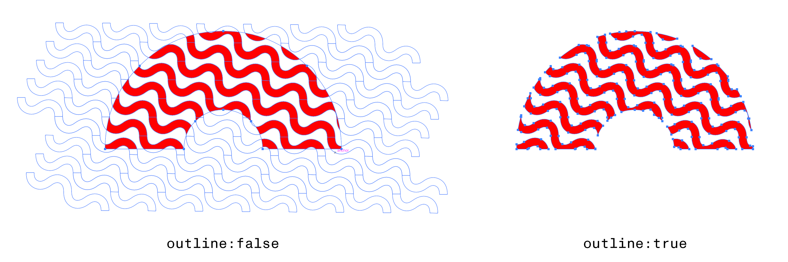
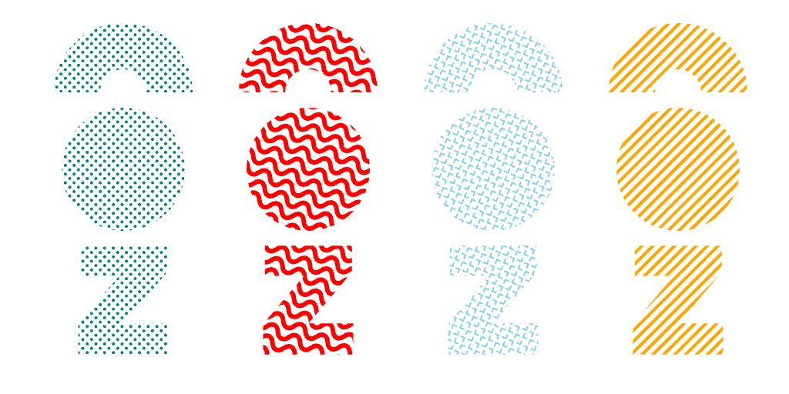
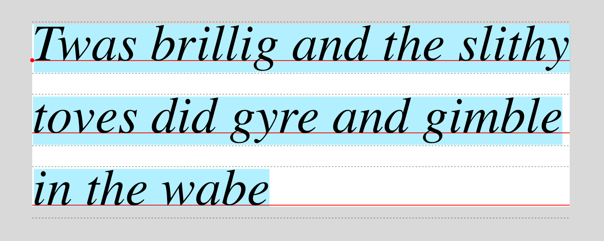
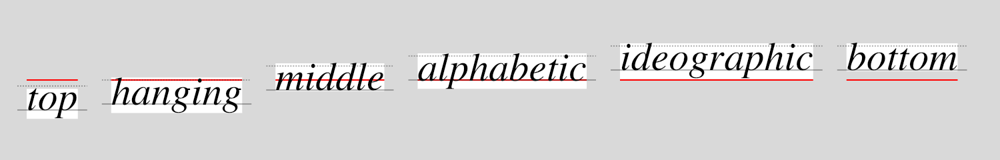
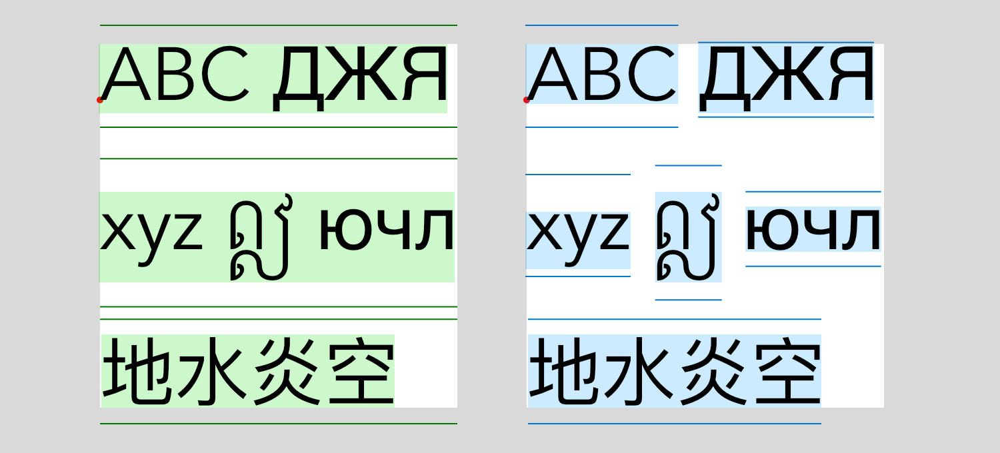

# CanvasRenderingContext2D

> Most of your interaction with the canvas will actually be directed toward its ‘rendering context’, a supporting object you can acquire by calling the canvas’s [getContext()](https://developer.mozilla.org/en-US/docs/Web/API/HTMLCanvasElement/getContext) and [newPage()][newPage] methods.

| Canvas State                           | Drawing                                      | Pattern & Color                                  | Line Style                              | Transform                                         | Bezier Paths                             | Font Style                         | Text Layout                                             | Images                                                       | Compositing & Effects                                    |
|----------------------------------------|----------------------------------------------|--------------------------------------------------|-----------------------------------------|---------------------------------------------------|------------------------------------------|------------------------------------|---------------------------------------------------------|--------------------------------------------------------------|----------------------------------------------------------|
| [**canvas**][canvas_attr] [🧪][canvas] | [clearRect()][clearRect()]                   | [**fillStyle**][fillStyle]                       | [**lineCap**][lineCap]                  | [**currentTransform**][currentTransform]          | [moveTo()][moveTo()]                     | [**font**][font] [🧪][c2d_font]    | [**direction**][direction]                              | [**imageSmoothingEnabled**][imageSmoothingEnabled]           | [**filter**][filter]                                     |
| [beginPath()][beginPath()]             | [fillRect()][fillRect()]                     | [**strokeStyle**][strokeStyle]                   | [**lineDashFit** 🧪][lineDashFit]       | [createProjection() 🧪][createProjection()]       | [lineTo()][lineTo()]                     | [**fontHinting** 🧪][fonthinting]  | [**textAlign**][textAlign] / [🧪][c2d_textAlign]         | [**imageSmoothingQuality**][imageSmoothingQuality]           | [**globalAlpha**][globalAlpha]                           |
| [closePath()][closePath()]             | [strokeRect()][strokeRect()]                 | [createConicGradient()][createConicGradient()]   | [**lineDashMarker** 🧪][lineDashMarker] | [getTransform()][getTransform()]                  | [arcTo()][arcTo()]                       | [**fontStretch**][fontStretch]     | [**textBaseline**][textBaseline]                        | [createImageData()][createImageData()] / [🧪][ctx_imagedata] | [**globalCompositeOperation**][globalCompositeOperation] |
| [isPointInPath()][isPointInPath()]     | [fillText()][fillText()] ⧸[🧪][drawText]     | [createLinearGradient()][createLinearGradient()] | [**lineDashOffset**][lineDashOffset]    | [setTransform()][setTransform()]⧸[🧪][transforms] | [bezierCurveTo()][bezierCurveTo()]       | [**fontVariant** 🧪][fontvariant]  | [**textDecoration** 🧪][textDecoration]                 | [getImageData()][getImageData()] / [🧪][ctx_imagedata]       | [**shadowBlur**][shadowBlur]                             |
| [isPointInStroke()][isPointInStroke()] | [strokeText()][strokeText()] ⧸[🧪][drawText] | [createRadialGradient()][createRadialGradient()] | [**lineJoin**][lineJoin]                | [resetTransform()][resetTransform()]              | [conicCurveTo() 🧪][conicCurveTo]        | [**letterSpacing**][letterSpacing] | [**textWrap** 🧪][textwrap]                             | [putImageData()][putImageData()]                             | [**shadowColor**][shadowColor]                           |
| [save()][save()]                       | [fill()][fill()]                             | [createPattern()][createPattern()]               | [**lineWidth**][lineWidth]              | [transform()][transform()] ⧸[🧪][transforms]      | [quadraticCurveTo()][quadraticCurveTo()] | [**wordSpacing**][wordSpacing]     | [measureText()][measureText()] / [🧪][c2d_measuretext]    | [drawCanvas() 🧪][drawcanvas]                                | [**shadowOffsetX**][shadowOffsetX]                       |
| [restore()][restore()]                 | [stroke()][stroke()]                         | [createTexture() 🧪][createTexture()]            | [**miterLimit**][miterLimit]            | [translate()][translate()]                        | [arc()][arc()]                           |                                    | [outlineText() 🧪][outlineText()]                       | [drawImage()][drawImage()] / [🧪][drawimage]                 | [**shadowOffsetY**][shadowOffsetY]                       |
| [reset()][reset()]                     |                                              |                                                  | [getLineDash()][getLineDash()]          | [rotate()][rotate()]                              | [ellipse()][ellipse()]                   |                                    |                                                         |                                                              |                                                          |
| [clip()][clip()]                       |                                              |                                                  | [setLineDash()][setLineDash()]          | [scale()][scale()]                                | [rect()][rect()]                         |                                    |                                                         |                                                              |                                                          |
|                                        |                                              |                                                  |                                         |                                                   | [roundRect()][roundRect()]               |                                    |                                                         |                                                              |                                                          |


## Properties

### `.font`

By default any [`line-height`][lineHeight] value included in a font specification (separated from the font size by a `/`) will be preserved but ignored. If the `textWrap` property is set to `true`, the line-height will control the vertical spacing between lines.

For example:
```js
ctx.textWrap = true
ctx.font = "24px Avenir" // uses the default leading in the font metrics
ctx.font = "24px/1.5 Avenir" // sets the line height to 1.5 ems
```

### `.fontHinting`

By default the canvas disables Skia’s [font hinting](https://en.wikipedia.org/wiki/Font_hinting) when rendering text in order to better match the text rendering produced by browsers. To enable hinting, set the context's `.fontHinting` property to `true`. When enabled the results will likely look heavier than the default, but may appear more smoothly antialiased.

### `.fontVariant`

The context’s [`.font`][font] property follows the CSS 2.1 standard and allows the selection of only a single font-variant type: `normal` vs `small-caps`. The full range of CSS 3 [font-variant][font-variant] values can be used if assigned to the context’s `.fontVariant` property (presuming the currently selected font supports them). Note that setting `.font` will also update the current `.fontVariant` value, so be sure to set the variant *after* selecting a typeface.

### `.textAlign`

In addition to the [standard alignment values][textAlign] you may also specify `"justify"`. When justifying text you *must* provide a `width` argument in your call to [`fillText`][drawText]/[`strokeText`][drawText]/etc. so the typesetter knows how much space it needs to fill. Otherwise it will behave as if you had selected `"start"` alignment.

### ~~`.textTracking`~~

**The textTracking property has been removed** and replaced with the now-standard [`letterSpacing`][letterSpacing] property.

### `.textDecoration`

The `.textDecoration` property can be assigned a string using the same syntax as the CSS [`text-decoration`][css_textDecoration] property. With it, you can choose `underline`, `overline`, and `line-through` styles, specify the line color, and select a style like `wavy`, `dotted`, or `dashed`. Set it to `none` to go back to drawing undecorated text. This setting will persist across changes to the `.font` property.

### `.textWrap`

The standard canvas has a rather impoverished typesetting system, allowing for only a single line of text and an approach to width-management that horizontally scales the letterforms (a type-crime if ever there was one). Skia Canvas allows you to opt-out of this single-line world by setting the `.textWrap` property to `true`. Doing so affects the behavior of the `fillText()`, `strokeText()`, and `measureText()`

### `.lineDashMarker`

If a Path2D object is assigned to the context’s `lineDashMarker` property, it will be used instead of the default dash pattern when [`setLineDash`][setLineDash()] has been set to a non-empty value. The marker will be drawn at evenly spaced intervals along the path with the distance controlled by the first number in the `setLineDash` array—any subsequent values are ignored.

The marker should be a Path2D object centered on (0, 0). Points to the right of the origin will run parallel to the path being stroked. If the marker path ends with a [`closePath()`][p2d_closePath], the marker will be filled using the current [`strokeStyle`][strokeStyle]. if the path is not closed, it will be stroked using the current [`lineWidth`][lineWidth]/[`join`][lineJoin]/[`cap`][lineCap], [`miterLimit`][miterLimit], and [`strokeStyle`][strokeStyle].

```js
// define marker paths
let caret = new Path2D()
caret.moveTo(-8,-8)
caret.lineTo( 0, 0)
caret.lineTo(-8, 8)

let dot = new Path2D()
dot.arc(0, 0, 4, 0, 2*Math.PI)
dot.closePath() // use fill rather than stroke

let cross = new Path2D()
cross.moveTo(-6,-6)
cross.lineTo( 6, 6)
cross.moveTo(-6, 6)
cross.lineTo( 6,-6)

// draw arcs using different markers
function drawArc(x, color){
  ctx.strokeStyle = color
  ctx.lineWidth = 4
  ctx.beginPath()
  ctx.arc(x + 120, 120, 100, -Math.PI, -Math.PI/2)
  ctx.stroke()
}

ctx.setLineDash([20])
drawArc(0, "orange")

ctx.lineDashMarker = caret
drawArc(100, "deepskyblue")

ctx.lineDashMarker = dot
drawArc(200, "limegreen")

ctx.lineDashMarker = cross
drawArc(300, "red")

ctx.setLineDash([])
drawArc(400, "#aaa")

```


### `.lineDashFit`

The `lineDashFit` attribute can be set to `"move"`, `"turn"`, or `"follow"` and controls how the marker is transformed with each repetition along the path. `"move"`  and `"turn"` use simple translation and rotation, whereas `"follow"` will bend the marker to match the dashed path's contours.

------

## Methods

### `conicCurveTo()`

```js returns="void"
conicCurveTo(cpx, cpy, x, y, weight)
```

Adds a line segment connecting the current point to (*x, y*) but curving toward the control point (*cpx, cpy*) along the way. The `weight` argument controls how close the curve will come to the control point. If the weight is `0`, the result will be a straight line from the current point to (*x, y*). With a weight of `1.0`, the function is equivalent to calling `quadraticCurveTo()`. Weights greater than `1.0` will pull the line segment ever closer to the control point.

### `createProjection()`
```js returns="DOMMatrix"
createProjection(quad, [basis])
```

This method returns a [DOMMatrix][DOMMatrix] object which can be used to simulate perspective effects or other distortions in which the four corners of the canvas are mapped to an arbitrary quadrilateral (four sided polygon). The matrix must be passed to the context's [setTransform][setTransform()] method for it take effect.

#### `quad`

The `quad` argument defines the **target** of the transformation. It specifies four points that establish where the four corners of the source coordinate space will be positioned within the viewport. If these points form a polygon other than a rectangle, lines drawn along the x & y axes of the source space will no longer be perpendicular—trapezoids allow for ‘vanishing point’ effects and parallelograms create ‘skew’.

The geometry of the quadrilateral should be described as an Array of either 8 or 4 numbers specifying an arbitrary polygon or rectangle respectively:

```js
[x1, y1, x2, y2, x3, y3, x4, y4] // four corner points
[left, top, right, bottom] // four edges of a rectangle

// internal arrays for grouping are also allowed
[[x1, y1], [x2, y2], [x3, y3], [x4, y4]]
```

#### `basis`

The optional `basis` argument defines the **source** quadrilateral whose corners will be mapped to the positions defined by `quad`. If no `basis` is specified, the canvas's bounding box will be used (i.e., the rectangle from ⟨`0`, `0`⟩ to ⟨`canvas.width`, `canvas.height`⟩). Note that drawing commands that go outside of the `basis` region may well be visible—it only establishes the geometry of the projection, not the [clipping][clip()] path.

The `basis` polygon can be described using 2, 4, or 8 numbers, using the canvas dimensions to fill in the unspecified coordinates:
```js
[width, height] // rectangle from ⟨0, 0⟩ to ⟨width, height⟩
[left, top, right, bottom] // four edges of a rectangle
[x1, y1, x2, y2, x3, y3, x4, y4] // four corner points
```

----

The projection matrix will apply to all types of drawing: shapes, images, and text. This example transforms a white box and red `"@"` character into a trapezoid bounded by the vertical midline of the canvas and its left and right edges. Since no `basis` argument is provided, it will default to using the current canvas bounds as the rectangle to be mapped onto that trapezoid.

```js
let canvas = new Canvas(512, 512),
    ctx = canvas.getContext("2d"),
    {width:w, height:h} = canvas;
ctx.font = '900 480px Times'
ctx.textAlign = 'center'
ctx.fillStyle = '#aaa'
ctx.fillRect(0, 0, w, h)

let quad = [
  w*.33, h/2,  // upper left
  w*.66, h/2,  // upper right
  w,     h*.9, // bottom right
  0,     h*.9, // bottom left
]

let matrix = ctx.createProjection(quad) // use default basis
ctx.setTransform(matrix)

ctx.fillStyle = 'white'
ctx.fillRect(10, 10, w-20, h-20)

ctx.fillStyle = '#900'
ctx.fillText("@", w/2, h-40)

```

The results below show the image generated when the `createProjection()` call is omitted entirely, called (as above) with just a `quad` argument, or called with two different values for the optional `basis` argument:


### `transform()` & `setTransform()`
```js
transform(...matrix)
setTransform(...matrix)
```

These behave just like the standard [transform][transform()] and [setTransform][setTransform()] methods, but can accept their matrix argument in a variety of forms:
- a [DOMMatrix][DOMMatrix] object
- a [CSS transform][css_transform] string (supporting all [transform functions][css_transform_fns] except `perspective`)
- a matrix-like object with numeric attributes named `a`, `b`, `c`, `d`, `e`, & `f`
- a 6-element array of numbers
- 6 individual numeric arguments

For example all of these invocations result in setting the context to the same transform state:

```js
ctx.setTransform(new DOMMatrix().scale(2, .5).rotate(180).translate(10, 10)) // DOMMatrix
ctx.setTransform('scale(2, 50%) rotate(180deg) translate(10, 10)') // CSS transform
ctx.setTransform({a:-2, b:0, c:0, d:-0.5, e:-20, f:-40}) // matrix-like object
ctx.setTransform([-2, 0, 0, -0.5, -20, -40]) // array
ctx.setTransform(-2, 0, 0, -0.5, -20, -40) // numeric arguments
```
### `createTexture()`
```js returns="CanvasTexture"
createTexture(spacing, {path, color, angle, line, cap="butt", offset=0, outline=false})
```

The `createTexture()` method returns a `CanvasTexture` object that can be assigned to the context’s `strokeStyle` or `fillStyle` property. Similar to a `CanvasPattern`, a `CanvasTexture` defines a repeating pattern that will be drawn instead of a flat color, but textures define their content using *vectors* rather than bitmaps.

Textures can be based on a user-provided Path2D object or will draw a stripe pattern of parallel lines if a path isn’t provided.

#### `spacing`

The `spacing` argument is required and defines the rectangular area that each repeating ‘tile’ in the pattern will occupy. It can either be a single number (which will be used for both dimensions) or an array with two numbers (width and height). When creating a stripe pattern, the `spacing` argument defines the distance between neighboring lines, so providing more than one value is unnecessary.

**The optional second argument can be an object with one or more of the following attributes:**

#### `path`
If set to a Path2D object, the `path` will be drawn once per tile with its origin in the upper left corner of each tile. Note that the path will not be clipped even if it extends beyond the bounds of the current tile, allowing you to overlap the texture with neighboring tiles.

#### `line`
If set to a positive number, the path will be stroked rather than filled and the `line` value will set the width of the stroke.

#### `cap`

By default, stroked lines in the pattern will be drawn with blunt line caps. The `cap` argument can be set to any valid [lineCap][lineCap] string to change this style. If the `line` argument isn't also included, the `cap` setting will have no effect since the pattern will be filled rather than stroked.

#### `color`
By default the texture will be drawn in black (filled if `line` is undefined, stroked otherwise). The `color` argument can be set to a string defining the stroke/fill color to be used instead.

#### `angle`
The rectangle defined by the `spacing` argument will be aligned with the canvas’s horizontal and vertical axes by default. Specifying an `angle` value (in radians) allows you to rotate this tile grid clockwise relative to its default orientation.

#### `offset`
As with `CanvasPattern` objects, textures are positioned globally relative to the upper left corner of the canvas—not the corner of the object currently being filled or stroked. To fine-tune the texture’s alignment with individual objects, set the `offset` argument to an `[x, y]` array with two numbers that will shift the texture relative to its origin.

#### `outline`

By default, textures are drawn to the canvas using a using a [clipping path][clip()] to match the shape being filled or stroked. This is quick and gives good results when generating bitmaps. But for exports to PDF or SVG, you may want to ‘flatten’ the texture into plain Bézier paths by setting the `outline` argument to `true`. Enabling this option does some fairly expensive vector math (which will slow down rendering), but yields cleaner vectors in the output file:



<details>
  <summary>
Sample Code: CanvasTexture



  </summary>

```js
async function texturesDemo(){
  let canvas = new Canvas(512, 256),
      ctx = canvas.getContext("2d")

  // define Path2Ds to use as repeating patterns
  let n = 10
  let nylonPath = new Path2D()
  nylonPath.moveTo(0,     n/4)
  nylonPath.lineTo(n/4,   n/4)
  nylonPath.lineTo(n/4,   0)
  nylonPath.moveTo(n*3/4, n)
  nylonPath.lineTo(n*3/4, n*3/4)
  nylonPath.lineTo(n,     n*3/4)
  nylonPath.moveTo(n/4,   n/2)
  nylonPath.lineTo(n/4,   n*3/4)
  nylonPath.lineTo(n/2,   n*3/4)
  nylonPath.moveTo(n/2,   n/4)
  nylonPath.lineTo(n*3/4, n/4)
  nylonPath.lineTo(n*3/4, n/2)

  let d = 1
  let dotPath = new Path2D()
  dotPath.arc(0, 0, d, 0, 2*Math.PI)

  let w = 16
  let wavePath = new Path2D()
  wavePath.moveTo(-w/2, w/2)
  wavePath.bezierCurveTo(-w*3/8, w*3/4, -w/8,    w*3/4, 0,     w/2)
  wavePath.bezierCurveTo( w/8,   w/4,    w*3/8,  w/4,   w/2,   w/2)
  wavePath.bezierCurveTo( w*5/8, w*3/4,  w*7/8,  w*3/4, w,     w/2)
  wavePath.bezierCurveTo( w*9/8, w/4,    w*11/8, w/4,   w*3/2, w/2)

  // create CanvasTextures using the Path2D objects
  let dots = ctx.createTexture(d*4, {path:dotPath, color:'teal', angle:Math.PI/4}), // path is filled if `line` omitted
      waves = ctx.createTexture([w, w/2], {path:wavePath, color:'red', line:3, angle:Math.PI/7}),
      nylon = ctx.createTexture(n, {path:nylonPath, color:'skyblue', line:1, cap:'round', angle:Math.PI/8}),
      lines = ctx.createTexture(5, {line:2, color:'orange'}) // no `path` required for parallel lines pattern

  // draw using CanvasTextures as fill & stroke styles
  for (let [i, texture] of Object.entries([dots, waves, nylon, lines])){
    let x = 80 + i*120
    let y = 60

    // stroke path
    ctx.lineWidth = 30
    ctx.strokeStyle = texture
    ctx.beginPath()
    ctx.ellipse(x, y, 30, 30, 0, Math.PI, 2*Math.PI)
    ctx.stroke()

    // fill path
    ctx.fillStyle = texture
    ctx.beginPath()
    ctx.ellipse(x, y+50, 40, 40, 0, 0, Math.PI*2)
    ctx.fill()

    // fill text
    ctx.textAlign = 'center'
    ctx.font = '900 100px sans-serif'
    ctx.fillText("Z", x, y+170)
  }

  await canvas.toFile('out.png', {density:2, matte:'white'})
}

texturesDemo()
```
</details>

### `createImageData()` & `getImageData()`
```js returns="ImageData"
createImageData(width, height)
createImageData(width, height, {colorType="rgba", colorSpace="srgb"})
createImageData(imagedata)

getImageData(sx, sy, sw, sh)
getImageData(sx, sy, sw, sh, {colorType="rgba", colorSpace="srgb", density, matte, msaa})
```

These methods behave identically to the standard [createImageData()][createImageData()] and [getImageData()][getImageData()] methods but have been extended to also accept an optional `colorType` value in their settings argument. The `colorType` defines the arrangement of individual color components in the ImageData's pixel array. If omitted, the type will default to `"rgba"`, but any of the [supported color types][imgdata_colortype] can be specified instead.

The `colorSpace` argument is currently unused since non-sRGB colorspaces are not yet supported. You may omit it from your calls to these methods.

The `getImageData()` method also accepts a handful of rendering options which have the same behaviors and default values as their equivalents in the Canvas [toFile()][toFile] method: [`density`][density], [`matte`][matte], and [`msaa`][msaa].

:::tip
Calling `getImageData` involves copying bitmaps between the GPU and main memory. If you're invoking it frequently in your code (e.g., within a tight loop), you may get better performance by disabling the [`gpu` property][canvas_gpu] for that canvas to avoid this overhead.
:::

### `drawImage()`
```js
drawImage(img, x, y)
drawImage(img, x, y, width, height)
drawImage(img, srcX, srcY, srcWidth, srcHeight, x, y, width, height)
```

This method behaves identically to the standard [`drawImage()`][drawImage()] function, but accepts ImageData objects as well as Image and Canvas objects as its first argument.

:::info[Note]
Image objects loaded from SVG files that don't have an [intrinsic size][img_size] have some behavioral quirks to keep in mind when drawing:
- When passed to `drawImage()` without size arguments, the SVG will be scaled to a size that fits within the Canvas's current bounds (using an approach akin to CSS's `object-fit: contain`).
- When using the 9-argument version of `drawImage()`, the ‘crop’ arguments (`srcX`, `srcY`, `srcWidth`, & `srcHeight`) will correspond to this scaled-to-fit size, *not* the Image's reported `width` & `height`.
:::

### `drawCanvas()`
```js
drawCanvas(canvas, x, y)
drawCanvas(canvas, x, y, width, height)
drawCanvas(canvas, srcX, srcY, srcWidth, srcHeight, x, y, width, height)
```

This method behaves identically to the standard [`drawImage()`][drawImage()] function with one key difference: if the first argument is a canvas, it will not be converted to a bitmap before being drawn. Instead its contents will be added to the canvas as resolution-independent vector graphics. This is especially useful when scaling or rotating since it preserves the fidelity of text, patterns, and gradients from the source canvas.

```js
let src = new Canvas(10, 10),
    srcCtx = src.getContext("2d");
srcCtx.font = 'italic 10px Times'
srcCtx.fillText('¶', 2, 8)

let dst = new Canvas(350, 150),
    dstCtx = dst.getContext("2d");
dstCtx.drawImage(src, 0, 0, 150, 150)
dstCtx.drawCanvas(src, 200, 0, 150, 150)
```


### `fillText()` & `strokeText()`
```js
fillText(str, x, y, [width])
strokeText(str, x, y, [width])
```

The text-drawing methods’ behavior is mostly standard unless `.textWrap` has been set to `true`, in which case there are 3 main effects:

  1. Manual line breaking via `"\n"` escapes will be honored rather than converted to spaces
  2. The optional `width` argument accepted by `fillText`, `strokeText` and `measureText` will be interpreted as a ‘column width’ and used to word-wrap long lines
  3. The line-height setting in the `.font` value will be used to set the inter-line leading rather than simply being ignored.

Even when `.textWrap` is `false`, the text-drawing methods will never choose a more-condensed weight or otherwise attempt to squeeze your entire string into the measure specified by `width`. Instead the text will be typeset up through the last word that fits and the rest will be omitted. This can be used in conjunction with the `.lines` property of the object returned by `measureText()` to incrementally lay out a long string into, for example, a multi-column layout with an even number of lines in each.

### `measureText()`
```js returns="TextMetrics"
measureText(str, [width])
```

The `measureText()` method returns a [TextMetrics][TextMetrics] object describing the dimensions of a run of text *without* actually drawing it to the canvas. Skia Canvas adds an additional property to the metrics object called `.lines` which contains an array describing the geometry of each line individually.

#### Per-line metrics
Each element of the `.lines` array contains an object of the form:
```js
{x, y, width, height, baseline, hangingBaseline, alphabeticBaseline, ideographicBaseline, ascent, descent, startIndex, endIndex, runs}
```

The `x`, `y`, `width`, and `height` values define a rectangle that fully encloses the text of a given line relative to the ‘origin’ point you would pass to `fillText()` or `strokeText()`. The rectangle only includes the visible glyph shapes on the line, so in cases where [`textWrap`][textwrap] is enabled, only the longest line will extend to the full width of the text block.

The `baseline` value is a y-axis offset from the text origin to that particular line’s baseline (using the context’s current `textBaseline` setting). The `hangingBaseline`, `alphabeticBaseline`, and `ideographicBaseline` properties give the offsets for those positions regardless of the current `textBaseline`.

The `ascent` and `descent` properties give the y-axis offsets from the text origin to the font’s ascender and descender lines (as defined in the metrics). In the case of a line using multiple fonts, the values will be the maximum values of all fonts on the line.

The `startIndex` and `endIndex` values are the indices into the string of the range of characters that were typeset on that line. Calling `.substring(startIndex, endIndex)` on your original string will extract the snippet.

The `runs` array further decomposes the line into all its single-font ranges of characters, providing their bounds and font metrics. This can be useful in cases where a fallback font is providing character glyphs not present in the ‘main’ font specified in the [`font`][ctx_font] property.

#### Per-font metrics
Each element of the `.runs` array contains an object of the form:
```js
{x, y, width, height, family, ascent, descent, capHeight, xHeight, underline, strikethrough}
```

The `x`, `y`, `width`, and `height` values define a rectangle that fully encloses this single-font run of characters relative to the text’s ‘origin’ point.

The `family` property is a string identifying the typeface being used for this region of the line.

The `ascent` and `descent` properties give the y-axis offsets from the text origin to the font’s ascender and descender lines (as defined in the metrics). In the case of a line using multiple fonts, each run on the line will likely have different values.

The `capHeight` and `xHeight` values give the y-axis offsets for the tops of capital letters and ascender-less letters respectively. Note that these heights are derived from the font’s metrics rather than the letterforms themselves, so they may not precisely align with any given character.

The `underline` and `strikethrough` offsets provide the vertical position at which you could draw the corresponding type of line (if you wish to do so manually).

#### Examples
<details>
  <summary>
Sample Code: TextMetrics



  </summary>


```js
import {Canvas} from 'skia-canvas'
const canvas = new Canvas(750, 300),
      ctx = canvas.getContext("2d")

async function metricsDemo(){
  // try customizing these and seeing what does (or doesn't) change in the graphic
  let msg = "Twas brillig and the slithy toves did gyre and gimble in the wabe"
  let [x, y] = [40, 75] // set the location of the text
  let maxWidth = 680 // set the point at which the text will wrap
  ctx.font = 'italic 64px/1.4 serif' // try adjusting lineHeight and note dotted lines
  ctx.textBaseline = 'alphabetic' // the red line will correspond to this selection
  ctx.textAlign = 'left'
  ctx.textWrap = true

  // print the font metrics to the console
  let m = ctx.measureText(msg, maxWidth)
  console.log(m)

  // set the origin point for the drawing the text to screen
  ctx.translate(x, y)

  // use the `actualBoundingBox` to draw a white rectangle behind the entire multi-line run
  let left   = -m.actualBoundingBoxLeft
  let top    = -m.actualBoundingBoxAscent
  let right  =  m.actualBoundingBoxRight
  let bottom =  m.actualBoundingBoxDescent
  ctx.fillStyle = 'white'
  ctx.fillRect(left, top, right - left, bottom - top)

  // draw a red circle at the origin point (i.e., the position passed to fillText)
  ctx.fillStyle = 'red'
  ctx.beginPath()
  ctx.ellipse(0, 0, 2.5, 2.5, 0, 0, 2*Math.PI)
  ctx.fill()

  // step through each object in the `lines` array
  for (const [i, line] of m.lines.entries()) {
    // print out the substring that's typeset on this line
    console.log(`line ${i+1}: "${msg.slice(line.startIndex, line.endIndex)}"`)

    // use the line's rect dimensions to enclose just the area occupied by glyphs
    ctx.fillStyle = 'rgba(0,204,255, 0.3)'
    ctx.fillRect(line.x, line.y, line.width, line.height)

    // draw the baseline chosen as `textBaseline` as a red line
    ctx.fillStyle = 'red'
    ctx.strokeStyle = 'red'
    ctx.beginPath()
    ctx.moveTo(left, line.baseline)
    ctx.lineTo(right, line.baseline)
    ctx.stroke()

    // draw dotted lines around the 1em tall text block (i.e., the non-leading portions of the lineHeight)
    let textTop    = line.baseline + m.alphabeticBaseline - m.fontBoundingBoxAscent
    let textBottom = line.baseline + m.alphabeticBaseline + m.fontBoundingBoxDescent
    ctx.beginPath()
    ctx.setLineDash([2])
    ctx.strokeStyle = 'rgba(0,50,50, 0.4)'
    ctx.moveTo(left, textTop)
    ctx.lineTo(right, textTop)
    ctx.moveTo(left, textBottom)
    ctx.lineTo(right, textBottom)
    ctx.stroke()
    ctx.setLineDash([])
  }

  // typeset the text itself
  ctx.fillStyle = 'black'
  ctx.fillText(msg, 0, 0, maxWidth)

  await canvas.toFile('out.png', {density:2, matte:'#d9d9d9'})
}

metricsDemo()
```

----
Output:
```
TextMetrics {
  width: 667.3400268554688,
  actualBoundingBoxLeft: -0,
  actualBoundingBoxRight: 667.3400268554688,
  actualBoundingBoxAscent: 44.79999923706055,
  actualBoundingBoxDescent: 182.1999969482422,
  fontBoundingBoxAscent: 48,
  fontBoundingBoxDescent: 16,
  emHeightAscent: 48,
  emHeightDescent: 16,
  hangingBaseline: 38.400001525878906,
  alphabeticBaseline: 0,
  ideographicBaseline: -16,
  lines: [
    {
      x: 2,
      y: -44.79999923706055,
      width: 665.9375,
      height: 60,
      baseline: 0.40000152587890625,
      hangingBaseline: -38,
      alphabeticBaseline: 0.40000152587890625,
      ideographicBaseline: 16.400001525878906,
      ascent: -47.599998474121094,
      descent: 16.400001525878906,
      startIndex: 0,
      endIndex: 27,
      runs: [Array]
    },
    {
      x: 1,
      y: 45.19999694824219,
      width: 657.4375,
      height: 60,
      baseline: 90.39999389648438,
      hangingBaseline: 51.99999237060547,
      alphabeticBaseline: 90.39999389648438,
      ideographicBaseline: 106.39999389648438,
      ascent: 42.399993896484375,
      descent: 106.39999389648438,
      startIndex: 28,
      endIndex: 53,
      runs: [Array]
    },
    {
      x: 2,
      y: 135.1999969482422,
      width: 292.65625,
      height: 47,
      baseline: 180.39999389648438,
      hangingBaseline: 142,
      alphabeticBaseline: 180.39999389648438,
      ideographicBaseline: 196.39999389648438,
      ascent: 132.39999389648438,
      descent: 196.39999389648438,
      startIndex: 54,
      endIndex: 65,
      runs: [Array]
    }
  ]
}
line 1: "Twas brillig and the slithy"
line 2: "toves did gyre and gimble"
line 3: "in the wabe"
```

</details>


<details>
  <summary>
Sample Code: Baselines



  </summary>


```js
import {Canvas} from 'skia-canvas'
const canvas = new Canvas(750, 120),
      ctx = canvas.getContext("2d")

async function baselinesDemo(){
  const BASELINES = ["top", "hanging", "middle", "alphabetic", "ideographic", "bottom"]
  let [x, y] = [20, 60] // set the location of the first column
  let spacing = 25 // space between columns
  let padding = 7 // amount to outdent the gray lines for hanging & alphabetical
  ctx.font = 'italic 30px serif'
  ctx.textWrap = true

  ctx.translate(x, y)

  for (const baseline of BASELINES){
    ctx.textBaseline = baseline

    let msg = baseline // single-line example

    // uncomment to try adding an additional line of text:
    // msg = baseline + "\nbaseline"

    let m = ctx.measureText(msg)

    // use the `actualBoundingBox` to draw a white rectangle behind the text run
    let left   = -m.actualBoundingBoxLeft
    let top    = -m.actualBoundingBoxAscent
    let right  =  m.actualBoundingBoxRight
    let bottom =  m.actualBoundingBoxDescent
    ctx.fillStyle = 'white'
    ctx.fillRect(left, top, right - left, bottom - top)

    for (const line of m.lines){
      // draw selected `textBaseline` in red
      ctx.beginPath()
      ctx.moveTo(left, line.baseline)
      ctx.lineTo(right, line.baseline)
      ctx.strokeStyle = 'red'
      ctx.stroke()

      // draw alphabetic baseline as a solid gray line
      ctx.beginPath()
      ctx.moveTo(left-padding, line.baseline - m.alphabeticBaseline)
      ctx.lineTo(right+padding, line.baseline - m.alphabeticBaseline)
      ctx.strokeStyle = 'rgba(0,0,0, 0.3)'
      ctx.stroke()

      // draw hanging baseline as a dotted line
      ctx.beginPath()
      ctx.moveTo(left-padding, line.baseline - m.hangingBaseline)
      ctx.lineTo(right+padding, line.baseline - m.hangingBaseline)
      ctx.setLineDash([1])
      ctx.stroke()
      ctx.setLineDash([])

      // NB: you can also use the m.ideographicBaseline offset
    }

    // typeset the text itself
    ctx.fillStyle = 'black'
    ctx.fillText(msg, 0, 0)

    // move to next column
    ctx.translate(right - left + spacing, 0)
  }

  await canvas.toFile('out.png', {density:2, matte:'#d9d9d9'})
}

baselinesDemo()
```
</details>

<details>
  <summary>
Sample Code: Lines & Runs



  </summary>


```js
import {Canvas} from 'skia-canvas'
const canvas = new Canvas(750, 340),
      ctx = canvas.getContext("2d")

async function lineMetricsDemo(){
  let msg = "ABC ДЖЯ xyz ឦ ючл 地水炎空" // text with many glyphs not present in Avenir…
  let [x, y] = [75, 75] // set the location of the text
  let maxWidth = 315 // set the point at which the text will wrap
  ctx.font = '56px/2 Avenir'
  ctx.textWrap = true

  // set the origin point for the drawing the text to screen
  ctx.translate(x, y)

  // obtain the font metrics we'll be using to draw boxes
  let m = ctx.measureText(msg, maxWidth)

  for (const column of ['left', 'right']){
    // use the `actualBoundingBox` to draw a white rectangle behind the entire multi-line run
    let left   = -m.actualBoundingBoxLeft
    let top    = -m.actualBoundingBoxAscent
    let right  =  m.actualBoundingBoxRight
    let bottom =  m.actualBoundingBoxDescent
    ctx.fillStyle = 'white'
    ctx.fillRect(left, top, right - left, bottom - top)

    // draw a red circle at the origin point (i.e., the position passed to fillText)
    ctx.fillStyle = 'red'
    ctx.beginPath()
    ctx.ellipse(0, 0, 2.5, 2.5, 0, 0, 2*Math.PI)
    ctx.fill()

    for (const line of m.lines){
      // on the left, draw green boxes around the line bounds and stroke the line's ascent & descent
      if (column=='left'){
        ctx.fillStyle = '#00dc0033'
        ctx.fillRect(line.x, line.y, line.width, line.height)

        ctx.strokeStyle = '#007700'
        ctx.beginPath()
        ctx.moveTo(0, line.ascent)
        ctx.lineTo(m.width, line.ascent)
        ctx.moveTo(0, line.descent)
        ctx.lineTo(m.width, line.descent)
        ctx.stroke()
      }

      // on the right, draw blue boxes around each single-font run's bounds and stroke the
      // ascent & descent lines specific to that font run
      if (column=='right'){
        for (const run of line.runs){
          ctx.fillStyle = '#09f3'
          ctx.fillRect(run.x, run.y, run.width, run.height)

          ctx.strokeStyle = '#07c'
          ctx.beginPath()
          ctx.moveTo(run.x, run.ascent)
          ctx.lineTo(run.x + run.width, run.ascent)
          ctx.moveTo(run.x, run.descent)
          ctx.lineTo(run.x + run.width, run.descent)
          ctx.stroke()
        }
      }
    }

    // draw the text on top
    ctx.fillStyle = 'black'
    ctx.fillText(msg, 0, 0, maxWidth)

    // shift rightward for next column
    ctx.translate(maxWidth + 5, 0)
  }

  await canvas.toFile('out.png', {density:2, matte:'#d9d9d9'})
}

lineMetricsDemo()
```

</details>


### `outlineText()`
```js returns="Path2D"
outlineText(str, [width])
```

The `outlineText()` method typesets a string and returns a Path2D containing the shapes of its character glyphs. It will use the context’s current typography settings (e.g., [`.font`][font],[`.textWrap`][textwrap], [`.textAlign`][textAlign] [`.textBaseline`][textBaseline], etc.) to style the string and will anchor the text relative to the (0, 0) origin point. As a result, you’ll typically want to use the context’s transform-related methods or Path2D’s [`offset()`][p2d_offset] and [`transform()`][p2d_transform] to position the path before drawing it to the canvas.

As with the [`fillText()`][drawText] and [`strokeText()`][drawText] methods, `outlineText()` will produce a single line of text unless `.textWrap` is enabled and will use the optional `width` argument to determine the maximum line width. If a `width` is specified but `.textWrap` is *not* enabled, any text that doesn't fit within that measure will be omitted from the path.

```js
ctx.textBaseline = 'top'
ctx.font = 'bold 140px Helvetica'
let ampersand = ctx.outlineText('&')

for (let i=0; i<8000; i++){
  let x = Math.random() * 100,
      y = Math.random() * 120;
  ctx.fillStyle = ampersand.contains(x, y) ? 'lightblue' : '#eee'
  ctx.fillRect(x, y, 2, 2)
}
```


<!-- references_begin -->
[c2d_font]: #font
[c2d_measuretext]: #measuretext
[c2d_textAlign]: #textalign
[canvas]: canvas.md
[canvas_gpu]: canvas.md#gpu
[conicCurveTo]: #coniccurveto
[createProjection()]: #createprojection
[createTexture()]: #createtexture
[drawText]: #filltext--stroketext
[drawcanvas]: #drawcanvas
[drawimage]: #drawimage
[fontvariant]: #fontvariant
[fonthinting]: #fonthinting
[ctx_font]: #font
[lineDashFit]: #linedashfit
[lineDashMarker]: #linedashmarker
[newPage]: canvas.md#newpage
[outlineText()]: #outlinetext
[img_size]: image.md#width--height
[imgdata_colortype]: imagedata.md#colortype
[ctx_imagedata]: #createimagedata--getimagedata
[p2d_offset]: path2d.md#offset
[p2d_transform]: path2d.md#transform
[toFile]: canvas.md#tofile
[textDecoration]: #textdecoration
[textwrap]: #textwrap
[transforms]: #transform--settransform
[matte]: canvas.md#matte
[density]: canvas.md#density
[msaa]: canvas.md#msaa
[p2d_closePath]: https://developer.mozilla.org/en-US/docs/Web/API/CanvasRenderingContext2D/closePath
[css_transform]: https://developer.mozilla.org/en-US/docs/Web/CSS/transform
[css_transform_fns]: https://developer.mozilla.org/en-US/docs/Web/CSS/transform-function
[TextMetrics]: https://developer.mozilla.org/en-US/docs/Web/API/TextMetrics
[DOMMatrix]: https://developer.mozilla.org/en-US/docs/Web/API/DOMMatrix
[lineHeight]: https://developer.mozilla.org/en-US/docs/Web/CSS/line-height
[font-variant]: https://developer.mozilla.org/en-US/docs/Web/CSS/font-variant
[canvas_attr]: https://developer.mozilla.org/en-US/docs/Web/API/CanvasRenderingContext2D/canvas
[currentTransform]: https://developer.mozilla.org/en-US/docs/Web/API/CanvasRenderingContext2D/currentTransform
[direction]: https://developer.mozilla.org/en-US/docs/Web/API/CanvasRenderingContext2D/direction
[fillStyle]: https://developer.mozilla.org/en-US/docs/Web/API/CanvasRenderingContext2D/fillStyle
[filter]: https://developer.mozilla.org/en-US/docs/Web/API/CanvasRenderingContext2D/filter
[font]: https://developer.mozilla.org/en-US/docs/Web/API/CanvasRenderingContext2D/font
[fontStretch]: https://developer.mozilla.org/en-US/docs/Web/API/CanvasRenderingContext2D/fontStretch
[globalAlpha]: https://developer.mozilla.org/en-US/docs/Web/API/CanvasRenderingContext2D/globalAlpha
[globalCompositeOperation]: https://developer.mozilla.org/en-US/docs/Web/API/CanvasRenderingContext2D/globalCompositeOperation
[imageSmoothingEnabled]: https://developer.mozilla.org/en-US/docs/Web/API/CanvasRenderingContext2D/imageSmoothingEnabled
[imageSmoothingQuality]: https://developer.mozilla.org/en-US/docs/Web/API/CanvasRenderingContext2D/imageSmoothingQuality
[lineCap]: https://developer.mozilla.org/en-US/docs/Web/API/CanvasRenderingContext2D/lineCap
[lineDashOffset]: https://developer.mozilla.org/en-US/docs/Web/API/CanvasRenderingContext2D/lineDashOffset
[lineJoin]: https://developer.mozilla.org/en-US/docs/Web/API/CanvasRenderingContext2D/lineJoin
[lineWidth]: https://developer.mozilla.org/en-US/docs/Web/API/CanvasRenderingContext2D/lineWidth
[miterLimit]: https://developer.mozilla.org/en-US/docs/Web/API/CanvasRenderingContext2D/miterLimit
[shadowBlur]: https://developer.mozilla.org/en-US/docs/Web/API/CanvasRenderingContext2D/shadowBlur
[shadowColor]: https://developer.mozilla.org/en-US/docs/Web/API/CanvasRenderingContext2D/shadowColor
[shadowOffsetX]: https://developer.mozilla.org/en-US/docs/Web/API/CanvasRenderingContext2D/shadowOffsetX
[shadowOffsetY]: https://developer.mozilla.org/en-US/docs/Web/API/CanvasRenderingContext2D/shadowOffsetY
[strokeStyle]: https://developer.mozilla.org/en-US/docs/Web/API/CanvasRenderingContext2D/strokeStyle
[textAlign]: https://developer.mozilla.org/en-US/docs/Web/API/CanvasRenderingContext2D/textAlign
[textBaseline]: https://developer.mozilla.org/en-US/docs/Web/API/CanvasRenderingContext2D/textBaseline
[letterSpacing]: https://developer.mozilla.org/en-US/docs/Web/API/CanvasRenderingContext2D/letterSpacing
[wordSpacing]: https://developer.mozilla.org/en-US/docs/Web/API/CanvasRenderingContext2D/wordSpacing
[arc()]: https://developer.mozilla.org/en-US/docs/Web/API/CanvasRenderingContext2D/arc
[arcTo()]: https://developer.mozilla.org/en-US/docs/Web/API/CanvasRenderingContext2D/arcTo
[beginPath()]: https://developer.mozilla.org/en-US/docs/Web/API/CanvasRenderingContext2D/beginPath
[bezierCurveTo()]: https://developer.mozilla.org/en-US/docs/Web/API/CanvasRenderingContext2D/bezierCurveTo
[clearRect()]: https://developer.mozilla.org/en-US/docs/Web/API/CanvasRenderingContext2D/clearRect
[clip()]: https://developer.mozilla.org/en-US/docs/Web/API/CanvasRenderingContext2D/clip
[closePath()]: https://developer.mozilla.org/en-US/docs/Web/API/CanvasRenderingContext2D/closePath
[createConicGradient()]: https://developer.mozilla.org/en-US/docs/Web/API/CanvasRenderingContext2D/createConicGradient
[createImageData()]: https://developer.mozilla.org/en-US/docs/Web/API/CanvasRenderingContext2D/createImageData
[createLinearGradient()]: https://developer.mozilla.org/en-US/docs/Web/API/CanvasRenderingContext2D/createLinearGradient
[createPattern()]: https://developer.mozilla.org/en-US/docs/Web/API/CanvasRenderingContext2D/createPattern
[createRadialGradient()]: https://developer.mozilla.org/en-US/docs/Web/API/CanvasRenderingContext2D/createRadialGradient
[drawImage()]: https://developer.mozilla.org/en-US/docs/Web/API/CanvasRenderingContext2D/drawImage
[ellipse()]: https://developer.mozilla.org/en-US/docs/Web/API/CanvasRenderingContext2D/ellipse
[fill()]: https://developer.mozilla.org/en-US/docs/Web/API/CanvasRenderingContext2D/fill
[fillRect()]: https://developer.mozilla.org/en-US/docs/Web/API/CanvasRenderingContext2D/fillRect
[fillText()]: https://developer.mozilla.org/en-US/docs/Web/API/CanvasRenderingContext2D/fillText
[getImageData()]: https://developer.mozilla.org/en-US/docs/Web/API/CanvasRenderingContext2D/getImageData
[getLineDash()]: https://developer.mozilla.org/en-US/docs/Web/API/CanvasRenderingContext2D/getLineDash
[getTransform()]: https://developer.mozilla.org/en-US/docs/Web/API/CanvasRenderingContext2D/getTransform
[isPointInPath()]: https://developer.mozilla.org/en-US/docs/Web/API/CanvasRenderingContext2D/isPointInPath
[isPointInStroke()]: https://developer.mozilla.org/en-US/docs/Web/API/CanvasRenderingContext2D/isPointInStroke
[lineTo()]: https://developer.mozilla.org/en-US/docs/Web/API/CanvasRenderingContext2D/lineTo
[measureText()]: https://developer.mozilla.org/en-US/docs/Web/API/CanvasRenderingContext2D/measureText
[moveTo()]: https://developer.mozilla.org/en-US/docs/Web/API/CanvasRenderingContext2D/moveTo
[putImageData()]: https://developer.mozilla.org/en-US/docs/Web/API/CanvasRenderingContext2D/putImageData
[quadraticCurveTo()]: https://developer.mozilla.org/en-US/docs/Web/API/CanvasRenderingContext2D/quadraticCurveTo
[rect()]: https://developer.mozilla.org/en-US/docs/Web/API/CanvasRenderingContext2D/rect
[reset()]: https://developer.mozilla.org/en-US/docs/Web/API/CanvasRenderingContext2D/reset
[resetTransform()]: https://developer.mozilla.org/en-US/docs/Web/API/CanvasRenderingContext2D/resetTransform
[restore()]: https://developer.mozilla.org/en-US/docs/Web/API/CanvasRenderingContext2D/restore
[rotate()]: https://developer.mozilla.org/en-US/docs/Web/API/CanvasRenderingContext2D/rotate
[roundRect()]: https://developer.mozilla.org/en-US/docs/Web/API/CanvasRenderingContext2D/roundRect
[save()]: https://developer.mozilla.org/en-US/docs/Web/API/CanvasRenderingContext2D/save
[scale()]: https://developer.mozilla.org/en-US/docs/Web/API/CanvasRenderingContext2D/scale
[setLineDash()]: https://developer.mozilla.org/en-US/docs/Web/API/CanvasRenderingContext2D/setLineDash
[setTransform()]: https://developer.mozilla.org/en-US/docs/Web/API/CanvasRenderingContext2D/setTransform
[stroke()]: https://developer.mozilla.org/en-US/docs/Web/API/CanvasRenderingContext2D/stroke
[strokeRect()]: https://developer.mozilla.org/en-US/docs/Web/API/CanvasRenderingContext2D/strokeRect
[strokeText()]: https://developer.mozilla.org/en-US/docs/Web/API/CanvasRenderingContext2D/strokeText
[transform()]: https://developer.mozilla.org/en-US/docs/Web/API/CanvasRenderingContext2D/transform
[translate()]: https://developer.mozilla.org/en-US/docs/Web/API/CanvasRenderingContext2D/translate
[css_textDecoration]: https://developer.mozilla.org/en-US/docs/Web/CSS/text-decoration
<!-- references_end -->
