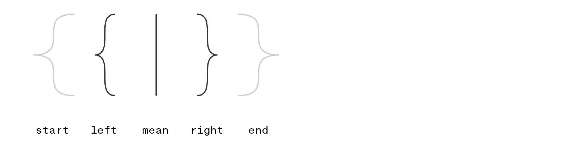
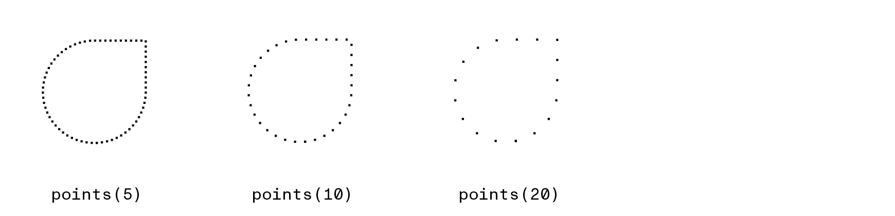
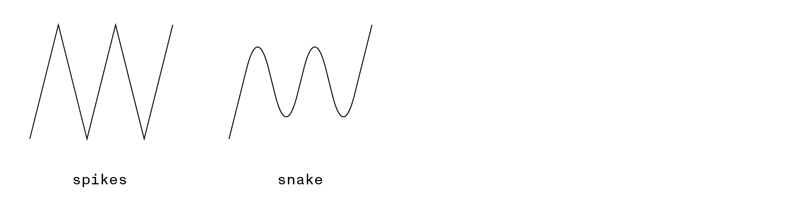
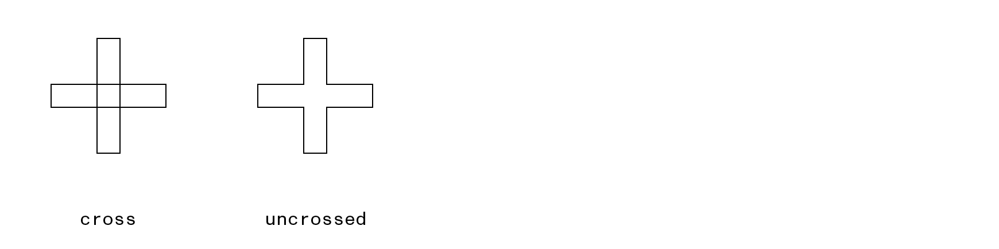
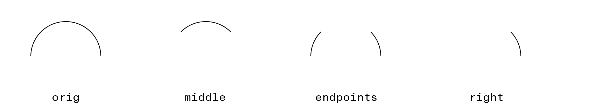
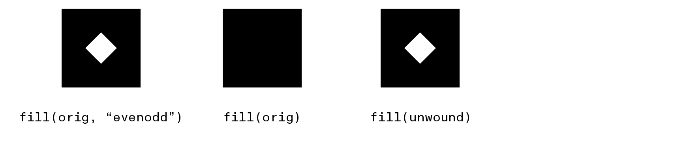

# Path2D

The `Path2D` class allows you to create paths independent of a given[Canvas][canvas] or[graphics context][context]. These paths can be modified over time and drawn repeatedly (potentially on multiple canvases). `Path2D` objects can also be used as [lineDashMarker][lineDashMarker]s or as the repeating pattern in a [CanvasTexture][createTexture()].


| Line Segments                              | Shapes                     | Boolean Ops 🧪           | Filters 🧪                       | Geometry 🧪                  |
| --                                         | --                         | --                       | --                               | --                           |
| [**d** 🧪][p2d_d]                          | [addPath()][p2d_addPath]   | [complement()][bool-ops] | [interpolate()][p2d_interpolate] |[**bounds**][p2d_bounds]        |
| [moveTo()][p2d_moveTo]                     | [arc()][p2d_arc]           | [difference()][bool-ops] | [jitter()][p2d_jitter]           |[**edges**][edges]          |
| [lineTo()][p2d_lineTo]                     | [arcTo()][p2d_arcTo]       | [intersect()][bool-ops]  | [round()][p2d_round]             | [contains()][p2d_contains]   |
| [bezierCurveTo()][p2d_bezierCurveTo]       | [ellipse()][p2d_ellipse]   | [union()][bool-ops]      | [simplify()][p2d_simplify]       | [points()][p2d_points]       |
| [conicCurveTo() 🧪][conicCurveTo]          | [rect()][p2d_rect]         | [xor()][bool-ops]        | [trim()][p2d_trim]               | [offset()][p2d_offset]       |
| [quadraticCurveTo()][p2d_quadraticCurveTo] | [roundRect()][roundRect()] |                          | [unwind()][p2d_unwind]           | [transform()][p2d_transform] |
| [closePath()][p2d_closePath]               |

## Creating `Path2D` objects

Its constructor can be called without any arguments to create a new, empty path object. It can also accept a string using [SVG syntax][SVG_path_commands] or a reference to an existing `Path2D` object (which it will return a clone of):
```js
// three identical (but independent) paths
let p1 = new Path2D("M 10,10 h 100 v 100 h -100 Z")
let p2 = new Path2D(p1)
let p3 = new Path2D()
p3.rect(10, 10, 100, 100)
```

## Drawing paths

A canvas’s context always contains an implicit ‘current’ bézier path which is updated by commands like [lineTo()][lineTo()] and [arcTo()][arcTo()] and is drawn to the canvas by calling [fill()][fill()], [stroke()][stroke()], or [clip()][clip()] without any arguments (aside from an optional [winding][nonzero] [rule][evenodd]). If you start creating a second path by calling [beginPath()][beginPath()] the context discards the prior path, forcing you to recreate it by hand if you need it again later.

You can then use these objects by passing them as the first argument to the context’s `fill()`, `stroke()`, and `clip()` methods (along with an optional second argument specifying the winding rule).

-----------

## Properties

### `.bounds`

In the browser, Path2D objects offer very little in the way of introspection—they are mostly-opaque recorders of drawing commands that can be ‘played back’ later on. Skia Canvas offers some additional transparency by allowing you to measure the total amount of space the lines will occupy (though you’ll need to account for the current `lineWidth` if you plan to draw the path with `stroke()`).

The `.bounds` property returns an object defining the minimal rectangle containing the path:
```
{top, left, bottom, right, width, height}
```

### `.d`

Contains a string describing the path’s edges using [SVG syntax][SVG_path_commands]. This property is both readable and writeable (and can be appended to using the `+=` operator).

### `.edges`

Returns an array containing each path segment that has been added to the path so far. Each element of the list is an array of the form `["verb", ...points]`, mirroring the calling conventions of both Path2D and the rendering context. As a result, the `edges` may be used to ‘replay’ a sequence of commands such as:
```js
let original = new Path2D()
// ... add some contours to the path

// apply the original path’s edges to a new Path2D
let clone = new Path2D()
for (const [verb, ...pts] of original.edges){
  clone[verb](...pts)
}

// or use the original path’s edges to draw directly to the context
for (const [verb, ...pts] of original.edges){
  ctx[verb](...pts)
}
```

The array is not a verbtaim transcript of the drawing commands that have been called since some commands (e.g., `arc()`) will be converted into an equivalent sequence of bézier curves. The full range of verbs and numbers of point arguments is as follows:

```js
[
  ["moveTo", x, y],
  ["lineTo", x, y],
  ["quadraticCurveTo", cpx, cpy, x, y],
  ["bezierCurveTo", cp1x, cp1y, cp2x, cp2y, x, y],
  ["conicCurveTo", cpx, cpy, x, y, weight],
  ["closePath"]
]
```

------------

## Methods

### `contains()`
```js returns="boolean"
contains(x, y)
```

Returns true if the point (*x, y*) is either inside the path or intersects one of its contours.

### `complement()`, `difference()`, `intersect()`, `union()`, and `xor()`
```js returns="Path2D"
complement(path)
difference(path)
intersect(path)
union(path)
xor(path)
```

In addition to creating `Path2D` objects through the constructor, you can use pairs of existing paths *in combination* to generate new paths based on their degree of overlap. Based on the method you choose, a different boolean relationship will be used to construct the new path. In all the following examples we’ll be starting off with a pair of overlapping shapes:
```js
let oval = new Path2D()
oval.arc(100, 100, 100, 0, 2*Math.PI)

let rect = new Path2D()
rect.rect(0, 100, 100, 100)
```


We can then create a new path by using one of the boolean operations such as:
```js
let knockout = rect.complement(oval),
    overlap = rect.intersect(oval),
    footprint = rect.union(oval),
    ...
```


Note that the `xor` operator is liable to create a path with lines that cross over one another so you’ll get different results when filling it using the [`"evenodd"`][evenodd] winding rule (as shown above) than with [`"nonzero"`][nonzero] (the canvas default).

### `interpolate()`
```js returns="Path2D"
interpolate(otherPath, weight)
```

When two similar paths share the same sequence of ‘verbs’ and differ only in the point arguments passed to them, the `interpolate()` method can combine them in different proportions to create a new path. The `weight` argument controls whether the resulting path resembles the original (at `0.0`), the `otherPath` (at `1.0`), or something in between.

```js
let start = new Path2D()
start.moveTo(-200, 100)
start.bezierCurveTo(-300, 100, -200, 200, -300, 200)
start.bezierCurveTo(-200, 200, -300, 300, -200, 300)

let end = new Path2D()
end.moveTo(200, 100)
end.bezierCurveTo(300, 100, 200, 200, 300, 200)
end.bezierCurveTo(200, 200, 300, 300, 200, 300)

let left = start.interpolate(end, .25),
    mean = start.interpolate(end, .5),
    right = start.interpolate(end, .75)
```



### `jitter()`
```js returns="Path2D"
jitter(segmentLength, amount, seed=0)
```

The `jitter()` method will return a new Path2D object obtained by breaking the original path into segments of a given length then applying random offsets to the resulting points. Though the modifications are random, they will be consistent between runs based on the specified `seed`. Try passing different integer values for the seed until you get results that you like.

```js
let cube = new Path2D()
cube.rect(100, 100, 100, 100)
cube.rect(150, 50, 100, 100)
cube.moveTo(100, 100)
cube.lineTo(150, 50)
cube.moveTo(200, 100)
cube.lineTo(250, 50)
cube.moveTo(200, 200)
cube.lineTo(250, 150)

let jagged = cube.jitter(1, 2),
    reseed = cube.jitter(1, 2, 1337),
    sketchy = cube.jitter(10, 1)
```


### `offset()`
```js returns="Path2D"
offset(dx, dy)
```

Returns a copy of the path whose points have been shifted horizontally by `dx` and vertically by `dy`.

### `points()`
```js returns="[[x1, y1], [x2,y2], ...]"
points(step=1)
```

The `points()` method breaks a path into evenly-sized steps and returns the (*x, y*) positions of the resulting vertices. The `step` argument determines the amount of distance between neighboring points and defaults to 1 px if omitted.


```js
let path = new Path2D()
path.arc(100, 100, 50, 0, 2*Math.PI)
path.rect(100, 50, 50, 50)
path = path.simplify()

for (const [x, y] of path.points(10)){
  ctx.fillRect(x, y, 3, 3)
}
```


### `round()`
```js returns="Path2D"
round(radius)
```

Calling `round()` will return a new Path2D derived from the original path whose corners have been rounded off to the specified radius.

```js
let spikes = new Path2D()
spikes.moveTo(50, 225)
spikes.lineTo(100, 25)
spikes.lineTo(150, 225)
spikes.lineTo(200, 25)
spikes.lineTo(250, 225)
spikes.lineTo(300, 25)

let snake = spikes.round(80)
```


### `simplify()`
```js returns="Path2D"
simplify(rule="nonzero")
```

In cases where the contours of a single path overlap one another, it’s often useful to have a way of effectively applying a `union` operation *within* the path itself. The `simplify` method traces the path and returns a new copy that removes any overlapping segments. When called with no arguments it defaults to the `"nonzero"` winding rule, but can also be called with `"evenodd"` to preserve overlap regions while still removing edge-crossings.

```js
let cross = new Path2D(`
  M 10,50 h 100 v 20 h -100 Z
  M 50,10 h 20 v 100 h -20 Z
`)
let uncrossed = cross.simplify()
```


### `transform()`
```js returns="Path2D"
transform(...matrix)
```

Returns a new copy of the path whose points have been modified by the specified transform matrix. The matrix can be passed as a [DOMMatrix][DOMMatrix] object, a [CSS transform][css_transform] string (e.g, `"rotate(20deg)"`), or 6 individual numbers (see the Context's [setTransform()][transforms] documentation for details). The original path remains unmodified.

### `trim()`
```js returns="Path2D"
trim(start, end, inverted)
```

The `trim()` method returns a new Path2D which contains only a portion of the original path. The `start` and `end` arguments specify percentages of the original contour as numbers between `0` and `1.0`. If both arguments are provided, the new path will be a continuous contour connecting those endpoints. If the `inverted` argument is set to `true`, the new path will contain everything from the original **except** the region between the specified endpoints.

Passing a single positive number implicitly sets the starting point to `0.0` and uses the supplied argument as the `end`. Passing a negative value sets the ending point to `1.0` and uses the argument as the `start` value. In either case, you can include `inverted` as the second argument to flip the selected contour.

```js
let orig = new Path2D()
orig.arc(100, 100, 50, Math.PI, 0)

let middle = orig.trim(.25, .75),
    endpoints = orig.trim(.25, .75, true),
    left = orig.trim(.25),
    right = orig.trim(-.25)

```


### `unwind()`
```js returns="Path2D"
unwind()
```
The `unwind()` method interprets the current path using the `"evenodd"` winding rule then returns a new path that covers an equivalent area when filled using the `"nonzero"` rule (i.e., the default behavior of the context’s [`fill()`][fill()] method).

This conversion can be useful in situations where a single path contains multiple, overlapping contours and the resulting shape depends on the [nesting-depth and direction](https://oreillymedia.github.io/Using_SVG/extras/ch06-fill-rule.html) of the contours.

```js
let orig = new Path2D(`
  M 0 0 h 100 v 100 h -100 Z
  M 50 30 l 20 20 l -20 20 l -20 -20 Z
`)

let unwound = orig.unwind()
```


<!-- references_begin -->
[bool-ops]: #complement-difference-intersect-union-and-xor
[canvas]: canvas.md
[conicCurveTo]: context.md#coniccurveto
[context]: context.md
[createTexture()]: context.md#createtexture
[edges]: #edges
[lineDashMarker]: context.md#linedashmarker
[p2d_bounds]: #bounds
[p2d_contains]: #contains
[p2d_d]: #d
[p2d_interpolate]: #interpolate
[p2d_jitter]: #jitter
[p2d_offset]: #offset
[p2d_points]: #points
[p2d_round]: #round
[p2d_simplify]: #simplify
[p2d_transform]: #transform
[p2d_trim]: #trim
[p2d_unwind]: #unwind
[transforms]: context.md#transform--settransform
[roundRect()]: https://developer.chrome.com/blog/canvas2d/#round-rect
[nonzero]: https://en.wikipedia.org/wiki/Nonzero-rule
[evenodd]: https://en.wikipedia.org/wiki/Even–odd_rule
[SVG_path_commands]: https://developer.mozilla.org/en-US/docs/Web/SVG/Attribute/d#path_commands
[p2d_addPath]: https://developer.mozilla.org/en-US/docs/Web/API/Path2D/addPath
[p2d_closePath]: https://developer.mozilla.org/en-US/docs/Web/API/CanvasRenderingContext2D/closePath
[p2d_moveTo]: https://developer.mozilla.org/en-US/docs/Web/API/CanvasRenderingContext2D/moveTo
[p2d_lineTo]: https://developer.mozilla.org/en-US/docs/Web/API/CanvasRenderingContext2D/lineTo
[p2d_bezierCurveTo]: https://developer.mozilla.org/en-US/docs/Web/API/CanvasRenderingContext2D/bezierCurveTo
[p2d_quadraticCurveTo]: https://developer.mozilla.org/en-US/docs/Web/API/CanvasRenderingContext2D/quadraticCurveTo
[p2d_arc]: https://developer.mozilla.org/en-US/docs/Web/API/CanvasRenderingContext2D/arc
[p2d_arcTo]: https://developer.mozilla.org/en-US/docs/Web/API/CanvasRenderingContext2D/arcTo
[p2d_ellipse]: https://developer.mozilla.org/en-US/docs/Web/API/CanvasRenderingContext2D/ellipse
[p2d_rect]: https://developer.mozilla.org/en-US/docs/Web/API/CanvasRenderingContext2D/rect
[css_transform]: https://developer.mozilla.org/en-US/docs/Web/CSS/transform
[DOMMatrix]: https://developer.mozilla.org/en-US/docs/Web/API/DOMMatrix
[arcTo()]: https://developer.mozilla.org/en-US/docs/Web/API/CanvasRenderingContext2D/arcTo
[beginPath()]: https://developer.mozilla.org/en-US/docs/Web/API/CanvasRenderingContext2D/beginPath
[clip()]: https://developer.mozilla.org/en-US/docs/Web/API/CanvasRenderingContext2D/clip
[fill()]: https://developer.mozilla.org/en-US/docs/Web/API/CanvasRenderingContext2D/fill
[lineTo()]: https://developer.mozilla.org/en-US/docs/Web/API/CanvasRenderingContext2D/lineTo
[stroke()]: https://developer.mozilla.org/en-US/docs/Web/API/CanvasRenderingContext2D/stroke
<!-- references_end -->
