# Path2D

> The `Path2D` class allows you to create paths independent of a given [Canvas][canvas] or [graphics context][context]. These paths can be modified over time and drawn repeatedly (potentially on multiple canvases). `Path2D` objects can also be used as [lineDashMarker][lineDashMarker]s or as the repeating pattern in a [CanvasTexture][createTexture()].


| Line Segments                              | Shapes                         | Geometry 🧪                   | Measurement 🧪                  | Filters 🧪                        | Boolean Ops 🧪            |
| --                                         | --                             | --                           | --                             | --                               | --                       |
| [**d** 🧪][p2d_d]                           | [**contours** 🧪][p2d_contours] | [**bounds**][p2d_bounds]     | [**length**][p2d_length]       | [interpolate()][p2d_interpolate] | [complement()][bool-ops] |
| [moveTo()][p2d_moveTo]                     | [**edges** 🧪][edges]           | [contains()][p2d_contains]   | [positionAt()][p2d_positionAt] | [jitter()][p2d_jitter]           | [difference()][bool-ops] |
| [lineTo()][p2d_lineTo]                     | [addPath()][p2d_addPath]       | [points()][p2d_points]       | [tangentAt()][p2d_tangentAt]   | [round()][p2d_round]             | [intersect()][bool-ops]  |
| [arcTo()][p2d_arcTo]                       | [arc()][p2d_arc]               | [offset()][p2d_offset]       | [normalAt()][p2d_normalAt]     | [simplify()][p2d_simplify]       | [union()][bool-ops]      |
| [bezierCurveTo()][p2d_bezierCurveTo]       | [ellipse()][p2d_ellipse]       | [transform()][p2d_transform] |                                | [slice()][p2d_slice]             | [xor()][bool-ops]        |
| [conicCurveTo() 🧪][conicCurveTo]           | [rect()][p2d_rect]             |                              |                                | [trim()][p2d_trim]               |                          |
| [quadraticCurveTo()][p2d_quadraticCurveTo] | [roundRect()][roundRect()]     |                              |                                |                                  |                          |
| [closePath()][p2d_closePath]               |                                |                              |                                |                                  |                          |

## Creating `Path2D` objects

Its constructor can be called without any arguments to create a new, empty path object. It can also accept a string using [SVG syntax][SVG_path_commands] or a reference to an existing `Path2D` object (which it will return a clone of):
```js
// three identical (but independent) paths
let p1 = new Path2D("M 10,10 h 100 v 100 h -100 Z")
let p2 = new Path2D(p1)
let p3 = new Path2D()
p3.rect(10, 10, 100, 100)
```

## Drawing paths

A canvas’s context always contains an implicit ‘current’ bézier path which is updated by commands like [lineTo()][lineTo()] and [arcTo()][arcTo()] and is drawn to the canvas by calling [fill()][fill()], [stroke()][stroke()], or [clip()][clip()] without any arguments (aside from an optional [winding][nonzero] [rule][evenodd]). If you start creating a second path by calling [beginPath()][beginPath()] the context discards the prior path, forcing you to recreate it by hand if you need it again later.

You can then use these objects by passing them as the first argument to the context’s `fill()`, `stroke()`, and `clip()` methods (along with an optional second argument specifying the winding rule).

-----------

## Properties

### `.bounds`

In the browser, Path2D objects offer very little in the way of introspection—they are mostly-opaque recorders of drawing commands that can be ‘played back’ later on. Skia Canvas offers some additional transparency by allowing you to measure the total amount of space the lines will occupy (though you’ll need to account for the current `lineWidth` if you plan to draw the path with `stroke()`).

The `.bounds` property returns an object defining the minimal rectangle containing the path:
```
{top, left, bottom, right, width, height}
```

### `.contours`

The sequence of drawing operations in a path can be grouped into one or more ‘contours’ (i.e., unbroken lines that may be either open or closed), where each `moveTo()` marks the beginning of a new contour. You can access each of these individually via the `.contours` property. It returns an array of single-contour Path2D objects, one for each of the contours in the path.

### `.d`

Contains a string describing the path’s edges using [SVG syntax][SVG_path_commands]. This property is both readable and writeable (and can be appended to using the `+=` operator).

### `.edges`

Returns an array containing each path segment that has been added to the path so far. Each element of the list is an array of the form `["verb", ...points]`, mirroring the calling conventions of both Path2D and the rendering context. As a result, the `edges` may be used to ‘replay’ a sequence of commands such as:
```js
let original = new Path2D()
// ... add some contours to the path

// apply the original path’s edges to a new Path2D
let clone = new Path2D()
for (const [verb, ...pts] of original.edges){
  clone[verb](...pts)
}

// or use the original path’s edges to draw directly to the context
for (const [verb, ...pts] of original.edges){
  ctx[verb](...pts)
}
```

The array is not a verbatim transcript of the drawing commands that have been called since some commands (e.g., `arc()`) will be converted into an equivalent sequence of bézier curves. The full range of verbs and numbers of point arguments is as follows:

```js
[
  ["moveTo", x, y],
  ["lineTo", x, y],
  ["quadraticCurveTo", cpx, cpy, x, y],
  ["bezierCurveTo", cp1x, cp1y, cp2x, cp2y, x, y],
  ["conicCurveTo", cpx, cpy, x, y, weight],
  ["closePath"]
]
```

### `.length`

Returns the total length of the line(s) drawn by the path. It measures the distance along each of its contours, tracing curves rather than jumping straight from vertex to vertex. If the path contains multiple contours, `length` is the *sum* of their individual lengths. 

The measurements are in ‘path units’, using the native coordinates from each of the line-drawing commands. The [`slice()`][p2d_slice], [`points()`][p2d_points], [`jitter()`][p2d_jitter], [`positionAt()`][p2d_positionAt], [`tangentAt()`][p2d_tangentAt], and [`normalAt()`][p2d_normalAt] methods accept arguments in the same units, so you may find `length` useful as a denominator when calling them.

------------

## Methods

### `contains()`
```js returns="boolean"
contains(x, y)
```

Returns true if the point (*x, y*) is either inside the path or intersects one of its contours.


### `complement()`, `difference()`, `intersect()`, `union()`, `xor()`
```js returns="Path2D"
complement(path)
difference(path)
intersect(path)
union(path)
xor(path)
```

In addition to creating `Path2D` objects through the constructor, you can use pairs of existing paths *in combination* to generate new paths based on their degree of overlap. Based on the method you choose, a different boolean relationship will be used to construct the new path. In all the following examples we’ll be starting off with a pair of overlapping shapes:
```js
let oval = new Path2D()
oval.arc(100, 100, 100, 0, 2*Math.PI)

let rect = new Path2D()
rect.rect(0, 100, 100, 100)
```
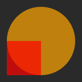

We can then create a new path by using one of the boolean operations such as:
```js
let knockout = rect.complement(oval),
    overlap = rect.intersect(oval),
    footprint = rect.union(oval),
    ...
```
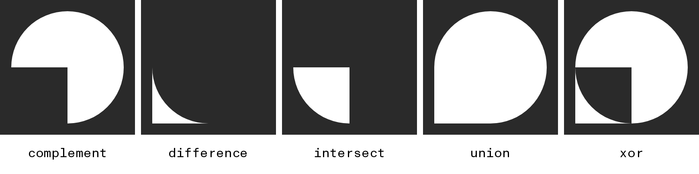

### `interpolate()`
```js returns="Path2D"
interpolate(otherPath, weight)
```

When two similar paths share the same sequence of ‘verbs’ and differ only in the point arguments passed to them, the `interpolate()` method can combine them in different proportions to create a new path. The `weight` argument controls whether the resulting path resembles the original (at `0.0`), the `otherPath` (at `1.0`), or something in between.

```js
let start = new Path2D()
start.moveTo(-200, 100)
start.bezierCurveTo(-300, 100, -200, 200, -300, 200)
start.bezierCurveTo(-200, 200, -300, 300, -200, 300)

let end = new Path2D()
end.moveTo(200, 100)
end.bezierCurveTo(300, 100, 200, 200, 300, 200)
end.bezierCurveTo(200, 200, 300, 300, 200, 300)

let left = start.interpolate(end, .25),
    mean = start.interpolate(end, .5),
    right = start.interpolate(end, .75)
```
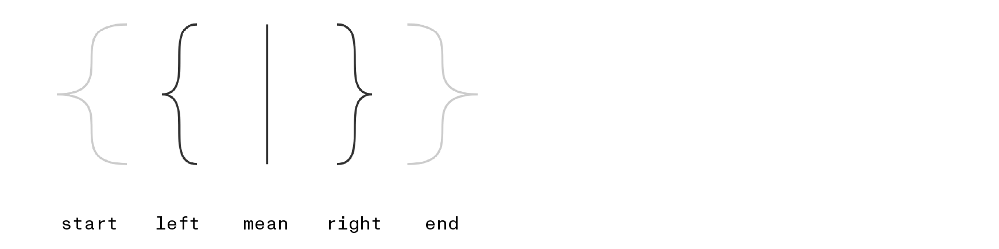


### `jitter()`
```js returns="Path2D"
jitter(segmentLength, amount, seed=0)
```

The `jitter()` method will return a new Path2D object obtained by breaking the original path into segments of a given length then applying random offsets to the resulting points. Though the modifications are random, they will be consistent between runs based on the specified `seed`. Try passing different integer values for the seed until you get results that you like.

```js
let cube = new Path2D()
cube.rect(100, 100, 100, 100)
cube.rect(150, 50, 100, 100)
cube.moveTo(100, 100)
cube.lineTo(150, 50)
cube.moveTo(200, 100)
cube.lineTo(250, 50)
cube.moveTo(200, 200)
cube.lineTo(250, 150)

let jagged = cube.jitter(1, 2),
    reseed = cube.jitter(1, 2, 1337),
    sketchy = cube.jitter(10, 1)
```
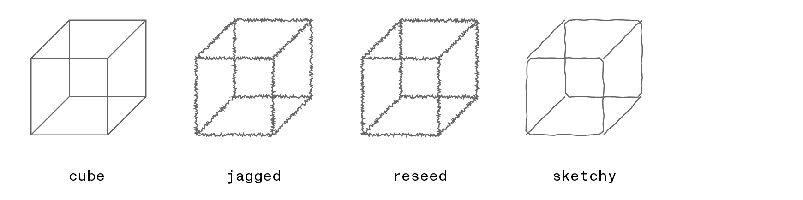

### `offset()`
```js returns="Path2D"
offset(dx, dy)
```

Returns a copy of the path whose points have been shifted horizontally by `dx` and vertically by `dy`.

### `points()`
```js returns="[[x1, y1], [x2,y2], ...]"
points(step=1, mode="even")
```

The `points()` method breaks a path into evenly-sized steps and returns the (*x, y*) positions of the resulting vertices. The `step` argument specifies the desired amount of distance between neighboring points and defaults to 1 px if omitted. If `step` doesn't divide evenly into the contour length, it will be expanded/contracted as needed to fit the contour. You can disable this fitting by passing `"exact"` as the `mode` arg, in which case the distance between points will be precisely the `step` length (but beware: the final points in closed contours may look uneven, and there's no guarantee the endpoint of a contour will be included).


```js
let path = new Path2D()
path.arc(100, 100, 50, 0, 2*Math.PI)
path.rect(100, 50, 50, 50)
path = path.simplify()

for (const [x, y] of path.points(10)){
  ctx.fillRect(x, y, 3, 3)
}
```
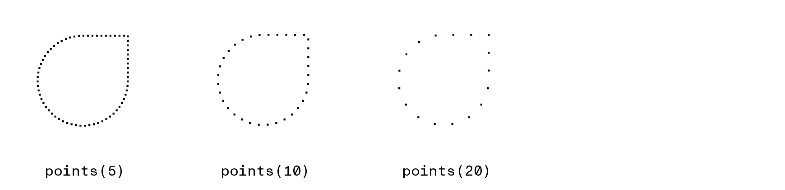

### `positionAt()`
```js returns="{x:Number, y:Number} | null"
positionAt(distance)
```

The `positionAt()` method takes a distance (in [path units][p2d_length]) and returns an x/y coordinate pair locating the corresponding point on the path. Positive `distance` values are measured relative to the path's start and negative relative to its end.

```js
function dotAtLocation(path, distance, color){
  let {x, y} = path.positionAt(distance)
  ctx.fillStyle = color
  ctx.beginPath()
  ctx.arc(x, y, 4, 0, 2*Math.PI)
  ctx.fill()    
}

let curve = new Path2D("M 20 85 Q 57 35 93 85 Q 111 110 130 110")
dotAtLocation(curve, 0.0 * curve.length, 'red')
dotAtLocation(curve, 0.5 * curve.length, 'orange')
dotAtLocation(curve, 1.0 * curve.length, 'skyblue')
ctx.stroke(curve)
ctx.translate(150, 0)

let lines = new Path2D("M 20 90 L 50 60 M 60 90 L 90 60 M 100 90 L 130 60")
dotAtLocation(lines, 0.0 * lines.length, 'red')
dotAtLocation(lines, 0.5 * lines.length, 'orange')
dotAtLocation(lines, 1.0 * lines.length, 'skyblue')
ctx.stroke(lines)
ctx.translate(150, 0)

let bookends = new Path2D("M 45 127 A 60 60 0 1 1 105 127")
dotAtLocation(bookends,  25, 'red')
dotAtLocation(bookends,  50, 'orange')
dotAtLocation(bookends, -50, 'skyblue')
dotAtLocation(bookends, -25, 'violet')
ctx.stroke(bookends)
```

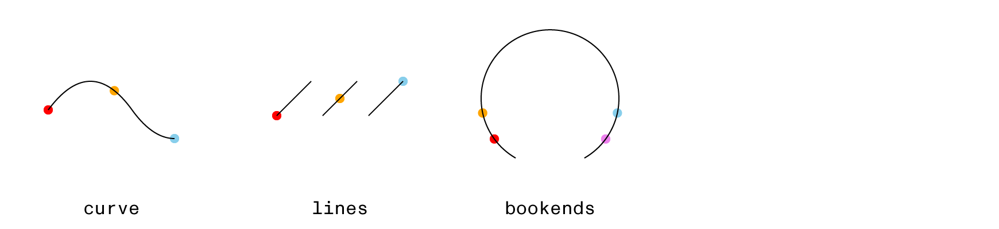

### `tangentAt()` & `normalAt()`
```js returns="Number | null"
tangentAt(distance)
normalAt(distance)
```

The `tangentAt()` method complements [`positionAt()`][p2d_positionAt] by returning the *angle* of the path's curve at a `distance` measured in [path units][p2d_length]. Positive distances are measured from the beginning of the path and negative distances from its end. The tangent angle is returned in radians and can be passed directly to [`rotate()`][rotate()] to align with the path's curve (see below). The `normalAt()` convenience method returns an angle that is perpendicular to the tangent and will always be on the ‘left hand’ side of the curve being followed.

```js
let path = new Path2D("M 20 85 Q 57 35 93 85 Q 111 110 130 110")

function lineAtLocation(angleType, distance, color){
  let point = path.positionAt(distance)
  let angle = angleType=="tangent" ? path.tangentAt(distance) : path.normalAt(distance)
  ctx.save()
  ctx.strokeStyle = color
  ctx.lineWidth = 3
  ctx.translate(point.x, point.y)
  ctx.rotate(angle)
  ctx.stroke(new Path2D("M-20 0 h 40"))
  ctx.restore()
}

lineAtLocation("tangent", 0, 'red')
lineAtLocation("tangent", 0.33 * path.length, 'orange')
lineAtLocation("tangent", 0.66 * path.length, 'skyblue')
lineAtLocation("tangent", path.length, 'violet')
ctx.stroke(path)
ctx.translate(150, 0)

lineAtLocation("normal", 0, 'red')
lineAtLocation("normal", 0.33 * path.length, 'orange')
lineAtLocation("normal", 0.66 * path.length, 'skyblue')
lineAtLocation("normal", path.length, 'violet')
ctx.stroke(path)
```

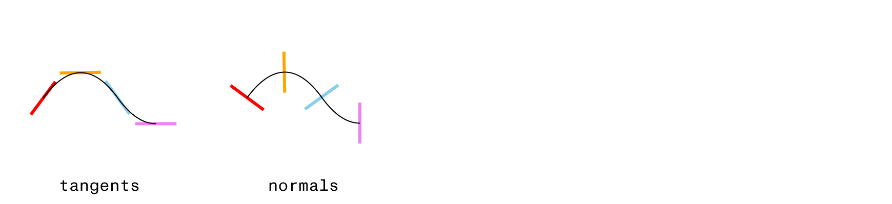

### `round()`
```js returns="Path2D"
round(radius)
```

Calling `round()` will return a new Path2D derived from the original path whose corners have been rounded off to the specified radius.

```js
let spikes = new Path2D()
spikes.moveTo(50, 225)
spikes.lineTo(100, 25)
spikes.lineTo(150, 225)
spikes.lineTo(200, 25)
spikes.lineTo(250, 225)
spikes.lineTo(300, 25)

let snake = spikes.round(80)
```
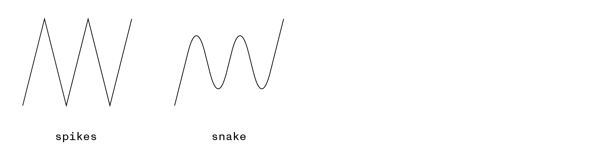

### `simplify()`
```js returns="Path2D"
simplify(rule="nonzero")
```

Paths that contain multiple contours use a ‘winding rule’ to decide whether overlapping regions should be filled or knocked out. You can make this decision at draw-time by passing a rule argument to [`ctx.fill()`][fill()] (either `evenodd` or its default: `nonzero`).

The `simplify()` method lets you make this decision ahead of time by constructing a new Path2D that has had all of its overlapping regions removed (so there's no ambiguity to be resolved when drawn). When called with the default `nonzero` rule, any contours whose points wind in the same direction (i.e., both clockwise or both counter-clockwise) will be flattened into un-layered contours enclosing them all. Contours that wind in opposing directions will create a hole.

Alternatively, the `evenodd` rule will create holes in all the regions where an *even* number of contours are layered atop one another (similar to the [`xor()`][bool-ops] operation), regardless of the clockwise-ness of the points.

Since the simplified path contains no overlaps, it will render identically whichever winding rule is passed to `fill()`:
```js
let original = new Path2D(`
  M 10,50 h 100 v 20 h -100 Z
  M 50,10 h 20 v 100 h -20 Z
`)

let merged = original.simplify(), // nonzero
    hollow = original.simplify('evenodd')

ctx.stroke(original)
ctx.translate(150, 0)
ctx.fill(original)
ctx.translate(150, 0)
ctx.fill(original, "evenodd")
```
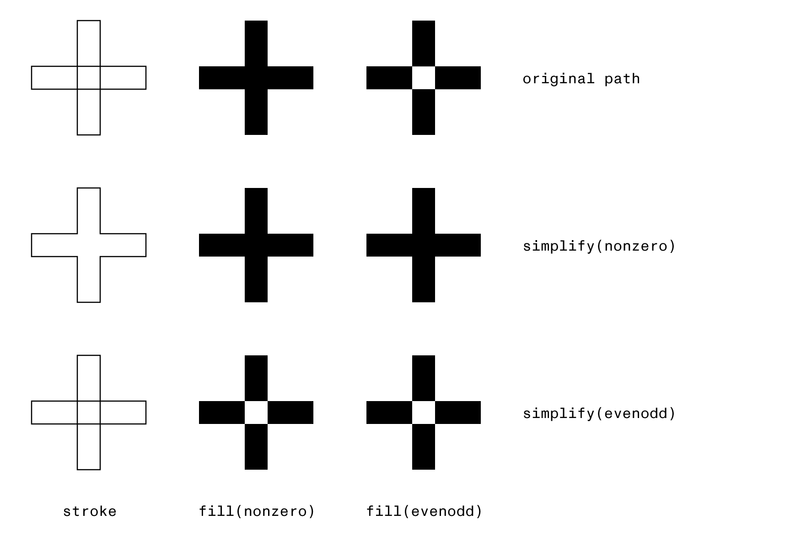

:::info[Note]
In this context ‘simplify’ refers only to the shape’s structure, not its level of detail: the method removes crossings rather than reducing the number of points. In fact, splitting an intersection into separate contours frequently *increases* both the contour and point counts.
:::

### `transform()`
```js returns="Path2D"
transform(...matrix)
```

Returns a new copy of the path whose points have been modified by the specified transform matrix. The matrix can be passed as a [DOMMatrix][DOMMatrix] object, a [CSS transform][css_transform] string (e.g, `"rotate(20deg)"`), or 6 individual numbers (see the Context's [setTransform()][transforms] documentation for details). The original path remains unmodified.

### `slice()`
```js returns="Path2D"
slice(start, end, inverted=false) // copy between the start & end positions (or their complement)
slice(start) // copy from the starting position to the end of the path
slice() // clone the full path
```

The `slice()` method is analogous to the [Array method][array.slice] of the same name: it allows you to create a new path that contains a subset of the points in the original. The `start` and `end` arguments correspond to **distances** along the path and their magnitude can range from `0` to the path's [`length`][p2d_length]. Positive values measure from the path's initial point and negative values from its final point. If the `inverted` argument is set to `true`, the new path will contain everything from the original *except* the region between the specified endpoints.

Passing a single number (either positive or negative) set the starting position and selects the region from there to the end of the path.

```js
let orig = new Path2D()
orig.arc(100, 100, 50, Math.PI, 0)

let len = orig.length

let middle = orig.slice(.25*len, .75*len),
    endpoints = orig.slice(.25*len, .75*len, true),
    left = orig.slice(.25*len),
    right = orig.slice(-.25*len)
```
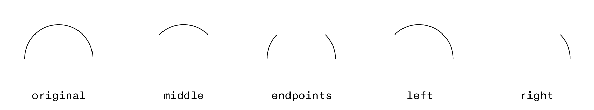

### `trim()`
```js returns="Path2D"
trim(start, end, inverted=false)
trim(keep, inverted=false)
```

The `trim()` method returns a new Path2D which contains only a portion of the original path. The `start` and `end` arguments specify **proportions** of the original length as numbers between `0` and `1.0`. If both arguments are provided, the new path will be a continuous contour connecting those endpoints. If the `inverted` argument is set to `true`, the new path will contain everything from the original *except* the region between the specified endpoints.

Passing a single number specifies the proportion of the path to ‘keep’, starting from the beginning for positive numbers or the end for negative numbers. In either case, you can include `inverted` as the second argument to flip the selected region.

```js
let orig = new Path2D()
orig.arc(100, 100, 50, Math.PI, 0)

let middle = orig.trim(.25, .75),
    endpoints = orig.trim(.25, .75, true),
    left = orig.trim(.25),
    right = orig.trim(-.25)
```
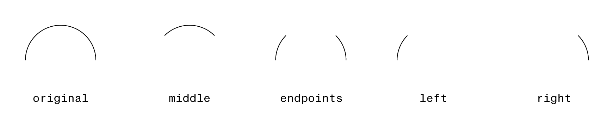

### ~~`unwind()`~~
```js returns="Path2D"
unwind()
```

**The unwind() method has been deprecated** and will be removed in a future release. You should now use [`simplify('evenodd')`][p2d_simplify] to convert `evenodd` paths to a form that can be filled using the default `nonzero` winding rule instead. 

:::info[Note]
Previously the main use for `unwind()` was dealing with the values returned by `difference()`, `xor()`, and the other [boolean operations][bool-ops] (all of which returned paths that expected to be filled with an `evenodd` rule). As of version 4, those methods all return pre-simlpified paths that will render correctly using the default `nonzero` winding rule.
:::

<!-- references_begin -->
[bool-ops]: #complement-difference-intersect-union-xor
[canvas]: canvas.md
[conicCurveTo]: context.md#coniccurveto
[context]: context.md
[createTexture()]: context.md#createtexture
[edges]: #edges
[lineDashMarker]: context.md#linedashmarker
[p2d_bounds]: #bounds
[p2d_contains]: #contains
[p2d_contours]: #contours
[p2d_d]: #d
[p2d_interpolate]: #interpolate
[p2d_jitter]: #jitter
[p2d_length]: #length
[p2d_normalAt]: #tangentat--normalat
[p2d_offset]: #offset
[p2d_points]: #points
[p2d_positionAt]: #positionat
[p2d_round]: #round
[p2d_simplify]: #simplify
[p2d_tangentAt]: #tangentat--normalat
[p2d_transform]: #transform
[p2d_slice]: #slice
[p2d_trim]: #trim
[transforms]: context.md#transform--settransform
[nonzero]: https://en.wikipedia.org/wiki/Nonzero-rule
[evenodd]: https://en.wikipedia.org/wiki/Even–odd_rule
[SVG_path_commands]: https://developer.mozilla.org/en-US/docs/Web/SVG/Attribute/d#path_commands
[p2d_addPath]: https://developer.mozilla.org/en-US/docs/Web/API/Path2D/addPath
[p2d_closePath]: https://developer.mozilla.org/en-US/docs/Web/API/CanvasRenderingContext2D/closePath
[p2d_moveTo]: https://developer.mozilla.org/en-US/docs/Web/API/CanvasRenderingContext2D/moveTo
[p2d_lineTo]: https://developer.mozilla.org/en-US/docs/Web/API/CanvasRenderingContext2D/lineTo
[p2d_bezierCurveTo]: https://developer.mozilla.org/en-US/docs/Web/API/CanvasRenderingContext2D/bezierCurveTo
[p2d_quadraticCurveTo]: https://developer.mozilla.org/en-US/docs/Web/API/CanvasRenderingContext2D/quadraticCurveTo
[p2d_arc]: https://developer.mozilla.org/en-US/docs/Web/API/CanvasRenderingContext2D/arc
[p2d_arcTo]: https://developer.mozilla.org/en-US/docs/Web/API/CanvasRenderingContext2D/arcTo
[p2d_ellipse]: https://developer.mozilla.org/en-US/docs/Web/API/CanvasRenderingContext2D/ellipse
[p2d_rect]: https://developer.mozilla.org/en-US/docs/Web/API/CanvasRenderingContext2D/rect
[css_transform]: https://developer.mozilla.org/en-US/docs/Web/CSS/transform
[DOMMatrix]: https://developer.mozilla.org/en-US/docs/Web/API/DOMMatrix
[arcTo()]: https://developer.mozilla.org/en-US/docs/Web/API/CanvasRenderingContext2D/arcTo
[beginPath()]: https://developer.mozilla.org/en-US/docs/Web/API/CanvasRenderingContext2D/beginPath
[clip()]: https://developer.mozilla.org/en-US/docs/Web/API/CanvasRenderingContext2D/clip
[fill()]: https://developer.mozilla.org/en-US/docs/Web/API/CanvasRenderingContext2D/fill
[lineTo()]: https://developer.mozilla.org/en-US/docs/Web/API/CanvasRenderingContext2D/lineTo
[rotate()]: https://developer.mozilla.org/en-US/docs/Web/API/CanvasRenderingContext2D/rotate
[roundRect()]: https://developer.mozilla.org/en-US/docs/Web/API/CanvasRenderingContext2D/roundRect
[stroke()]: https://developer.mozilla.org/en-US/docs/Web/API/CanvasRenderingContext2D/stroke
[array.slice]: https://developer.mozilla.org/en-US/docs/Web/JavaScript/Reference/Global_Objects/Array/slice
<!-- references_end -->
