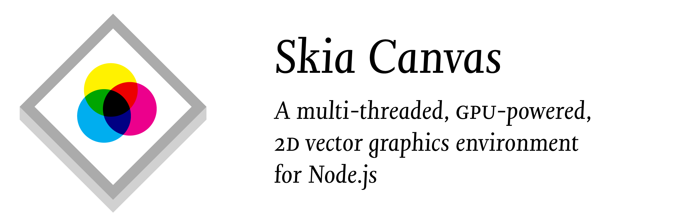
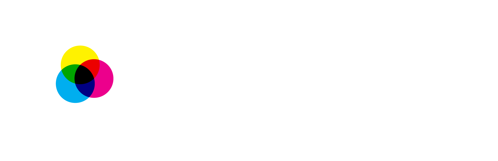

<div id="hero">

  
  

</div>

Skia Canvas is a browser-less implementation of the HTML Canvas drawing API for Node.js. It is based on Google’s [Skia](https://skia.org) graphics engine and, accordingly, produces very similar results to Chrome’s `<canvas>` element. The library is well suited for use on desktop machines where you can render hardware-accelerated graphics to a window and on the server where it can output a variety of image formats.

While the primary goal of this project is to provide a reliable emulation of the [standard API](https://developer.mozilla.org/en-US/docs/Web/API/Canvas_API) according to the [spec](https://html.spec.whatwg.org/multipage/canvas.html), it also extends it in a number of areas to take greater advantage of Skia's advanced graphical features and provide a more expressive coding environment.

In particular, Skia Canvas:

  - is fast and compact since rendering takes place on the GPU and all the heavy lifting is done by native code written in Rust and C++
  - can render to [windows][window] using an OS-native graphics pipeline and provides a browser-like [UI event][win_bind] framework
  - generates output in both raster (JPEG & PNG) and vector (PDF & SVG) image formats
  - can save images to [files][saveAs], return them as [Buffers][toBuffer], or encode [dataURL][toDataURL_ext] strings
  - uses native threads and the Node [worker pool](https://github.com/neon-bindings/rfcs/pull/35) for asynchronous rendering and file I/O
  - can create [multiple ‘pages’][newPage] on a given canvas and then [output][saveAs] them as a single, multi-page PDF or an image-sequence saved to multiple files
  - can [simplify][p2d_simplify], [blunt][p2d_round], [combine][bool-ops], [excerpt][p2d_trim], and [atomize][p2d_points] bézier paths using [efficient](https://www.youtube.com/watch?v=OmfliNQsk88) boolean operations or point-by-point [interpolation][p2d_interpolate]
  - provides [3D perspective][createProjection()] transformations in addition to [scaling][scale()], [rotation][rotate()], and [translation][translate()]
  - can fill shapes with vector-based [Textures][createTexture()] in addition to bitmap-based [Patterns][createPattern()] and supports line-drawing with custom [markers][lineDashMarker]
  - supports the full set of [CSS filter][filter] image processing operators
  - offers rich typographic control including:
    - multi-line, [word-wrapped][textwrap] text
    - line-by-line [text metrics][c2d_measuretext]
    - small-caps, ligatures, and other opentype features accessible using standard [font-variant][fontvariant] syntax
    - proportional [letter-spacing][letterSpacing], [word-spacing][wordSpacing], and [leading][c2d_font]
    - support for [variable fonts][VariableFonts] and transparent mapping of weight values
    - use of non-system fonts [loaded][fontlibrary-use] from local files

## Example Usage

### Generating image files

```js
const {Canvas} = require('skia-canvas')

let canvas = new Canvas(400, 400),
    {width, height} = canvas,
    ctx = canvas.getContext("2d");

let sweep = ctx.createConicGradient(Math.PI * 1.2, width/2, height/2)
sweep.addColorStop(0, "red")
sweep.addColorStop(0.25, "orange")
sweep.addColorStop(0.5, "yellow")
sweep.addColorStop(0.75, "green")
sweep.addColorStop(1, "red")
ctx.strokeStyle = sweep
ctx.lineWidth = 100
ctx.strokeRect(100,100, 200,200)

// render to multiple destinations using a background thread
async function render(){
  // save a ‘retina’ image...
  await canvas.saveAs("rainbox.png", {density:2})
  // ...or use a shorthand for canvas.toBuffer("png")
  let pngData = await canvas.png
  // ...or embed it in a string
  let pngEmbed = ``
}
render()

// ...or save the file synchronously from the main thread
canvas.saveAsSync("rainbox.pdf")
```

### Multi-page sequences

```js
const {Canvas} = require('skia-canvas')

let canvas = new Canvas(400, 400),
    {width, height} = canvas;

for (const color of ['orange', 'yellow', 'green', 'skyblue', 'purple']){
  ctx = canvas.newPage()
  ctx.fillStyle = color
  ctx.fillRect(0,0, width, height)
  ctx.fillStyle = 'white'
  ctx.arc(width/2, height/2, 40, 0, 2 * Math.PI)
  ctx.fill()
}

async function render(){
  // save to a multi-page PDF file
  await canvas.saveAs("all-pages.pdf")

  // save to files named `page-01.png`, `page-02.png`, etc.
  await canvas.saveAs("page-{2}.png")
}
render()

```

### Rendering to a window

```js
const {Window} = require('skia-canvas')

let win = new Window(300, 300)
win.title = "Canvas Window"
win.on("draw", e => {
  let ctx = e.target.canvas.getContext("2d")
  ctx.lineWidth = 25 + 25 * Math.cos(e.frame / 10)
  ctx.beginPath()
  ctx.arc(150, 150, 50, 0, 2 * Math.PI)
  ctx.stroke()

  ctx.beginPath()
  ctx.arc(150, 150, 10, 0, 2 * Math.PI)
  ctx.stroke()
  ctx.fill()
})
```

<!-- references_begin -->
[bool-ops]: api/path2d.md#complement-difference-intersect-union-and-xor
[c2d_font]: api/context.md#font
[c2d_measuretext]: api/context.md#measuretext
[createProjection()]: api/context.md#createprojection
[createTexture()]: api/context.md#createtexture
[fontlibrary-use]: api/font-library.md#use
[fontvariant]: api/context.md#fontvariant
[lineDashMarker]: api/context.md#linedashmarker
[newPage]: api/canvas.md#newpage
[p2d_interpolate]: api/path2d.md#interpolate
[p2d_points]: api/path2d.md#points
[p2d_round]: api/path2d.md#round
[p2d_simplify]: api/path2d.md#simplify
[p2d_trim]: api/path2d.md#trim
[saveAs]: api/canvas.md#saveas
[textwrap]: api/context.md#textwrap
[toBuffer]: api/canvas.md#tobuffer
[toDataURL_ext]: api/canvas.md#todataurl
[win_bind]: api/window.md#on--off--once
[window]: api/window.md
[VariableFonts]: https://developer.mozilla.org/en-US/docs/Web/CSS/CSS_Fonts/Variable_Fonts_Guide
[filter]: https://developer.mozilla.org/en-US/docs/Web/API/CanvasRenderingContext2D/filter
[letterSpacing]: https://developer.mozilla.org/en-US/docs/Web/API/CanvasRenderingContext2D/letterSpacing
[wordSpacing]: https://developer.mozilla.org/en-US/docs/Web/API/CanvasRenderingContext2D/wordSpacing
[createPattern()]: https://developer.mozilla.org/en-US/docs/Web/API/CanvasRenderingContext2D/createPattern
[rotate()]: https://developer.mozilla.org/en-US/docs/Web/API/CanvasRenderingContext2D/rotate
[scale()]: https://developer.mozilla.org/en-US/docs/Web/API/CanvasRenderingContext2D/scale
[translate()]: https://developer.mozilla.org/en-US/docs/Web/API/CanvasRenderingContext2D/translate
<!-- references_end -->
