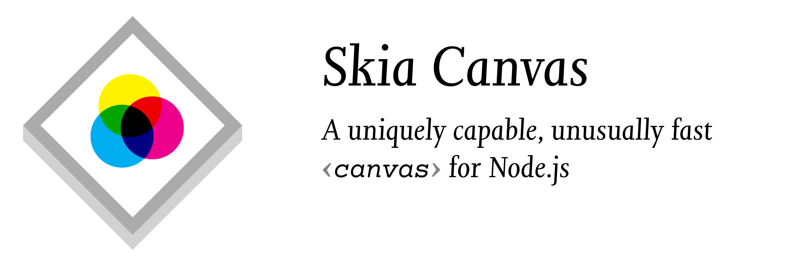
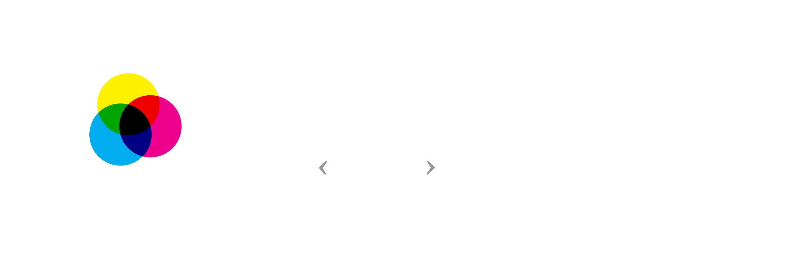

<div id="hero">

  
  

</div>

Skia Canvas is a ‘headless’ vector graphics renderer and on-screen windowing toolkit that lets you write code using the familiar [Canvas API][mdn_canvas_api] but without needing a browser to run it in. Instead, your graphics code runs anywhere Node.js does, making it possible to [render][canvas_saving] image files from a web service or display interactive animations in a native OS [window][window] on your desktop. Behind the scenes, it’s all powered by [Skia][skia], the GPU-accelerated graphics engine used by Google Chrome.

### A More Capable Canvas

In addition to being a faithful emulation of the [canvas standard](https://html.spec.whatwg.org/multipage/canvas.html) with [minimal][npm_dependencies] dependencies, Skia Canvas includes a raft of extensions, adding 2D capabilities that reach well beyond what the browser’s `<canvas>` can do.

In particular, Skia Canvas can:

  - generate images in vector (PDF & SVG) as well as bitmap (JPEG, PNG, WEBP, & RAW) formats
  - save images to [files][toFile], encode to [dataURL][toURL] strings, and return [Buffers][toBuffer] or [Sharp][sharp] objects
  - create [multiple ‘pages’][newPage] on a given canvas and [output][toFile] them as a multi-page PDF or an image-sequence saved to multiple files
  - load [PDFs & SVGs][loadimage] as scalable vector images or open a [multi-page PDF][loadcanvas] as an editable canvas
  - render in wide-gamut Display P3 color with [CSS Color 4][ctx_colors] syntax support
  - [slice][p2d_slice] & [sample][p2d_points] Path2D objects, combine them with [boolean operators][bool-ops], and decompose them into [contours][p2d_contours], [verbs][edges], or [points][p2d_positionAt]
  - transform coordinates using [3D perspective][createProjection()] in addition to [scaling][scale()], [rotation][rotate()], and [translation][translate()]
  - fill paths with vector-based [Textures][createTexture()] or bitmap [Patterns][createPattern()] and draw strokes with custom [markers][lineDashMarker]
  - apply the full set of [CSS filter][filter] image processing operators
  - provide rich typographic control including:
    - multi-line, [word-wrapped][textwrap] text
    - line-by-line [text metrics][c2d_measuretext]
    - small-caps, ligatures, and other [opentype features][fontfeatures] accessible using standard [font-variant][fontvariant] syntax
    - proportional [letter-spacing][letterSpacing], [word-spacing][wordSpacing], and [leading][c2d_font]
    - support for [variable fonts][VariableFonts] and automatic use of weight, width, and optical-sizing axes
    - use of non-system fonts [loaded][fontlibrary-use] from local files
  - use native threads in a [user-configurable][multithreading] worker pool for asynchronous rendering and file I/O
  - render images server-side on standard Linux hosts and ‘serverless’ platforms like Vercel, Cloudflare Containers, and AWS Lambda

## Installing Skia Canvas

If you’re running on a supported platform, installation should be as simple as:

```bash
npm install skia-canvas
```

For detailed [installation][installation] instructions and runtime [configuration][global_settings] options, take a look at the [Getting Started][getting_started] page.

## Example Usage

Skia Canvas's classes and extensions to the standard are extensively covered in the [API Documentation][api_docs]. But to give you a sense of some of the things you can achieve with it, here are some real-world examples:

### Generating image files

```js view="rainbox.png|assets/examples/generating-image-files@2x.png"
import {Canvas} from 'skia-canvas'

let canvas = new Canvas(400, 400),
    ctx = canvas.getContext("2d"),
    {width, height} = canvas;

// draw an empty box with a gradient at its edges
let sweep = ctx.createConicGradient(Math.PI * 1.2, width/2, height/2)
sweep.addColorStop(0, "red")
sweep.addColorStop(0.25, "orange")
sweep.addColorStop(0.5, "yellow")
sweep.addColorStop(0.75, "green")
sweep.addColorStop(1, "red")
ctx.strokeStyle = sweep
ctx.lineWidth = 100
ctx.strokeRect(100,100, 200,200)

// render to multiple destinations using a background thread...
await canvas.toFile("rainbox.png", {density:2}) // save a ‘retina’ image
let pngData = await canvas.png // use a shorthand for canvas.toBuffer("png")
let pngEmbed = `` // embed it in a string

// ...or save the file synchronously from the main thread
canvas.toFileSync("rainbox.pdf")
```

### Multi-page sequences

```js view="all-pages-labeled.pdf|assets/examples/multi-page-sequences.pdf"
import {Canvas, loadCanvas} from 'skia-canvas'

let canvas = new Canvas(400, 400),
    ctx = canvas.getContext("2d"), // leave first page blank
    {width, height} = canvas

for (const color of ['orange', 'yellow', 'green', 'skyblue', 'purple']){
  ctx = canvas.newPage() // add pages 2–6
  ctx.fillStyle = color
  ctx.fillRect(0,0, width, height)
  ctx.fillStyle = 'white'
  ctx.arc(width/2, height/2, 40, 0, 2 * Math.PI)
  ctx.fill()
}

await canvas.toFile("page-{2}.png")  // save to files named `page-01.png`, `page-02.png`, etc.
await canvas.toFile("all-pages.pdf") // save to a single multi-page PDF file

// the multi-page PDF can be read back in and even drawn upon
let multipage = await loadCanvas("all-pages.pdf")
for (let [i, pg] of multipage.pages.entries()){
  pg.font = 'italic 12px serif'
  pg.textAlign = 'center'
  pg.textBaseline = 'middle'
  pg.fillText(`p. ${i+1}`, multipage.width/2, multipage.height/2)
}
await multipage.toFile("all-pages-labeled.pdf")
```

### Rendering to a window

```js view="screenshot|assets/examples/rendering-to-a-window@2x.png"
import {Window} from 'skia-canvas'

let win = new Window(300, 300)
win.title = "Canvas Window"
win.on("draw", e => {
  let ctx = e.target.canvas.getContext("2d")
  ctx.lineWidth = 25 + 25 * Math.cos(e.frame / 10)
  ctx.beginPath()
  ctx.arc(150, 150, 50, 0, 2 * Math.PI)
  ctx.stroke()

  ctx.beginPath()
  ctx.arc(150, 150, 10, 0, 2 * Math.PI)
  ctx.stroke()
  ctx.fill()
})
```


### Wide-gamut colors

```js view="test-pattern.png|assets/examples/wide-gamut-colors@2x.png"
import {Canvas} from 'skia-canvas'

let pad = 16, size = 64, width = 4*size + 3*pad,
    canvas = new Canvas(336, 240),
    ctx = canvas.getContext("2d", {colorSpace:"display-p3"})

// CSS Color 4 syntax is supported everywhere (and colors can exceed the sRGB gamut)
for (let [p3, srgb] of [
  ["color(display-p3 1 0 0)", "#ff0000"], ["lch(75% 100 150)", "#00dc51"],
  ["lch(85% 80 170)", "#00f8b6"], ["color(display-p3 0 1 1)", "#00ffff"]
]){
  ctx.fillStyle = p3 // wide gamut color
  ctx.fillRect(pad, pad, size, size/2)
  ctx.fillStyle = srgb  // nearest sRGB equivalent
  ctx.fillRect(pad, pad + size/2, size, size/2)
  ctx.translate(size + pad, 0)
}
ctx.translate(-width, pad + size)

// gradients can select the color space used for interpolation
for (let {space, from, to, hue} of [
  {space:"srgb",  from:"navy", to:"gold"}, // perceptual midpoint is off-center
  {space:"oklab", from:"navy", to:"gold"}, // Oklab stays perceptually uniform
  {space:"oklch", from:"red",  to:"red", hue:"longer"}, // full 360° from a single hue
]){
  let ramp = ctx.createLinearGradient(0, pad, width, pad)
  if (hue) ramp.hueInterpolationMethod = hue // only applies to angle-based spaces
  ramp.colorInterpolationMethod = space
  ramp.addColorStop(0, from)
  ramp.addColorStop(1, to)
  ctx.fillStyle = ramp
  ctx.fillRect(0, pad, width, size/2)
  ctx.translate(0, pad + size/2)
}

await canvas.toFile("test-pattern.png")
```

### Integrating with [Sharp.js][sharp]

```js view="sharp exports|assets/examples/integrating-with-sharp@2x.png"
import sharp from 'sharp'
import {Canvas, loadImage} from 'skia-canvas'

let canvas = new Canvas(400, 400),
    ctx = canvas.getContext("2d"),
    {width, height} = canvas,
    [x, y] = [width/2, height/2]

ctx.fillStyle = 'red'
ctx.fillRect(0, 0, x, y)
ctx.fillStyle = 'orange'
ctx.fillRect(x, y, x, y)

// Render the canvas to a Sharp object on a background thread then desaturate
await canvas.toSharp().modulate({saturation:.25}).jpeg().toFile("faded.jpg")

// Convert an ImageData to a Sharp object and save a grayscale version
let imgData = ctx.getImageData(0, 0, width, height, {matte:'white', density:2})
await imgData.toSharp().grayscale().png().toFile("black-and-white.png")

// Create an image using Sharp then draw it to the canvas as an Image object
let sharpImage = sharp({create:{ width:x, height:y, channels:4, background:"skyblue" }})
let canvasImage = await loadImage(sharpImage)
ctx.drawImage(canvasImage, x, 0)
await canvas.toFile('mosaic.png')
```

## Benchmarks

#### Methodology

For each drawing test, the Cairo-based `canvas` library’s time is used as a baseline measurement and the other libraries’ **Relative Speed** values are presented as ‘*n* times faster’ multiples (e.g., `2×` means it ran in half the time). **Per Run** times are the mean runtime across all the library’s iterations for a given test. The file sizes listed in the **Output** column vary between libraries in part due to Skia Canvas’s PNG exporter automatically selecting which adaptive filters to use.

Skia Canvas was tested in two modes: ‘serial’ and ‘async’. When running serially, each rendering operation is awaited before continuing to the next test iteration. When running asynchronously, all the test iterations are begun simultaneously and are executed in parallel using the library’s multi-threading support.

[See full results here…](https://github.com/samizdatco/canvas-benchmarks/blob/main/results/darwin-arm64/2026-10-01/index.md)

### [Path2D drawing](https://github.com/samizdatco/canvas-benchmarks/tree/main/tests/path2d.js)
| Library                | Per Run   | Relative Speed (50 iterations)           | Output                                       |
| ---------------------- | --------- | ---------------------------------------- | -------------------------------------------- |
| *canvaskit-wasm*       | ` 472 ms` | ` 0.3×`        | [` 499 KB`](https://github.com/samizdatco/canvas-benchmarks/blob/main/results/darwin-arm64/2026-10-01/snapshots/path2d_wasm.png)       |
| *canvas*               | ` 133 ms` | ` 1.0×`      | [` 506 KB`](https://github.com/samizdatco/canvas-benchmarks/blob/main/results/darwin-arm64/2026-10-01/snapshots/path2d_canvas.png)     |
| *@napi-rs/canvas*      | `  99 ms` | ` 1.3×`        | [` 501 KB`](https://github.com/samizdatco/canvas-benchmarks/blob/main/results/darwin-arm64/2026-10-01/snapshots/path2d_napi.png)       |
| *skia-canvas (serial)* | `  45 ms` | ` 3.0×`   | [` 331 KB`](https://github.com/samizdatco/canvas-benchmarks/blob/main/results/darwin-arm64/2026-10-01/snapshots/path2d_skia-sync.png)  |
| *skia-canvas (async)*  | `  20 ms` | ` 6.7×`  | [` 331 KB`](https://github.com/samizdatco/canvas-benchmarks/blob/main/results/darwin-arm64/2026-10-01/snapshots/path2d_skia-async.png) |

### [Scale/rotate images](https://github.com/samizdatco/canvas-benchmarks/tree/main/tests/image-blit.js)
| Library                | Per Run   | Relative Speed (30 iterations)               | Output                                           |
| ---------------------- | --------- | -------------------------------------------- | ------------------------------------------------ |
| *canvaskit-wasm*       | ` 783 ms` | ` 1.0×`        | [` 2.1 MB`](https://github.com/samizdatco/canvas-benchmarks/blob/main/results/darwin-arm64/2026-10-01/snapshots/image-blit_wasm.png)       |
| *canvas*               | ` 819 ms` | ` 1.0×`      | [` 1.9 MB`](https://github.com/samizdatco/canvas-benchmarks/blob/main/results/darwin-arm64/2026-10-01/snapshots/image-blit_canvas.png)     |
| *@napi-rs/canvas*      | ` 193 ms` | ` 4.2×`        | [` 2.1 MB`](https://github.com/samizdatco/canvas-benchmarks/blob/main/results/darwin-arm64/2026-10-01/snapshots/image-blit_napi.png)       |
| *skia-canvas (serial)* | ` 124 ms` | ` 6.6×`   | [` 2.0 MB`](https://github.com/samizdatco/canvas-benchmarks/blob/main/results/darwin-arm64/2026-10-01/snapshots/image-blit_skia-sync.png)  |
| *skia-canvas (async)*  | `  24 ms` | `33.5×`  | [` 2.0 MB`](https://github.com/samizdatco/canvas-benchmarks/blob/main/results/darwin-arm64/2026-10-01/snapshots/image-blit_skia-async.png) |

### [Gradients](https://github.com/samizdatco/canvas-benchmarks/tree/main/tests/gradients.js)
| Library                | Per Run   | Relative Speed (250 iterations)             | Output                                          |
| ---------------------- | --------- | ------------------------------------------- | ----------------------------------------------- |
| canvaskit-wasm         | ` ————— ` | ` ——— `   *not supported*                   | ` ————— `                                       |
| *canvas*               | `  57 ms` | ` 1.0×`      | [` 133 KB`](https://github.com/samizdatco/canvas-benchmarks/blob/main/results/darwin-arm64/2026-10-01/snapshots/gradients_canvas.jpg)     |
| *@napi-rs/canvas*      | `  25 ms` | ` 2.3×`        | [` 130 KB`](https://github.com/samizdatco/canvas-benchmarks/blob/main/results/darwin-arm64/2026-10-01/snapshots/gradients_napi.jpg)       |
| *skia-canvas (serial)* | `   7 ms` | ` 7.8×`   | [` 130 KB`](https://github.com/samizdatco/canvas-benchmarks/blob/main/results/darwin-arm64/2026-10-01/snapshots/gradients_skia-sync.jpg)  |
| *skia-canvas (async)*  | `   3 ms` | `16.3×`  | [` 130 KB`](https://github.com/samizdatco/canvas-benchmarks/blob/main/results/darwin-arm64/2026-10-01/snapshots/gradients_skia-async.jpg) |

### [SVG to PDF](https://github.com/samizdatco/canvas-benchmarks/tree/main/tests/to-pdf.js)
> *`canvas` & `napi-rs` convert the input SVG to a bitmap rather than exporting it as a vector*

| Library                | Per Run   | Relative Speed (200 iterations)          | Output                                       |
| ---------------------- | --------- | ---------------------------------------- | -------------------------------------------- |
| canvaskit-wasm         | ` ————— ` | ` ——— `   *not supported*                | ` ————— `                                    |
| *canvas*               | `  27 ms` | ` 1.0×`      | [` 142 KB`](https://github.com/samizdatco/canvas-benchmarks/blob/main/results/darwin-arm64/2026-10-01/snapshots/to-pdf_canvas.pdf)     |
| *@napi-rs/canvas*      | `  28 ms` | ` 1.0×`        | [` 272 KB`](https://github.com/samizdatco/canvas-benchmarks/blob/main/results/darwin-arm64/2026-10-01/snapshots/to-pdf_napi.pdf)       |
| *skia-canvas (serial)* | `   5 ms` | ` 5.6×`   | [`  52 KB`](https://github.com/samizdatco/canvas-benchmarks/blob/main/results/darwin-arm64/2026-10-01/snapshots/to-pdf_skia-sync.pdf)  |
| *skia-canvas (async)*  | `   2 ms` | `17.0×`  | [`  52 KB`](https://github.com/samizdatco/canvas-benchmarks/blob/main/results/darwin-arm64/2026-10-01/snapshots/to-pdf_skia-async.pdf) |

### [PDF to PNG](https://github.com/samizdatco/canvas-benchmarks/tree/main/tests/from-pdf.js)
> *rendered in JavaScript using [**PDF.js**](https://www.npmjs.com/package/pdfjs-dist):*

| Library                | Per Run   | Relative Speed (20 iterations)             | Output                                         |
| ---------------------- | --------- | ------------------------------------------ | ---------------------------------------------- |
| canvaskit-wasm         | ` ————— ` | ` ——— `   *not supported*                  | ` ————— `                                      |
| *canvas*               | ` 768 ms` | ` 1.0×`      | [` 3.1 MB`](https://github.com/samizdatco/canvas-benchmarks/blob/main/results/darwin-arm64/2026-10-01/snapshots/from-pdf_canvas.png)     |
| *@napi-rs/canvas*      | ` 674 ms` | ` 1.1×`        | [` 3.4 MB`](https://github.com/samizdatco/canvas-benchmarks/blob/main/results/darwin-arm64/2026-10-01/snapshots/from-pdf_napi.png)       |
| *skia-canvas (serial)* | ` 458 ms` | ` 1.7×`   | [` 1.9 MB`](https://github.com/samizdatco/canvas-benchmarks/blob/main/results/darwin-arm64/2026-10-01/snapshots/from-pdf_skia-sync.png)  |
| *skia-canvas (async)*  | ` 253 ms` | ` 3.0×`  | [` 1.9 MB`](https://github.com/samizdatco/canvas-benchmarks/blob/main/results/darwin-arm64/2026-10-01/snapshots/from-pdf_skia-async.png) |

> *[rendered natively](https://github.com/samizdatco/canvas-benchmarks/tree/main/tests/from-pdf-native.js) in Rust using [Hayro](https://github.com/laurenzv/hayro):*

|                        |           |                                                   |                                                       |
| ---------------------- | --------- | ------------------------------------------------- | ----------------------------------------------------- |
| *skia-canvas (serial)* | ` 154 ms` | ` 5.0×`   | [` 1.3 MB`](https://github.com/samizdatco/canvas-benchmarks/blob/main/results/darwin-arm64/2026-10-01/snapshots/from-pdf-native_skia-sync.png)  |
| *skia-canvas (async)*  | `  70 ms` | `11.0×`  | [` 1.3 MB`](https://github.com/samizdatco/canvas-benchmarks/blob/main/results/darwin-arm64/2026-10-01/snapshots/from-pdf-native_skia-async.png) |

### [Text rendering](https://github.com/samizdatco/canvas-benchmarks/tree/main/tests/text.js)
| Library                | Per Run   | Relative Speed (200 iterations)        | Output                                     |
| ---------------------- | --------- | -------------------------------------- | ------------------------------------------ |
| *canvaskit-wasm*       | `  97 ms` | ` 0.2×`        | [` 150 KB`](https://github.com/samizdatco/canvas-benchmarks/blob/main/results/darwin-arm64/2026-10-01/snapshots/text_wasm.png)       |
| *canvas*               | `  24 ms` | ` 1.0×`      | [` 161 KB`](https://github.com/samizdatco/canvas-benchmarks/blob/main/results/darwin-arm64/2026-10-01/snapshots/text_canvas.png)     |
| *@napi-rs/canvas*      | `  19 ms` | ` 1.2×`        | [` 155 KB`](https://github.com/samizdatco/canvas-benchmarks/blob/main/results/darwin-arm64/2026-10-01/snapshots/text_napi.png)       |
| *skia-canvas (serial)* | `  14 ms` | ` 1.7×`   | [` 127 KB`](https://github.com/samizdatco/canvas-benchmarks/blob/main/results/darwin-arm64/2026-10-01/snapshots/text_skia-sync.png)  |
| *skia-canvas (async)*  | `   4 ms` | ` 5.7×`  | [` 127 KB`](https://github.com/samizdatco/canvas-benchmarks/blob/main/results/darwin-arm64/2026-10-01/snapshots/text_skia-async.png) |


<!-- references_begin -->
[bool-ops]: api/path2d.md#complement-difference-intersect-union-xor
[c2d_font]: api/context.md#font
[c2d_measuretext]: api/context.md#measuretext
[createProjection()]: api/context.md#createprojection
[createTexture()]: api/context.md#createtexture
[edges]: api/path2d.md#edges
[fontlibrary-use]: api/font-library.md#use
[fontvariant]: api/context.md#fontvariant
[fontfeatures]: api/context.md#fontfeaturesettings
[lineDashMarker]: api/context.md#linedashmarker
[loadimage]: api/image.md#loadimage
[newPage]: api/canvas.md#newpage
[p2d_contours]: api/path2d.md#contours
[p2d_points]: api/path2d.md#points
[p2d_positionAt]: api/path2d.md#positionat
[p2d_slice]: api/path2d.md#slice
[toFile]: api/canvas.md#tofile
[textwrap]: api/context.md#textwrap
[toBuffer]: api/canvas.md#tobuffer
[toURL]: api/canvas.md#tourl
[window]: api/window.md
[loadcanvas]: api/canvas.md#loadcanvas
[ctx_colors]: api/context.md#choosing-colors
[canvas_saving]: api/canvas.md#saving-graphics-to-files-buffers-and-strings
[api_docs]: /api
[getting_started]: getting-started.md
[installation]: getting-started.md#installation
[global_settings]: getting-started.md#global-settings
[multithreading]: getting-started.md#multithreading
[npm_dependencies]: https://www.npmjs.com/package/skia-canvas?activeTab=dependencies
[sharp]: https://sharp.pixelplumbing.com
[skia]: https://skia.org
[mdn_canvas_api]: https://developer.mozilla.org/en-US/docs/Web/API/Canvas_API
[VariableFonts]: https://developer.mozilla.org/en-US/docs/Web/CSS/CSS_Fonts/Variable_Fonts_Guide
[filter]: https://developer.mozilla.org/en-US/docs/Web/API/CanvasRenderingContext2D/filter
[letterSpacing]: https://developer.mozilla.org/en-US/docs/Web/API/CanvasRenderingContext2D/letterSpacing
[wordSpacing]: https://developer.mozilla.org/en-US/docs/Web/API/CanvasRenderingContext2D/wordSpacing
[createPattern()]: https://developer.mozilla.org/en-US/docs/Web/API/CanvasRenderingContext2D/createPattern
[rotate()]: https://developer.mozilla.org/en-US/docs/Web/API/CanvasRenderingContext2D/rotate
[scale()]: https://developer.mozilla.org/en-US/docs/Web/API/CanvasRenderingContext2D/scale
[translate()]: https://developer.mozilla.org/en-US/docs/Web/API/CanvasRenderingContext2D/translate
<!-- references_end -->
